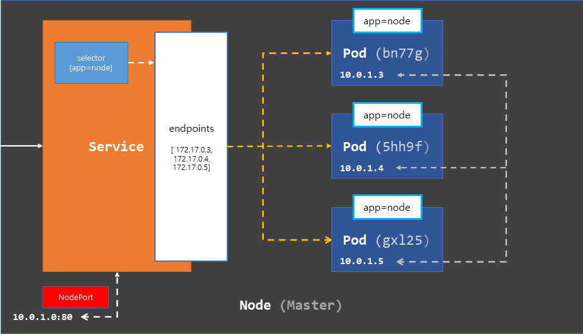
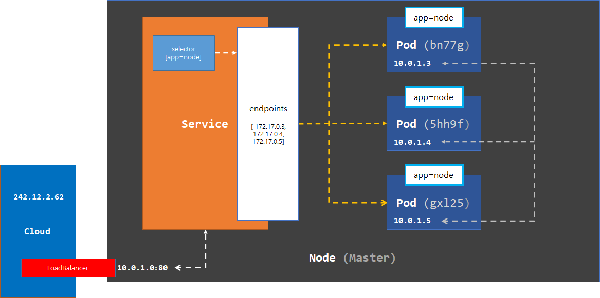
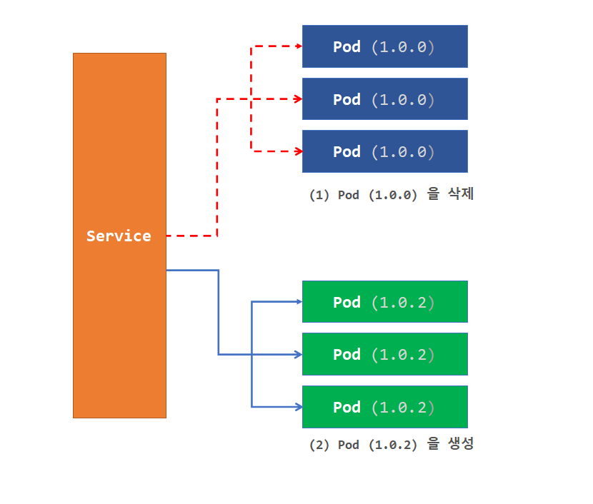
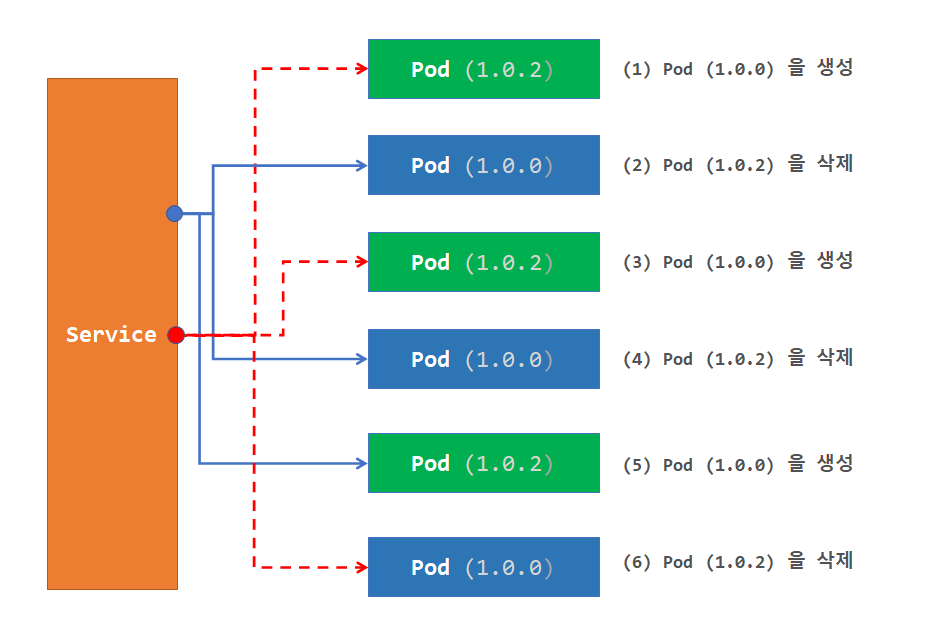
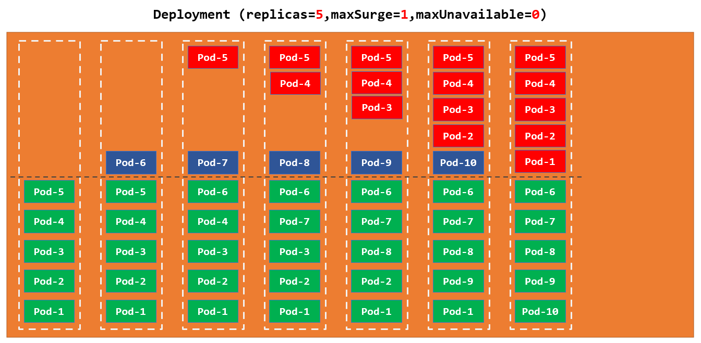
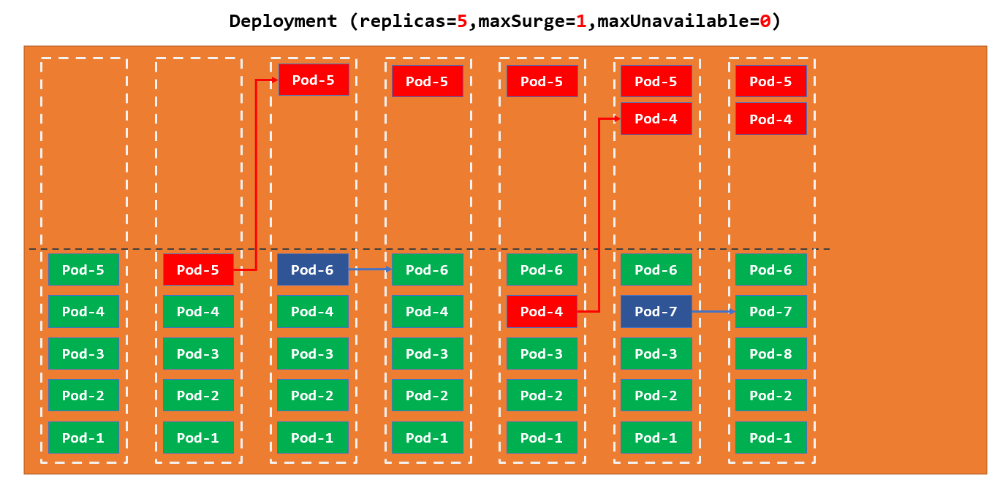
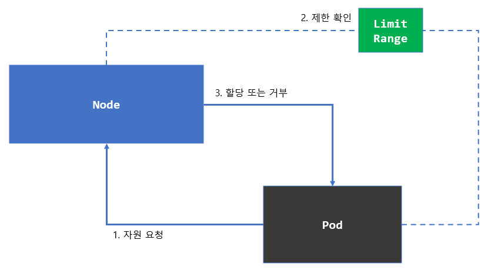

# Kubernetes

이번에는 컨테이너 기반의 애플리케이션 관리를 위하여 쿠버네티스를 알아 보도록 하겠습니다.

쿠버네티스 설치와 관련 된 내용은 [쿠버네티스 설치](./fragments/fragment000.md)를 보도록 합니다.

## hello kubernetes

쿠버네티스를 시작하기 위하여 도커를 사용하여 간단한 애플리케이션을 생성하도록 하겠습니다.

도커에 관한 자세한 내용은 [도커 배우기](./fragments/fragment001.md)

서비스를 추가하기 위하여 노드 환경의 서버 스크립트를 작성하도록 하겠습니다.

`app.js`파일을 생성한 다음 아래 코드를 등록합니다.

```js
const http = require('http');
const os   = require('os');
const port = 8080;

//- 서비스 처리기를 생성
const serverProcessHandler = (req, res) => {

    //- 전송할 데이터 셋팅    
    var data = {
        error_code    : 0, 
        error_message : null, 
        data          : 'Hello Kubernetes this is Container ID is '.concat(os.hostname)
    }

    //- 헤더 및 데이터 전송
    res.writeHead(200, {'Content-Type': 'application/json'});

    res.end(JSON.stringify(data));
} 

const serverOpenHandler = function() {

    console.log(`server is running at http://127.0.0.1:${port}`);
}

//- 서버를 생성
const www = http.createServer(serverProcessHandler);

//- 생성한 서버를 오픈
www.listen(port, serverOpenHandler);
```

생성한 서버를 동작 시키기 위하여 빌드 파일을 만들어야 하므로 `Dockerfile`을 생성한 다음 아래 코드를 입력합니다.

```dockerfile
# 기본 이미지를 셋팅
FROM node

# 서비스 파일을 복사
COPY app.js /app.js

# 실행 시 처리할 명령문을 셋팅
ENTRYPOINT [ "node", "/app.js" ]
```

두 파일을 생성하여 도커 이미지를 생성한 다음 서버를 실행해 보도록 하겠습니다.

(이미지를 빌드 하는 부분은 사용자 개인 아이디를 사용하도록 합니다. - 예>`kim0lil`을 사용자의 아이디로 변경)

```sh
# 이미지 생성
admin@jinhyeok MINGW64 ~/dev/80700 (master)
$ docker build -t kim0lil/80700:v-1.0.0 assets/00000

...  => [internal] load build definition from Dockerfile 

# 서버로 이미지 배포
admin@jinhyeok MINGW64 ~/dev/80700 (master)
$ docker push kim0lil/80700:v-1.0.0
The push refers to repository [docker.io/kim0lil/80700]

# 컨테이너로 이미지 배포
admin@jinhyeok MINGW64 ~/dev/80700 (master)
$ docker run -d -p 8080:8080 kim0lil/80700:v-1.0.0

# curl을 사용하여 테스트 실행
admin@jinhyeok MINGW64 ~/dev/80700 (master)
$ curl localhost:8080
{"error_code":0,"error_message":null,"data":"Hello Kubernetes this is Container ID is 43804afc0d47"}
```

이제 이 이미지를 사용하여 첫번째 쿠버네티스를 실행해 보도록 하겠습니다.

([도커 허브](http://dockerhub.com/)를 사용하므로 도커 허브가 없을 경우 도커 허브에 가입하도록 합니다.)

```sh
# 쿠버네티스 파드를 생성 및 실행합니다.
admin@jinhyeok MINGW64 ~/dev/80700 (master)
$ kubectl run hello-kube --restart='Always' --port=8080 --labels='app=node' --image='kim0lil/80700:v-1.0.0'

# 서비스를 생성합니다.
admin@jinhyeok MINGW64 ~/dev/80700 (master)
$ kubectl create service loadbalancer node --tcp=80:8080

# 미니 쿠버네티스를 사용하여 서비스를 오픈시킵니다.
admin@jinhyeok MINGW64 ~/dev/80700 (master)
$ minikube service node
|-----------|------|-------------|---------------------------|
| NAMESPACE | NAME | TARGET PORT |            URL            |
|-----------|------|-------------|---------------------------|
| default   | node | 80-8080/80  | http://192.168.49.2:31073 |
|-----------|------|-------------|---------------------------|

# curl 명령어를 사용하여 테스트 시행
admin@jinhyeok MINGW64 ~/dev/80700 (master)
$ curl http://192.168.49.2:31073
{"error_code":0,"error_message":null,"data":"Hello Kubernetes this is Container ID is hello-kube"}

# 테스트가 끝난 파드를 삭제
admin@jinhyeok MINGW64 ~/dev/80700 (master)
$ kubectl delete pods hello-kube
pod "hello-kube" deleted

```

첫번째 쿠버네티스 애플리케이션을 생성하였습니다.

다음 장 부터는 쿠버네티스의 각 오브젝트를 하나씩 살펴보도록 하겠습니다.

- - -

쿠버네티스는 하나 이상의 노드에서 동작합니다.

따라서 쿠버네티스를 사용하기 위해서는 노드를 생성하여야 합니다.

쿠버네티스 공식 홈페이지에서는 `minikube`를 사용하여 단일 클러스트 노드를 지원합니다.

따라서 노드를 설치하기 위해서는 [쿠버네티스 사이트](https://kubernetes.io/ko/docs/tasks/tools/)로 이동하여 `minikube`와 `kubectl`을 설치한 다음 실습을 따라 하도록 합니다.

설치가 완료 되어 있다면 아래 명령어를 통하여 노드의 정보를 확인할 수 있습니다.

```sh
# 노드 정보를 조회
$ kubectl get node
NAME            STATUS   ROLES           AGE     VERSION
minikube        Ready    control-plane   7m27s   v1.24.1


# 노드 상세 정보를 확인
# minikube를 사용하므로 control-plane이 현재 노드로 되어 있다.
admin@jinhyeok MINGW64 ~/dev/80700 (master)
$ kubectl describe node minikube
Name:               minikube
Roles:              control-plane
Labels:             beta.kubernetes.io/arch=amd64
...

# 노드 클러스터 정보를 조회
admin@jinhyeok MINGW64 ~/dev/80700 (master)
$ kubectl cluster-info
Kubernetes control plane is running at https://127.0.0.1:57257

To further debug and diagnose cluster problems, use 'kubectl cluster-info dump'.
```

노드에서 설명할 것 중에 중요한 것은 클러스트 된 노드의 경우 컨트롤 플레인(control-plane) 노드가 중요합니다.

컨트롤 플레인 노드는 여러 노드 중 마스터 노드로 분류 되어 다른 노드들을 관리할 책임이 있습니다.

만일 이 컨트롤 노드가 오류가 발생할 경우 다른 노드들 중 협의(vote)를 통하여 대표를 선출하여 컨트롤 플레인의 롤이 변경 됩니다.

자세한 내용은 뒤편에서 더 다룰 예정이니 간략하게만 기억하고 넘어 가도록 합니다.

- - -

## pods

첫번째로 알아볼 오브젝트는 파드(`pods`)입니다.

파드는 쿠버네티스를 동작 시키는 기본 단위이며 이 파드를 사용하여 다양한 컨테이너를 묶어서 [사이드카](https://learn.microsoft.com/ko-kr/azure/architecture/patterns/sidecar) 형태로 배포 되고 사용 되기도 합니다.

파일을 하나 생성한 다음 순서대로 따라하면서 설정파일을 만들어 보도록 하겠습니다.

`00001.yml` 파일을 생성한 다음 아래 설정 값을 입력합니다.

```yml
apiVersion: v1                       # 오브젝트 스키마 버전을 등록
kind: Pod                            # 오브젝트 타입
metadata:                            # 오브젝트 메타 정보를 등록
    name: app-node                   # 파드 명칭을 등록
    labels:                          # 레이블 등록
        app: node                    # app=node 레이블을 등록
spec:                                # 오브젝트 스팩을 등록
    containers:                      # 컨테이너 정보를 등록
    - image: kim0lil/80700:v-1.0.0   # 컨테이너 이미지를 등록
      name: app                      # 컨테이너 명칭을 등록
      ports:                         # 포트 정보를 등록
      - containerPort: 8080          # 컨테이너와 연결할 포트를 등록
        protocol: TCP                # 컨테이너와 연결할 포트의 프로토콜을 등록
```

설정값을 입력하였으면 파드를 생성해 보도록 하겠습니다.

파드를 생성할 때에는 `kubectl`의 `create` 명령어를 통하여 생성할 수 있습니다.

(설정 파일을 사용할 예정이므로 `-f`옵션을 추가하도록 합니다.)

```sh
# 설정 파일을 사용하여 파드 생성
admin@jinhyeok MINGW64 ~/dev/80700 (master)
$ kubectl create -f assets/00001/00001.yml
pod/app-node created

# 파드가 잘 생성 되었는지 확인
# 동일 명령문 [ kubectl get pod app-node 
#            , kubectl get po app-node ]
admin@jinhyeok MINGW64 ~/dev/80700 (master)
$ kubectl get pods app-node
NAME       READY   STATUS    RESTARTS   AGE
app-node   1/1     Running   0          25s

# 테스트를 위하여 서비스 실행
admin@jinhyeok MINGW64 ~/dev/80700 (master)
$  minikube service node
|-----------|------|-------------|---------------------------|
| NAMESPACE | NAME | TARGET PORT |            URL            |
|-----------|------|-------------|---------------------------|
| default   | node | 80-8080/80  | http://192.168.49.2:31073 |
|-----------|------|-------------|---------------------------|

# curl 명령어를 사용하여 테스트 시행
admin@jinhyeok MINGW64 ~/dev/80700 (master)
$ curl http://192.168.49.2:31073
{"error_code":0,"error_message":null,"data":"Hello Kubernetes this is Container ID is app-node"}

# 테스트가 끝난 파드를 삭제
admin@jinhyeok MINGW64 ~/dev/80700 (master)
$ kubectl delete pods app-node
pod "app-node" deleted
```

### labels

`00001.yml`파일을 생성하는 도중 `labels`를 등록하였을 것입니다.

쿠버네티스의 서비스는 파드의 이 레이블을 사용하여 사용자의 요청을 포워딩하는데 사용합니다.

다시 한번 `00001.yml` 설정 파일을 사용하여 파드를 생성한 다음 등록 된 `label`을 확인한 다음

서비스를 상세 조회해 보도록 하겠습니다.

```sh
# 설정 파일을 사용하여 파드 생성
admin@jinhyeok MINGW64 ~/dev/80700 (master)
$ kubectl create -f assets/00001/00001.yml
pod/app-node created

# 파드가 잘 생성 되었는지 레이블과 함께 조회
admin@jinhyeok MINGW64 ~/dev/80700 (master)
$ kubectl get pods --show-labels
NAME       READY   STATUS    RESTARTS   AGE     LABELS
app-node   1/1     Running   0          4m32s   app=node

# 레이블 셀렉터를 사용하여 해당 레이블에 매칭 되는 파드를 조회
# 동일 명령문  [ kubectl get pods --l='app=node' ]
admin@jinhyeok MINGW64 ~/dev/80700 (master)
$ kubectl get pods --selector='app=node'
NAME       READY   STATUS    RESTARTS   AGE
app-node   1/1     Running   0          25s

# 또는 레이블 필터와 레이블 컬럼을 동시에 조회
# 동일 명령문 [ kubectl get pods --l='app=node' -L='app' ]
admin@jinhyeok MINGW64 ~/dev/80700 (master)
$ kubectl get pods --selector='app=node' --label-columns='app'
NAME       READY   STATUS    RESTARTS   AGE     APP
app-node   1/1     Running   0          7m39s   node

# 서비스의 레이블을 조회
admin@jinhyeok MINGW64 ~/dev/80700 (master)
$ kubectl get service --selector='app=node' --show-labels
NAME   TYPE           CLUSTER-IP    EXTERNAL-IP   PORT(S)        AGE   LABELS
node   LoadBalancer   10.110.5.26   <pending>     80:31073/TCP    7m   app=node

# 서비스를 상세 조회
admin@jinhyeok MINGW64 ~/dev/80700 (master)
$ kubectl describe service node
Name:                     node
Namespace:                default
Labels:                   app=node
Annotations:              <none>
Selector:                 app=node
...
```

서비스의 상세 내용을 확인하면 `Selector`의 속성값으로 `app=node`를 지정하고 있다는 것을 확인합니다.

이 `Selector`를 사용하여 서비스는 사용자의 요청을 원하는 파드로 연결할 것입니다.

깊은 설명은 서비스 파트에서 다루도록 하고 일단은 서비스와 파드를 연결하는 역활을 이 `Labels`와 `Selector`가 하고 있다는 것만 기억하도록 합니다.

이번에는 동작중인 파드의 레이블을 수정해볼 것입니다.

생성된 파드의 레이블을 수정할 경우 `kubectl label`명령어를 사용하여 수정할 수 있습니다.

```sh
# 파드의 레이블 조회
admin@jinhyeok MINGW64 ~/dev/80700 (master)
$ kubectl get pods --show-labels
NAME       READY   STATUS    RESTARTS   AGE   LABELS
app-node   1/1     Running   0          16s   app=node

# 신규 등록 하는 레이블일 경우 추가적으로 항목을 등록
admin@jinhyeok MINGW64 ~/dev/80700 (master)
$ kubectl label pods app-node version=1.0.0
pod/app-node labeled

# 수정이 필요한 레이블일 경우 --overwrite=true 옵션을 등록
admin@jinhyeok MINGW64 ~/dev/80700 (master)
$ kubectl label pods app-node app=nodejs --overwrite=true

# 수정이 잘 되어 있는지 조회
admin@jinhyeok MINGW64 ~/dev/80700 (master)
$ kubectl get pods -L=app,version
NAME       READY   STATUS    RESTARTS   AGE     APP      VERSION
app-node   1/1     Running   0          2m53s   nodejs   1.0.0

```

테스트를 끝낸 파드를 삭제 합니다.

```sh
# 테스트가 끝난 파드를 삭제
admin@jinhyeok MINGW64 ~/dev/80700 (master)
$ kubectl delete pods app-node
pod "app-node" deleted
```

파드 외에도 쿠버네티스는 다양한 용도에서 레이블을 사용하고 있습니다.

따라서 레이블은 다양한 방면에 거처서 나올 것이니 레이블의 용도만 이해하고 넘어 가도록 합니다.

- - -

쿠버네티스는 하나 이상의 노드(`node`)로 이루어져 있으며 파드는 이 노드에 스케줄링 되어 적재 됩니다.


쿠버네티스가 생성한 파드는 모두 고유한 아이피를 가지고 있습니다.

이는 파드와의 통신에 유리합니다.

또한 나중에 다룰 `kube-proxy`를 통하여 아이피 변환등을 사용하여 각 노드 끼리의 통신도 처리 할 수 있습니다.


파드를 생성한 다음 쿠버네티스로 `IP`가 할당 되어 있는지 확인해 봅니다.

```sh
# 설정 파일을 사용하여 파드 생성
admin@jinhyeok MINGW64 ~/dev/80700 (master)
$ kubectl create -f assets/00001/00001.yml
pod/app-node created

# IP 할당 여부를 확인
$ kubectl get pods -o wide
NAME       READY   STATUS    RESTARTS   AGE   IP        
app-node   1/1     Running   0          21s   172.17.0.2

# 테스트가 끝난 파드를 삭제
admin@jinhyeok MINGW64 ~/dev/80700 (master)
$ kubectl delete pods app-node
pod "app-node" deleted
```

- - -

### annotation

어노테이션은 레이블과 비슷하지만 관리용도가 아닌 파드의 메타 정보(로깅을 위한 정보, 빌드를 위한 정보)등을 등록하는데 사용합니다.

새로운 파일(`00001-1.yml`)파일을 생성한 다음 아래 설정 값을 등록합니다.

```yml
apiVersion: v1
kind: Pod
metadata:
  name: app-node
  labels:
    app: node
  annotations:                               # 어노테이션을 등록
    imageregistry: https://hub.docker.com    # 어노테이션을 키:값으로 등록
spec:
  containers:
  - image: kim0lil/80700:v-1.0.0
    name: app
    ports:
    - containerPort: 8080
      protocol: TCP
```

파드를 생성한 다음 `describe`를 사용하여 생성한 파드를 조회합니다.

```sh
# 어노테이션 포함 된 파드를 생성
admin@jinhyeok MINGW64 ~/dev/80700 (master)
$ kubectl create -f assets/00001/00001-1.yml
pod/app-node created

# 어노테이션이 포함 된 파드를 조회
admin@jinhyeok MINGW64 ~/dev/80700 (master)
$ kubectl describe pods app-node
...
Labels:       app=node
Annotations:  autopilot.gke.io/resource-adjustment:
                {"input":{"containers":[{"name":"app"}]},"output":{"containers":[{"limits":{"cpu":"500m","ephemeral-storage":"1Gi","memory":"2Gi"},"reques...
              imageregistry: https://hub.docker.com
              seccomp.security.alpha.kubernetes.io/pod: runtime/default
Status:       Running

```

### apiVersion

쿠버네티스의 모든 오브젝트는 사용할 수 있는 필드의 스키마가 정의 되어 있으며 이 스키마의 버전을 나타내는 게 `apiVersion` 속성입니다.

### kind

오브젝트의 타입을 정의하는 속성입니다.

파드의 경우 `Pod`를 사용합니다.

### short-name

쿠버네티스에서 지원하는 단축명으로써 쿠버네티스 명령어 사용시 줄일 수 있는 오브젝트 단축어를 말합니다.

단축명을 사용하면 파드를 조회하는 명령어를 `kubectl get pods`에서 `kubectl get po`으로 줄일 수 있습니다.

### api-resources

`api-resources`를 사용하면 쿠버네티스 `api-server`에서 지원하는 `apiVersion`과 `kind`를 확인할 수 있습니다.

```sh
# 쿠버네티스 api에서 지원하는 resources를 조회
admin@jinhyeok MINGW64 ~/dev/80700/assets/00000 (master)
$ kubectl api-resources
NAME                              SHORTNAMES   APIVERSION                             NAMESPACED   KIND
bindings                                       v1                                     true         Binding
componentstatuses                 cs           v1                                     false        ComponentStatus
configmaps                        cm           v1                                     true         ConfigMap
endpoints                         ep           v1                                     true         Endpoints
events                            ev           v1                                     true         Event
limitranges                       limits       v1                                     true         LimitRange
namespaces                        ns           v1                                     false        Namespace
pods                              po           v1                                     true         Pod
...
```

### namespace

쿠버네티스의 오브젝트들은 고유한 작업 영역안에서 실행 되고 있습니다.

이러한 영역을 네임스페이스라고 합니다.

기억을 되살려서 우리가 파드를 생성할 때 사용한 설정 파일에는 아무런 영역(네임스페이스)을 설정하지 않았지만 오류가 발생하지 않았습니다.

```yml
apiVersion: v1                       # 오브젝트 스키마 버전을 등록
kind: Pod                            # 오브젝트 타입
metadata:                            # 오브젝트 메타 정보를 등록
    name: app-node                   # 파드 명칭을 등록
    labels:                          # 레이블 등록
        app: node                    # app=node 레이블을 등록
spec:                                # 오브젝트 스팩을 등록
    containers:                      # 컨테이너 정보를 등록
    - image: kim0lil/80700:v-1.0.0   # 컨테이너 이미지를 등록
      name: app                      # 컨테이너 명칭을 등록
      ports:                         # 포트 정보를 등록
      - containerPort: 8080          # 컨테이너와 연결할 포트를 등록
        protocol: TCP                # 컨테이너와 연결할 포트의 프로토콜을 등록
```

쿠버네티스에서는 기본적으로 네임스페이스를 설정하지 않을 경우 `default` 네임스페이스를 사용하고 있습니다.

따라서 우리가 이 설정 파일을 사용하여 생성한 파드는 `default` 네임스페이스를 사용할 것입니다.

실습을 통하여 확인해 보도록 하겠습니다.

```sh
# 설정 파일을 사용하여 파드 생성
admin@jinhyeok MINGW64 ~/dev/80700 (master)
$ kubectl create -f assets/00001/00001.yml
pod/app-node created

# 파드에 등록 된 네임스페이스를 확인
admin@jinhyeok MINGW64 ~/dev/80700 (master)
$ kubectl describe pods app-node
Name:             app-node
Namespace:        default
...
```

중요한 점은 이전에 실습한 `api-resources`의 `NAMESPACED`항목이 `true`로 되어 있는 오브젝트들에게만 등록되어 사용되며 `false`로 되어 있는 오브젝트들은 고유한 네임스페이스가 없는 전체 영역에서 실행 됩니다.

```sh
# 쿠버네티스 api에서 지원하는 resources를 조회
admin@jinhyeok MINGW64 ~/dev/80700 (master)
$ kubectl api-resources
NAME                              SHORTNAMES   APIVERSION                             NAMESPACED   KIND
bindings                                       v1                                     true         Binding
componentstatuses                 cs           v1                                     false        ComponentStatus
```

또는 `get`과 `describe` 명령어를 사용하여 쿠버네티스의 네임스페이스를 조회 할 수 있습니다.

```sh
# 쿠버네티스 "get" 명령어를 사용하여 네임스페이스 조회
admin@jinhyeok MINGW64 ~/dev/80700 (master)
$ kubectl get namespace
NAME                   STATUS   AGE
default                Active   10d
kube-node-lease        Active   10d
kube-public            Active   10d
kube-system            Active   10d
kubernetes-dashboard   Active   10d

# 쿠버네티스 "describe" 명령어를 사용하여 네임스페이스 조회
admin@jinhyeok MINGW64 ~/dev/80700 (master)
$ kubectl describe namespace kube-system
Name:         kube-system
Labels:       kubernetes.io/metadata.name=kube-system
Annotations:  <none>
Status:       Active

No resource quota.

No LimitRange resource.
```

이번에는 네임스페이스를 생성한 다음 생성한 네임스페이스 파드를 할당해 보도록 하겠습니다.

새로운 설정 파일(`00002.yml`)을 생성하여 아래 내용을 등록합니다.

```yml
apiVersion: v1
kind: Namespace           # 오브젝트 타입을 네임스페이스 타입으로 지정
metadata:
    name: user-namespace  # 네임스페이스 명칭을 등록
    labels:
        app: node
```

새로운 네임스페이스를 사용하는 파드의 설정파일(`00003.yml`)을 생성합니다.

```yml
apiVersion: v1
kind: Pod
metadata:
    name: app-node
    namespace: user-namespace    # 새로운 네임스페이스를 사용
    labels:
        app: node
        version: v2
spec:
    containers:
    - image: kim0lil/80700:v-1.0.0
      name: app
      ports:
      - containerPort: 8080
        protocol: TCP
```

두 설정 파일을 사용하여 네임스페이스와 파드를 생성합니다.

생성 후 잘 적용 되어 있는지 확인합니다.

```sh
# 네임스페이스를 생성
# 동일 명령문 [ kubectl create namespace user-namespace ]
admin@jinhyeok MINGW64 ~/dev/80700 (master)
$ kubectl create -f assets/00001/00002.yml
namespace/user-namespace created

# user-namespace에 등록 된 파드를 생성
admin@jinhyeok MINGW64 ~/dev/80700 (master)
$ kubectl create -f assets/00001/00003.yml
pod/app-node created

# 네임스페이스를 조회
admin@jinhyeok MINGW64 ~/dev/80700 (master)
$ kubectl get namespace -l='app=node'
NAME             STATUS   AGE
user-namespace   Active   13s

# 생성한 네임스페이스에 등록 된 파드를 조회
admin@jinhyeok MINGW64 ~/dev/80700 (master)
$ kubectl get pods --namespace='user-namespace'
NAME       READY   STATUS    RESTARTS   AGE
app-node   1/1     Running   0          14s
```

네임스페이스와 파드를 현재 같은 레이블을 가지고 있으므로 아래와 같은 명령어를 사용하여 묶어서 조회 할 수 있습니다.

```sh
# 네임스페이스를 한정지어 조회 ( 추가로 레이블 셀렉터를 지정 )
admin@jinhyeok MINGW64 ~/dev/80700 (master)
$ kubectl get pods,namespace -l='app=node' --namespace='user-namespace'
NAME           READY   STATUS    RESTARTS   AGE
pod/app-node   1/1     Running   0          4m27s

NAME                       STATUS   AGE
namespace/user-namespace   Active   4m32s
```

네임스페이스의 다양한 활용 방법은 뒤쪽에서 차근 차근 알아 보도록 하겠습니다.

그전에 다음 실습을 위하여 이전에 생성한 파드와 서비스를 제거 하도록 하겠습니다.

```sh
# 실습을 위하여 모든 네임스페이스의 오브젝트를 제거 (시스템 오브젝트를 다시 살아 아니 걱정 마세요.)
admin@jinhyeok MINGW64 ~/dev/80700 (master)
$ kubectl delete pods,service,namespace --all -A
...
```

### containers

파드는 도커의 이미지를 사용하여 서비스를 실행하게 됩니다.

이때 하나 이상의 컨테이너를 사용하여 파드가 동작하게 되어있으므로 파드를 등록할 때에는 컨테이너 정보를 필수로 등록하여야 합니다.

그렇지 않을 경우 파드는 동작하지 않을수도 있습니다.

이전까지 우리가 생성한 파드 설정 파일을 확인해 보면 파드에 등록되는 컨테이너와 컨테이너를 구성하는 이미지를 확인할 수 있습니다.

```yml
apiVersion: v1
kind: Pod
...
spec:                                # 파드 스팩을 등록
    containers:                      # 컨테이너 정보를 등록
    - image: kim0lil/80700:v-1.0.0   # 컨테이너 이미지를 등록
      name: app                      # 컨테이너 명칭을 등록
      ports:                         # 포트 정보를 등록
      - containerPort: 8080          # 컨테이너와 연결할 포트를 등록
        protocol: TCP                # 컨테이너와 연결할 포트의 프로토콜을 등록
```

이번에는 기존의 `node` 컨테이너를 그대로 두고 새로운 `flask` 컨테이너를 하나 더 생성한 다음 두 컨테이너를 하나로 묶어 파드로 서비스해보도록 하겠습니다.

그러기 위하여 이미지 생성을 위한 도커 파일 하나(`Dockerfile`)와 서비스를 위한 파이썬 파일(`app.py`)을 생성한 다음 이미지로 등록 하도록 하겠습니다.

그 전에 두 애플리케이션을 서비스 하기 위한 서비스를 생성하겠습니다.

( 서비스의 자세한 내용은 서비스 쪽에서 다루겠습니다. )

서비스를 생성하기 위해서 `00004.yml`파일을 생성한 다음 아래 설정값을 등록합니다.

```yml
apiVersion: v1
kind: Service
metadata:
  name: app-service
spec:
  ports:                # 서비스 포트 정보
  - name: node          # {0} 서비스 명칭
    port: 8080          # {0} 서비스 포트 번호
    targetPort: 8080    # {0} 포워딩 포트 번호
    protocol: TCP       # {0} 포워딩 프로토콜
  - name: flask         # {1} 서비스 명칭
    port: 8090          # {1} 서비스 포트 번호
    targetPort: 8090    # {1} 포워딩 포트 번호
    protocol: TCP       # {1} 포워딩 프로토콜
  selector:             # 서비스를 위한 레이블 선택자
    app: node           # 기본 레이블 app을 node 로 선택
    sub: flask          # 새로운 서비스를 sub 로 선택
```

설정 파일을 사용하여 서비스를 생성합니다.

```sh
# app-service 를 생성
admin@jinhyeok MINGW64 ~/dev/80700 (master)
$ kubectl create -f assets/00001/00004.yml 
service/app-service created

# app-service 를 조회
admin@jinhyeok MINGW64 ~/dev/80700 (master)
$ kubectl get service app-service
NAME          TYPE        CLUSTER-IP      EXTERNAL-IP   PORT(S)             AGE
app-service   ClusterIP   10.96.193.182   <none>        8080/TCP,8090/TCP   26s
```

다음으로 파이썬 도커 파일을 하나 생성합니다.

파일 이름은 `Dockerfile`입니다.

```Dockerfile
FROM python:3.7

RUN python -m pip install pip --upgrade
RUN pip install Flask

COPY app.py /app.py

ENTRYPOINT ["python","app.py"]
```

서비스를 위한 파이썬 파일을 하나 생성합니다.

파일 이름은 `app.py`입니다.

```py
from flask import Flask,Response        # 웹 서비스 처리를 위한 Flask 서비스를 불러옵니다.
import json, os                         # 데이터 처리를 위한 json과 시스템 아이디를 확인하기 위하여 os를 불러옵니다.

app = Flask(__name__)                   # 웹 서비를 생성합니다.

@app.route('/', methods=['GET','POST']) # 기본 서비스를 생성합니다.
def home():
    
    # 반환 값을 생성합니다.
    returnValue = json.dumps({ 'error_code' : '0', 'error_message' : None, 'data' : 'Hello Kubernetes this is Container ID(With Python) is '+os.uname()[1]})

    return Response(returnValue, mimetype='application/json')

# 8090 포트로 서비스를 오픈합니다.
if __name__ == '__main__':
    app.run(debug=True, host='0.0.0.0', port=8090)
```

이미지를 빌드한 다음 서버로 푸시합니다.

```sh
admin@jinhyeok MINGW64 ~/dev/80700 (master)
$ docker build -t kim0lil/80700:v-1.0.1 assets/00001/00005

admin@jinhyeok MINGW64 ~/dev/80700 (master)
$ docker push kim0lil/80700:v-1.0.1
```

이제 파드를 생성하겠습니다.

`00005.yml`파일을 생성한 다음 아래 설정값을 등록합니다.

```yml
apiVersion: v1
kind: Pod
metadata:
  name: app-server                   # 파드 명칭을 등록
  labels:                            # 레이블 등록
    app: app-server                  # app-server 레이블을 등록
spec:                                # 오브젝트 스팩을 등록
  containers:                        # {0} 컨테이너 정보를 등록
  - name: node                       # {0} 컨테이너 명칭을 등록
    image: kim0lil/80700:v-1.0.0     # {0} 컨테이너 이미지를 등록
    ports:                           # {0} 포트 정보를 등록
    - containerPort: 8080            # {0} 컨테이너와 연결할 포트를 등록
      protocol: TCP                  # {0} 컨테이너와 연결할 포트의 프로토콜을 등록
  - name: flask                      # {1} 컨테이너 명칭을 등록
    image: kim0lil/80700:v-1.0.1     # {1} 컨테이너 이미지를 등록 (새로 생성한 v-1.0.1 으로 등록)
    ports:                           # {1} 포트 정보를 등록
    - containerPort: 8090            # {1} 컨테이너와 연결할 포트를 등록
      protocol: TCP                  # {1} 컨테이너와 연결할 포트의 프로토콜을 등록
```

쿠버네티스 명령어로를 통하여 파드를 생성한 다음 서비스를 실행하여 서비스와 파드를 연결하도록 합니다.

```sh
# 두 컨테이너를 가진 파드를 생성
admin@jinhyeok MINGW64 ~/dev/80700 (master)
$ kubectl create -f assets/00001/00005/00005.yml 
pod/app-server created

# 파드가 올바르게 등록 되어 있는지 확인
admin@jinhyeok MINGW64 ~/dev/80700 (master)
$ kubectl get pods -l='app=app-server'
NAME         READY   STATUS    RESTARTS   AGE
app-server   2/2     Running   0          12s

# 서비스를 오픈
admin@jinhyeok MINGW64 ~/dev/80700 (master)
$ minikube service app-service
|-----------|-------------|-------------|--------------|
| NAMESPACE |    NAME     | TARGET PORT |     URL      |
|-----------|-------------|-------------|--------------|
| default   | app-service |             | No node port |
|-----------|-------------|-------------|--------------|
* service default/app-service has no node port
* app-service 서비스의 터널을 시작하는 중
|-----------|-------------|-------------|------------------------|
| NAMESPACE |    NAME     | TARGET PORT |          URL           |
|-----------|-------------|-------------|------------------------|
| default   | app-service |             | http://127.0.0.1:64287 |
|           |             |             | http://127.0.0.1:64288 |
|-----------|-------------|-------------|------------------------|

# curl을 사용하여 테스트 실행(node)
admin@jinhyeok MINGW64 ~/dev/80700 (master)
$ curl http://127.0.0.1:64287
{"error_code":0,"error_message":null,"data":"Hello Kubernetes this is Container ID is app-server"}

# curl을 사용하여 테스트 실행(python)
admin@jinhyeok MINGW64 ~/dev/80700 (master)
$ curl http://127.0.0.1:64288
{"error_code": "0", "error_message": null, "data": "Hello Kubernetes this is Container ID(With Python) is app-server"}
```

파드를 생성하는 단계는 여기까지 하도록 하겠습니다.

다음은 쿠버네티스의 다양한 객체를 실습하면서 쿠버네티스 객체에 대하여 알아 보도록 하겠습니다.

- - -

이전 실습까지 파드를 추가한 다음 파드에 컨테이너를 등록하여 서비스를 처리하였습니다.


하지만 이 컨테이너는 실제로는 쿠버네티스에서 관리하는 오브젝트가 아닙니다.

따라서 쿠버네티스로는 직접적으로 관리할 수는 없습니다.

따라서 실습에서는 컨테이너가 아닌 파드에 접근하여 처리하였습니다.

```sh
admin@jinhyeok MINGW64 ~/dev/80700 (master)
$ kubectl get po
NAME         READY   STATUS    RESTARTS   AGE
app-server   2/2     Running   0          31m
```

파드를 만드는 것을 직접 실습하였으니 이번에는 쿠버네티스가 파드와 컨테이너를 만드는 과정을 알려 드리도록 하겠습니다.

사용자가 쿠버네티스에게 파드를 만들라는 명령을 실행하는 것 부터 시작합니다.

명령을 전송하면 쿠버네티스의 클러스터 서버내의 `api`서버에서 요청을 받아 파드 정보를 등록합니다.


다음은 이제 `Scheduler`가 일을 할 시간입니다.

스케줄러는 현재 사용 중인 노드 중 생성 할 파드가 적재 가능한 노드를 찾아 `REST API Server`로 통지해 줍니다.


적재 가능한 노드의 스캐줄링이 완료 되는 `kublet`으로 통지가 가게 되고 `kublet`은 적재 가능한 노드와 파드 정보를 확인하여 도커에게 컨테이의 생성 요청을 내리게 됩니다.


- - -

## kubernetes object

쿠버네티스에는 다양한 오브젝트르 지원하며 현재에도 새로운 객체와 내용이 변경 되고 있습니다.

그렇다면 공부하기 전 무엇을 배울지부터 알아 보겠습니다.

쿠버네티스의 오브젝트는 `REST API`가 지원 가능한 오브젝트들이며 이는 `api-resources`통하여 확인할 수 있습니다.

```sh
NAME                              SHORTNAMES   APIVERSION                             NAMESPACED   KIND
configmaps                        cm           v1                                     true         ConfigMap
endpoints                         ep           v1                                     true         Endpoints
namespaces                        ns           v1                                     false        Namespace
nodes                             no           v1                                     false        Node
...
```

### replicationcontrollers

쿠버네티스에서 제일 중요한 오브젝트를 손꼽으라면 1번째는 당연히 파드입니다.

파드는 서비스를 실행하는 주체이며 이 파드가 없이는 서비스를 실행할 수 없습니다.

또한 각 파드는 고유한 아이피 주소를 가지고 있다고 하였습니다.

이러한 파드의 고유한 주소는 하나 이상의 파드를 실행함으로써 서비스 처리 시 요청을 분리하여 서비스 확장성에 중요한 대상이 됩니다.


이러한 파드를 생성하는 실습을 진행하겠습니다.

( 기존에 사용 된 `v-1.0.0`버전의 이미지를 사용하겠습니다. )

파드 생성을 위한 설정 파일(`00001.yml`)을 생성한 다음 아래 설정 값을 입력합니다.

```yml
apiVersion: v1
kind: Pod
metadata:
  name: proceed-1    # 1번 서버를 셋팅합니다.
  labels:
    app: replicas    # 서비스 선택을 위한 애플리케이션 레이블을 셋팅합니다.
spec:
  containers:
  - name: proceed-1
    image: kim0lil/80700:v-1.0.0
    ports:
    - containerPort: 8080

--- # 대시(-) 3개를 연속하여 입력할 경우 개별 오브젝트 설정값으로 인식합니다.

apiVersion: v1
kind: Pod
metadata:
  name: proceed-2    # 2번 서버를 셋팅합니다.
  labels:
    app: replicas    # 서비스 선택을 위한 애플리케이션 레이블을 셋팅합니다.
spec:
  containers:
  - name: proceed-2
    image: kim0lil/80700:v-1.0.0
    ports:
    - containerPort: 8080

---

apiVersion: v1
kind: Pod
metadata:
  name: proceed-3    # 3번 서버를 셋팅합니다.
  labels:
    app: replicas    # 서비스 선택을 위한 애플리케이션 레이블을 셋팅합니다.
spec:
  containers:
  - name: proceed-3
    image: kim0lil/80700:v-1.0.0
    ports:
    - containerPort: 8080

---

apiVersion: v1
kind: Service
metadata:
  name: replicas-service
spec:
  ports:
  - port: 8080
    targetPort: 8080
  selector:
    app: replicas    # 서비스 선택을 위한 애플리케이션 레이블을 셋팅합니다.
```

설정 파일을 생성하여 파드와 서비스를 실행한 다음 서비스를 실행하고 `curl`을 사용하여 요청의 결과값을 모니터링 해 봅니다.

이때 서비스를 조회하는 내용에서 `endpoints`를 유심히 살펴 보도록 합니다.

```sh
# 설정 파일을 사용하여 파드 {3}개와 서비스{1}개를 생성
admin@jinhyeok MINGW64 ~/dev/80700 (master)
$ kubectl create -f assets/00002/00001.yml
pod/proceed-1 created
pod/proceed-2 created
pod/proceed-3 created
service/replicas-service created

# 생성 된 파드를 조회
admin@jinhyeok MINGW64 ~/dev/80700 (master)
$ kubectl get pods -l='app=replicas'
NAME        READY   STATUS    RESTARTS   AGE
proceed-1   1/1     Running   0          1m13s
proceed-2   1/1     Running   0          1m13s
proceed-3   1/1     Running   0          1m13s

# 생성 된 서비스를 조회
$ kubectl describe service replicas-service
Name:              replicas-service
Namespace:         default
Labels:            <none>
Annotations:       <none>
Selector:          app=replicas
Type:              ClusterIP
IP Family Policy:  SingleStack
IP Families:       IPv4
IP:                10.106.97.170
IPs:               10.106.97.170
Port:              <unset>  8080/TCP
TargetPort:        8080/TCP
Endpoints:         172.17.0.2:8080,172.17.0.4:8080,172.17.0.5:8080
Session Affinity:  None
Events:            <none>

# 서비스를 실행
admin@jinhyeok MINGW64 ~/dev/80700 (master)
$ minikube service replicas-service
|-----------|------------------|-------------|--------------|
| NAMESPACE |       NAME       | TARGET PORT |     URL      |
|-----------|------------------|-------------|--------------|
| default   | replicas-service |             | No node port |
|-----------|------------------|-------------|--------------|
* service default/replicas-service has no node port
* replicas-service 서비스의 터널을 시작하는 중
|-----------|------------------|-------------|------------------------|
| NAMESPACE |       NAME       | TARGET PORT |          URL           |
|-----------|------------------|-------------|------------------------|
| default   | replicas-service |             | http://127.0.0.1:58046 |
|-----------|------------------|-------------|------------------------|

# 다른 명령어창을 실행하여 `curl` 모니터링을 실행
admin@jinhyeok MINGW64 ~/dev/80700 (master)
$ curl http://127.0.0.1:58046
  % Total    % Received % Xferd  Average Speed   Time    Time     Time  Current
                                 Dload  Upload   Total   Spent    Left  Speed
100    97    0    97    0     0  24581      0 --:--:-- --:--:-- --:--:-- 32333
{"error_code":0,"error_message":null,"data":"Hello Kubernetes this is Container ID is proceed-3"}

admin@jinhyeok MINGW64 ~/dev/80700 (master)
$ curl http://127.0.0.1:58046
  % Total    % Received % Xferd  Average Speed   Time    Time     Time  Current
                                 Dload  Upload   Total   Spent    Left  Speed
100    97    0    97    0     0  16949      0 --:--:-- --:--:-- --:--:-- 19400
{"error_code":0,"error_message":null,"data":"Hello Kubernetes this is Container ID is proceed-2"}
admin@jinhyeok MINGW64 ~/dev/80700 (master)
$ curl http://127.0.0.1:58046
  % Total    % Received % Xferd  Average Speed   Time    Time     Time  Current
                                 Dload  Upload   Total   Spent    Left  Speed
100    97    0    97    0     0  26294      0 --:--:-- --:--:-- --:--:-- 32333
{"error_code":0,"error_message":null,"data":"Hello Kubernetes this is Container ID is proceed-1"}

# 테스트가 모두 끝난 파드를 제거합니다.
# 서비스를 다음 실습을 위하여 남겨둡니다.
$ kubectl delete po --all
pod "proceed-1" deleted
pod "proceed-2" deleted
pod "proceed-3" deleted
```

모니터링을 확인해 보게 되면 각각 다른 컨테인에 요청을 보내는 것을 볼수 있습니다.

이를 알기 위해서는 파드에 속성에 대해서 설명하여야 합니다.

파드는 언제든지 오류가 발생할 경우 사라질 수 있습니다.

따라서 파드는 언제든지 삭제 되고 생성 될 수 있다는 말입니다.

이러한 내부의 파드를 연결해 주는 객체가 바로 서비스 입니다.

서비스가 각 파드의 정보를 확인하여 `endpoint`로 연결하고 연결 된 파드들은 레이블 선택자를 통하여 연제든 모니터링 되고 있다는 말입니다.

또한 상태가 없는 파드들은 모두 동일한 기능을 수행할 수 있으므로 할당할 수 있는 리소스만 무한하다면 수평적으로 무한한 확장이 가능합니다.


하지만 만일 파드내에 파일을 사용하여 저장하거나 각 파드의 고유한 처리가 있어야 한다면 이러한 확장은 불가능합니다.

( 따라서 이러한 떄에는 스테이트 풀셋(`statefulset`)을 사용하여 파드의 상태를 가지도록 추가적인 작업이 필요하며 이는 뒤편에서 다룰 것입니다. )


파드를 확장하기 위해서는 기본적으로 파드의 상태가 없는 무 상태성을 지녀야 합니다.

이러한 무 상태성의 파드를 관리해주는 컨트롤러가 이번에 배울 레플리케이션 컨트롤러(`repilcationcontroller`) 객체 입니다.

레플리케이션 컨트롤러는 지정한 개수의 무 상태성의 파드가 존재 하도록 생성/삭제하여 파드를 관리하며 파드의 오류 발생 시 단순 복구를 처리하는 관리(`controller`) 객체입니다.

이제 레플리케이션 컨트롤러를 생성해보도록 하겠습니다.

레플리케이션 컨트롤러의 설정 파일(`00002.yml`)을 생성한 다음 아래 설정 정보를 입력합니다.

```yml
apiVersion: v1
kind: ReplicationController             # 오브젝트 타입은 레플리케이션 컨트롤러로 등록
metadata:
  name: replication-controller
spec:
  replicas: 3                           # 확장(복제) 수량을 {3}으로 셋팅 [preceed-1,preceed-2,preceed-3]과 동일
  selector:                             # 복제되는 파드를 관리하기 위하여 레이블을 셋팅 (template의 레이블과 동일해야 합니다.)
    app: replicas                       # 관리를 위한 레이블 명칭을 등록
  template:                             # 확장(복제)를 위한 영역
    metadata:                           # 확징(복제)되는 파드에 등록 될 메타 데이터
      labels:                           # 확징(복제)되는 파드에 등록 될 레이블
        app: replicas                   # 확징(복제)되는 파드에 등록 될 레이블을 등록
    spec:                               # 확징(복제)되는 파드에 등록 될 스팩 정보
      containers:                       # 확징(복제)되는 파드에 등록 될 컨테이너 정보
      - name: proceed                   # 확징(복제)되는 파드에 등록 될 컨테이너 명칭을 등록
        image: kim0lil/80700:v-1.0.0    # 확징(복제)되는 파드에 등록 될 컨테이너 이미지를 등록
        ports:                          # 확징(복제)되는 파드에 등록 될 포트 정보
        - containerPort: 8080           # 확징(복제)되는 파드에 등록 될 컨테이너 포트 정보를 등록
```

설정 파일중 `template`은 레플리케이션 컨트롤러가 파드를 생성할 때 사용하는 설정 정보입니다.

이전 파드를 생성할 떄 사용한 파드 설정 정보와 유사합니다.

하지만 유의해야 할 점은 레플리케이션 컨트롤러에 있는 `selector`와 `template`의 있는 `labels`는 동일해야 합니다.

만일 그렇지 않을 경우 레플리케이션 컨트롤러는 복제 된 파드를 찾을 수 없게 되므로 무한정 파드를 생성하게 되는 오류가 발생합니다.

`replicas`속성은 확장(복제)되는 파드의 개수를 나타내므로 필요 시 `kubectl`로 확장 계수를 수정이 가능합니다.

이제 레플리케이션 컨트롤러(`replicationcontroller`) 설정파일을 사용하여 쿠버네티스 객체를 생성합니다.

테스트 후 파드를 삭제 할 경우 파드가 `replicas`만큼 재 생성 되는지도 확인합니다.

```sh
# 레플리케이션 컨트롤러 생성
admin@jinhyeok MINGW64 ~/dev/80700 (master)
$ kubectl create -f assets/00002/00002.yml 
replicationcontroller/replication-controller created

# 레플리케이션 컨트롤러 조회
# 동일 명령문 [ kubectl get rc ]
# DESIRED : 필요한 확장(복제) 수량
# CURRENT : 현재 확장(복제) 수량
admin@jinhyeok MINGW64 ~/dev/80700 (master)
$ kubectl get replicationcontroller
NAME                     DESIRED   CURRENT   READY   AGE
replication-controller   3         3         3       24s

# 레플리케이션 컨트롤러가 관리하는 파드 조회
admin@jinhyeok MINGW64 ~/dev/80700 (master)
$ kubectl get pods
NAME                           READY   STATUS        RESTARTS   AGE
replication-controller-gnfhk   1/1     Running       0          24s
replication-controller-nq982   1/1     Running       0          24s
replication-controller-qs9nl   1/1     Running       0          24s

# 서비스를 실행
admin@jinhyeok MINGW64 ~/dev/80700 (master)
$ minikube service replicas-service
|-----------|------------------|-------------|--------------|
| NAMESPACE |       NAME       | TARGET PORT |     URL      |
|-----------|------------------|-------------|--------------|
| default   | replicas-service |             | No node port |
|-----------|------------------|-------------|--------------|
😿  service default/replicas-service has no node port
🏃  replicas-service 서비스의 터널을 시작하는 중
|-----------|------------------|-------------|------------------------|
| NAMESPACE |       NAME       | TARGET PORT |          URL           |
|-----------|------------------|-------------|------------------------|
| default   | replicas-service |             | http://127.0.0.1:59370 |
|-----------|------------------|-------------|------------------------|

# curl 사용하여 테스트 실행
admin@jinhyeok MINGW64 ~/dev/80700 (master)
$ curl http://127.0.0.1:59370/
  % Total    % Received % Xferd  Average Speed   Time    Time     Time  Current
                                 Dload  Upload   Total   Spent    Left  Speed
100   116    0   116    0     0  31806      0 --:--:-- --:--:-- --:--:-- 38666
{"error_code":0,"error_message":null,"data":"Hello Kubernetes this is Container ID is replication-controller-gnfhk"}

admin@jinhyeok MINGW64 ~/dev/80700 (master)
$ curl http://127.0.0.1:59370/
  % Total    % Received % Xferd  Average Speed   Time    Time     Time  Current
                                 Dload  Upload   Total   Spent    Left  Speed
100   116    0   116    0     0  16748      0 --:--:-- --:--:-- --:--:-- 19333
{"error_code":0,"error_message":null,"data":"Hello Kubernetes this is Container ID is replication-controller-nq982"}

admin@jinhyeok MINGW64 ~/dev/80700 (master)
$ curl http://127.0.0.1:59370/
  % Total    % Received % Xferd  Average Speed   Time    Time     Time  Current
                                 Dload  Upload   Total   Spent    Left  Speed
100   116    0   116    0     0  33967      0 --:--:-- --:--:-- --:--:-- 38666
{"error_code":0,"error_message":null,"data":"Hello Kubernetes this is Container ID is replication-controller-qs9nl"}

# 레플리케이션 컨트롤러가 관리하는 첫번째 파드 삭제
admin@jinhyeok MINGW64 ~/dev/80700 (master)
$ kubectl delete pods replication-controller-gnfhk
pod "replication-controller-gnfhk" deleted

# [ 레플리케이션이 동일한 `replicas`를 유지하는지 확인 ]
# [ replication-controller-cdrtc ] 는 새로 생성된 파드입니다.
admin@jinhyeok MINGW64 ~/dev/80700 (master)
$ kubectl get pods
NAME                           READY   STATUS    RESTARTS   AGE
replication-controller-cdrtc   1/1     Running   0          11s
replication-controller-nq982   1/1     Running   0           1m
replication-controller-qs9nl   1/1     Running   0           1m

# [ 레플리케이션을 삭제할 경우 모드 파드가 삭제 되는지 확인 ]
# 레플리케이션 삭제
# 동일 명령문 [ kubectl delete rc ]
admin@jinhyeok MINGW64 ~/dev/80700 (master)
$ kubectl delete replicationcontroller replication-controller
replicationcontroller "replication-controller" deleted

# 상태가 [ Terminating ] 로 변하게 되며 삭제 됩니다.
admin@jinhyeok MINGW64 ~/dev/80700 (master)
$ kubectl get pods
NAME                           READY   STATUS        RESTARTS   AGE
replication-controller-cdrtc   1/1     Terminating   0          9m10s
replication-controller-nq982   1/1     Terminating   0          10m
replication-controller-qs9nl   1/1     Terminating   0          10m
```

#### scale

레플리케이션 컨트롤러의 수평적인 확장을 위하여 `replicas`라는 속성을 등록하였습니다.

이 속성을 사용하여 레플리케이션 컨트롤러의 확장 규모를 처리할 수 있습니다.

레플리케이션 컨트롤러 외에도 나중에 나올 `deployments`와 `replicaset`등 에도 나올 예정이니 간단히 짚고 넘어 가겠습니다.

이전에 우리가 생성한 레플리케이션 컨트롤러를 다시 생성해 보겠습니다.

```sh
# 스케일 실습을 위하여 레플리케이션 컨트롤러 생성
admin@jinhyeok MINGW64 ~/dev/80700 (master)
$ kubectl create -f assets/00002/00002.yml 
replicationcontroller/replication-controller created

# 생성 된 파드를 조회
admin@jinhyeok MINGW64 ~/dev/80700 (master)
$ kubectl get pods
NAME                           READY   STATUS    RESTARTS   AGE
replication-controller-dpbrr   1/1     Running   0          8s
replication-controller-pqzhw   1/1     Running   0          8s
replication-controller-q8t2j   1/1     Running   0          8s
```

{3}개의 파드가 동작(Running)중에 있습니다.

이때 사용자의 트래픽이 증가하여 하나의 서버가 더 필요해지게 될 경우 `scale` 명령어를 사용하여 {1}개의 파드를 추가적으로 생성할 수 있습니다.

```sh
# 레플리케이션 컨트롤러의 확장(복제)수을 {4}로 증가
admin@jinhyeok MINGW64 ~/dev/80700 (master)
$ kubectl scale replicationcontroller/replication-controller --replicas=4
replicationcontroller/replication-controller scaled

# 레플리케이션 컨트롤러가 {4}개의 파드를 관리하고 있는지 조회
admin@jinhyeok MINGW64 ~/dev/80700 (master)
$ kubectl get pods
NAME                           READY   STATUS    RESTARTS   AGE
replication-controller-8cq5h   1/1     Running   0          16s
replication-controller-dpbrr   1/1     Running   0          2m35s
replication-controller-pqzhw   1/1     Running   0          2m35s
replication-controller-q8t2j   1/1     Running   0          2m35s
```

또는 설정 파일(`00002.yml`)을 사용하여 레플리케이션 컨트롤러의 스케일을 변경할 수도 있습니다

이번에는 스케일을 {2}로 줄여보겠습니다.

```sh
# 설정 파일을 사용하여 확장(복제)수을 {2}로 증감
admin@jinhyeok MINGW64 ~/dev/80700 (master)
$ kubectl scale -f assets/00002/00002.yml --replicas=2
replicationcontroller/replication-controller scaled

# 레플리케이션 컨트롤러가 {2}개의 파드를 관리하고 있는지 조회
admin@jinhyeok MINGW64 ~/dev/80700 (master)
$ kubectl get po
NAME                           READY   STATUS        RESTARTS   AGE
replication-controller-8cq5h   1/1     Terminating   0          3m49s
replication-controller-dpbrr   1/1     Terminating   0          6m8s
replication-controller-pqzhw   1/1     Running       0          6m8s
replication-controller-q8t2j   1/1     Running       0          6m8s
```

또는 레이블을 사용하여 스케일을 변경할 수도 있습니다.

스케일을 {3}으로 다시 복구 시키겠습니다.

```sh
# 레이블을 사용하여 확장(복제)수을 {2}로 증감
admin@jinhyeok MINGW64 ~/dev/80700 (master)
$ kubectl scale replicationcontroller -l='app=replicas' --replicas=3
replicationcontroller/replication-controller scaled

# 레플리케이션 컨트롤러가 {3}개의 파드를 관리하고 있는지 조회
admin@jinhyeok MINGW64 ~/dev/80700 (master)
$ kubectl get pods
NAME                           READY   STATUS    RESTARTS   AGE
replication-controller-ntmqr   1/1     Running   0          10s
replication-controller-pqzhw   1/1     Running   0          8m31s
replication-controller-q8t2j   1/1     Running   0          8m31s

# 다음 실습을 위하여 레플리케이션 컨트롤러 삭제
admin@jinhyeok MINGW64 ~/dev/80700 (master)
$ kubectl delete rc replication-controller
replicationcontroller "replication-controller" deleted
```

#### liveness probe

레플리케이션 컨트롤러는 기본적인 오류를 처리할 수 있습니다.

이는 컨테이너가 올바르게 동작하는지 확인하는데 유용합니다.

그 중에서도 `liveness probe`는 컨테이너의 요청을 확인하여 컨테이너의 동작 여부를 확인합니다.

라이브니스 프로브의 경우 3가지 메너니즘을 사용하여 컨테이너가 올바르게 동작하는지 확인합니다.

1. Define a liveness command : 명령어를 통하여 동작 여부를 확인합니다. (`exec.command`속성을 사용)
2. Define a liveness HTTP request : HTTP의 Get요청을 통하여 동작 여부를 확인합니다. (`httpGet`속성을 사용)
3. Define a TCP liveness probe : TCP 요청(`소켓 요청`)을 통하여 동작 여부를 확인합니다. (`tcpSocket`속성을 사용)
4. Define a gRPC liveness probe : gRPC 소켓을 통하여 동작 여부를 확인 (베타 버전이므로 상세 내용은 [공식홈페이지](https://github.com/grpc-ecosystem/grpc-health-probe/)참조)

이 중 HttpGet 요청부터 실습새 보겠습니다.

기존에 작성하였던 `node`파일을 컨테이너 동작 여부를 확인할 수 있도록 수정하도록 하겠습니다.

```js
const http = require('http');
const os   = require('os');
const port = 8080;

//- 서비스 처리기를 생성한다.
const serverProcessHandler = (req, res) => {
    
    //- [healthy]요청일 경우 컨테이너의 유효성을 검사
    if ( req.url == '/healthy' )
    {
        //- 전송할 데이터 셋팅    
        var data = {
            ServerTime : new Date()
        }
        
        //- 헤더 및 데이터 전송
        res.writeHead(200, {'Content-Type': 'application/json'});
        res.end(JSON.stringify(data));
    }
    //- [unhealthy]요청일 경우 컨테이너의 유효성 검사를 하지 않음
    else if ( req.url == '/unhealthy' )
    {
        //- 헤더 및 데이터 전송
        res.writeHead(404);
        res.end();
    }
    else
    {
        //- 전송할 데이터 셋팅    
        var data = {
            error_code    : 0, 
            error_message : null, 
            data          : 'Hello Kubernetes this is Container ID is '.concat(os.hostname())
        }

        //- 헤더 및 데이터 전송
        res.writeHead(200, {'Content-Type': 'application/json'});

        res.end(JSON.stringify(data));
    }
} 

const serverOpenHandler = function() {

    console.log(`server is running at http://127.0.0.1:${port}`);
}

//- 서버를 생성한다.
const www = http.createServer(serverProcessHandler);

//- 생성한 서버를 오픈한다.
www.listen(port, serverOpenHandler);
```

이미지를 빌드한 다음 서버로 전송합니다.

```sh
# 이미지를 빌드
admin@jinhyeok MINGW64 ~/dev/80700 (master)
$ docker build -t kim0lil/80700:v-2.0.0 assets/00002/00003
...

# 서버로 전송
admin@jinhyeok MINGW64 ~/dev/80700 (master)
$ docker push kim0lil/80700:v-2.0.0
...
```

파드의 설정을 위한 파일(`00003.yml`)을 생성한 다음 설정값을 등록합니다.

```yml
apiVersion: v1
kind: Pod
metadata:
  name: liveness-http-get-healthy
  labels:
    app: liveness
spec:
  containers:
  - name: liveness-http-get
    image: kim0lil/80700:v-2.0.0
    livenessProbe:              # 라이브니스 프로브 설정
      periodSeconds: 5          # 라이브니스 프로브의 주기적인 요청 시간
      initialDelaySeconds: 5    # 컨테이너 초기화 시 딜레이 시간(s) 등록
      httpGet:                  # httpGet 요청을 실행
        path: /healthy          # get 요청 경로를 등록
        port: 8080              # 요청 할 포트 번호 등록
    ports:
    - containerPort: 8080
      protocol: TCP

---

apiVersion: v1
kind: Pod
metadata:
  name: liveness-http-get-unhealthy
  labels:
    app: liveness
spec:
  containers:
  - name: liveness-http-get
    image: kim0lil/80700:v-2.0.0
    livenessProbe:              # 라이브니스 프로브 설정
      periodSeconds: 5          # 라이브니스 프로브의 주기적인 요청 시간
      initialDelaySeconds: 5    # 컨테이너 초기화 시 딜레이 시간(s) 등록
      httpGet:                  # httpGet 요청을 실행
        path: /unhealthy        # get 요청 경로를 등록(unhealthy)
        port: 8080              # 요청 할 포트 번호 등록
    ports:
    - containerPort: 8080
      protocol: TCP
```

라이브니스가 포함 된 파드를 생성합니다.

`liveness-http-get-healthy`파드의 경우 올바르게 동작하는 반면 `liveness-http-get-unhealthy`파드는 올바르지 않는 실행을 보이게 될 것입니다.

또한 라이브니스 프로브에 의하여 `1분` 단위로 서버의 무한하게 재시작을 실행하게 될 것입니다.

```sh
# 설정 파일을 사용하여 파드 생성
admin@jinhyeok MINGW64 ~/dev/80700 (master)
$ kubectl create -f assets/00002/00003/00003.yml
pod/liveness-http-get-healthy created
pod/liveness-http-get-unhealthy created

# 파드를 재 조회
admin@jinhyeok MINGW64 ~/dev/80700 (master)
$ kubectl get po
NAME                          READY   STATUS    RESTARTS   AGE
liveness-http-get-healthy     1/1     Running   0          9s
liveness-http-get-unhealthy   1/1     Running   0          9s

# 대략 1분 뒤 파드를 재 조회
admin@jinhyeok MINGW64 ~/dev/80700 (master)
$ kubectl get po
NAME                          READY   STATUS    RESTARTS     AGE
liveness-http-get-healthy     1/1     Running   0            57s
liveness-http-get-unhealthy   1/1     Running   1 (7s ago)   57s

# 상세 정보를 확인합니다.
admin@jinhyeok MINGW64 ~/dev/80700 (master)
$ kubectl describe pods liveness-http-get-unhealthy
Name:         liveness-http-get-unhealthy
...
  Type     Reason     Age                     From               Message
  ----     ------     ----                    ----               -------
  Normal   Scheduled  4m35s                   default-scheduler  Successfully assigned default/liveness-http-get-unhealthy to minikube
  Normal   Killing    2m45s (x3 over 4m15s)   kubelet            Container liveness-http-get failed liveness probe, will be restarted
  Normal   Pulled     2m15s (x4 over 4m34s)   kubelet            Container image "kim0lil/80700:v-2.0.0" already present on machine
  Normal   Created    2m15s (x4 over 4m34s)   kubelet            Created container liveness-http-get
  Normal   Started    2m15s (x4 over 4m34s)   kubelet            Started container liveness-http-get
  Warning  Unhealthy  2m10s (x10 over 4m25s)  kubelet            Liveness probe failed: HTTP probe failed with statuscode: 404
```

`livenessProbe`의 `initialDelaySeconds`는 프로브가 컨테이너의 최초 요청하는 시간의 딜레이를 지정하는 속성으로써 웹 서비스의 경우 내부 애플리케이션을 초기화 하는 설정이 들아가게 되며

다양한 이유로 초기화가 늦어지게 됩니다.

따라서 `initialDelaySeconds`는 애플리케이션의 초기화 딜레이시간을 산정하여 5~30내의 값으로 지정하도록 합니다.

라이브니스 프로브의 경우 애플리케이션의 오류를 처리하는 가볍지만 강력한 방법이긴하지만 라이브리스 프로브가 무거워질 경우 내부 애플리케이션의 요청을 주기적으로 처리해야 하므로 실제 서비스를 침해할 수 있으니 주의하여야 합니다.

이번에는 `command`를 통하여 라이브니스 프로브를 구현하는 방법입니다.

이번에도 역시 앱(`app.js`)을 수정하도록 하겠습니다.

```js
const http = require('http');
const os   = require('os');
const fs   = require('fs');   //- 파일을 쓰기 위하여 fs를 사용
const port = 8080;

//- 서비스 처리기를 생성한다.
const serverProcessHandler = (req, res) => {
    
    //- [healthy]요청일 경우 컨테이너의 유효성을 검사
    if ( req.url == '/healthy' )
    {
        //- 전송할 데이터 셋팅    
        var data = {
            ServerTime : new Date()
        }
        
        //- 헤더 및 데이터 전송
        res.writeHead(200, {'Content-Type': 'application/json'});
        res.end();
    }
    //- [unhealthy]요청일 경우 컨테이너의 유효성 검사를 하지 않음
    else if ( req.url == '/unhealthy' )
    {
        //- 헤더 및 데이터 전송
        res.writeHead(404);
        res.end();
    }
    else
    {
        //- 전송할 데이터 셋팅    
        var data = {
            error_code    : 0, 
            error_message : null, 
            data          : 'Hello Kubernetes this is Container ID is '.concat(os.hostname())
        }

        //- 헤더 및 데이터 전송
        res.writeHead(200, {'Content-Type': 'application/json'});

        res.end(JSON.stringify(data));
    }
} 

const serverOpenHandler = function() {

    //- 서버가 실행 되면 '/start' 파일로 생성한다.
    fs.writeFileSync('/start', `server is running at http://127.0.0.1:${port}`);

    console.log(`server is running at http://127.0.0.1:${port}`);
}

//- 서버를 생성한다.
const www = http.createServer(serverProcessHandler);

//- 생성한 서버를 오픈한다.
www.listen(port, serverOpenHandler);
```

도커 파일을 사용하여 `2.0.1`버전으로 빌드후 서버로 푸시합니다.

```sh
# 도커 이미지를 빌드
admin@jinhyeok MINGW64 ~/dev/80700 (master)
$ docker build -t kim0lil/v-2.0.1 -f assets/00002/00003-1/Dockerfile assets/00002/00003-1
...

# 도커 이미지 푸시 
admin@jinhyeok MINGW64 ~/dev/80700 (master)
$ docker push kim0lil/80700:v-2.0.1
...
```

이제 레플리케이션 컨트롤러를 생성해 테스트를 진행합니다.

설정 파일(`00003-1`)을 생성한 다음 아래 설정 값을 입력합니다.

```yml
apiVersion: v1
kind: ReplicationController
metadata:
  name: rs-liveness
spec:
  replicas: 3
  selector:
    app: node
  template:
    metadata:
      labels:
        app: node
    spec:
      containers:
      - name: node
        image: kim0lil/80700:v-2.0.1 # 버전은 2.0.0이 아닌 2.0.1로 등록 ( 만일 2.0.0으로 등록 시 일정한 시간이 지날 경우 재 시작 )
        livenessProbe:
          initialDelaySeconds: 5 # 5초의 딜레이 시간이 주어짐
          exec:
            command: ['/bin/cat', '/start']
        ports:
        - containerPort: 8080
```

생성한 설정 파일을 사용하여 실습을 진행합니다.

```sh
# 설정 파일을 사용하여 레플리케이션 컨트롤러 생성
admin@jinhyeok MINGW64 ~/dev/80700 (master)
$ kubectl create -f assets/00002/00003-1/00003-1.yml
replicationcontroller/rs-liveness created

# 생성 된 레플리케이션 컨트롤러 조회
admin@jinhyeok MINGW64 ~/dev/80700 (master)
$ kubectl get replicationcontroller
NAME          DESIRED   CURRENT   READY   AGE
rs-liveness   3         3         3       31s

# 생성 된 파드 조회
admin@jinhyeok MINGW64 ~/dev/80700 (master)
$ kubectl get pods
NAME                READY   STATUS    RESTARTS   AGE
rs-liveness-l965b   1/1     Running   0          58s
rs-liveness-rctfw   1/1     Running   0          58s
rs-liveness-s6f75   1/1     Running   0          58s

# `start`파일을 제거
kubectl exec -it rs-liveness-l965b -- rm /start

# 파드의 라이브니스 정보를 확인
admin@jinhyeok MINGW64 ~/dev/80700 (master)
$ kubectl describe pod rs-liveness-l965b
Name:         rs-liveness-l965b
Namespace:    default
Priority:     0
Node:         minikube/192.168.49.2
Start Time:   Mon, 10 Oct 2022 22:38:41 +0900
Labels:       app=node
Annotations:  <none>
Status:       Running
...
Events:
  Type     Reason     Age   From               Message
  ----     ------     ----  ----               -------
  Normal   Scheduled  117s  default-scheduler  Successfully assigned default/rs-liveness-l965b to minikube
  Normal   Pulled     117s  kubelet            Container image "kim0lil/80700:v-2.0.1" already present on machine
  Normal   Created    116s  kubelet            Created container node
  Normal   Started    116s  kubelet            Started container node
  Warning  Unhealthy  8s    kubelet            Liveness probe failed: /bin/cat: /start: No such file or directory

# 일정 시간이 지나면 파드를 재시작
admin@jinhyeok MINGW64 ~/dev/80700 (master)
$ kubectl get pods
NAME                READY   STATUS    RESTARTS     AGE
rs-liveness-l965b   1/1     Running   1 (5s ago)   2m45s
rs-liveness-rctfw   1/1     Running   0            2m45s
rs-liveness-s6f75   1/1     Running   0            2m45s
```

### replicaset

레플리에키션 컨트롤러는 초기 쿠버네티스에는 유일하게 레플리카를 가지는 오브젝트였습니다.

하지만 이후 레플리케이션 컨트롤러와 유사한 오브젝트가 생겼으며 레플리케이션 컨트롤러의 완벽하게 대응되는 오브젝트인 레플리카셋 (`replicaset`)이 도입되었습니다.

또한 레플리카셋은 레플리케이션 컨트롤로보다 진보된 레이블 매칭이 추가 되어 기존 레플리케이션 컨트롤러가 불가능한 `app=*`와 같은 식으로 파드를 매칭할 수 있게 되었습니다.

먼저 레플리카셋을 지원하는 `api`의 버전을 확인하겠습니다.

```sh
# api-resources를 사용하여 지원하는 api 버전을 확인
admin@jinhyeok MINGW64 ~/dev/80700 (master)
$ kubectl api-resources
NAME                              SHORTNAMES   APIVERSION                             NAMESPACED   KIND
...
replicasets                       rs           apps/v1                                true         ReplicaSet
...
```

기존 레플리케이션 컨트롤러를 만드는 방법과 유사하므로 `kim0lil/80700:v-1.0.0`이미지를 사용해보도록 하겠습니다.

설정(디스크립터) 생성을 위하여 설정(`00004.yml`) 파일을 생성한 다음 설정 값을 등록합니다.

( 주석이 달려 있는 부분이 `replicationcontroller`와 변경 된 부분입니다. )

```yml
apiVersion: apps/v1
kind: ReplicaSet                     # 오브젝트 타입은 레플리카셋으로 등록
metadata:
  name: replica-set
spec:
  replicas: 3
  selector:                          # 복제되는 파드를 관리하기 위하여 선택자
    matchLabels:                     # 레이블을 사용하여 매칭을 시도
      app: replica-set               # 관리를 위한 레이블 명칭을 등록
  template:
    metadata:
      labels:
        app: replica-set
    spec:
      containers:
      - name: proceed
        image: kim0lil/80700:v-1.0.0
        ports:
        - containerPort: 8080
```

설정 파일을 사용하여 레플리카 셋을 생성하겠습니다.

```sh
# 레플리카셋 생성
admin@jinhyeok MINGW64 ~/dev/80700 (master)
$ kubectl create -f assets/00002/00004.yml
replicaset.apps/replica-set created

# 생성한 레플리카셋 조회
# 동일 명령문  [ kubectl get rs ]
admin@jinhyeok MINGW64 ~/dev/80700 (master)
$ kubectl get replicaset
NAME          DESIRED   CURRENT   READY   AGE
replica-set   3         3         3       65s

# 레플리카셋이 생성한 파드 조회
admin@jinhyeok MINGW64 ~/dev/80700 (master)
$ kubectl get pod -l='app=replica-set'
NAME                READY   STATUS    RESTARTS   AGE
replica-set-2826g   1/1     Running   0          55s
replica-set-7xc27   1/1     Running   0          55s
replica-set-rbmfw   1/1     Running   0          55s

# 테스트를 끝낸 레플리카셋을 삭제
admin@jinhyeok MINGW64 ~/dev/80700 (master)
$ kubectl delete replicaset replica-set
replicaset.apps "replica-set" deleted

```

레플리카셋은 레플리케이션의 레이블 매칭 외에도 풍부한 표현식(`expression`)을 지원합니다.

따라서 아래와 같은 표현식이 가능합니다. (설정 파일 = `00006.yml`)

```yml
apiVersion: apps/v1
kind: ReplicaSet                     # 오브젝트 타입은 레플리카셋으로 등록
metadata:
  name: replica-set
spec:
  replicas: 3
  selector:                          # 복제되는 파드를 관리하기 위하여 선택자
    matchExpressions:                # 표현식을 사용하여 파드를 매칭
    - key: app                       # 레플리케이션이 파드를 인식할 수 있는 레이블 키
      operator: In                   # 값 집합과 키의 관계를 나타냅니다. In(포함), NotIn(비포함), Exists(존재), DoesNotExist(존재안함)를 등록
      values:                        # 키와 값 집합의 관계 매칭을 위한 실제 값 (배열로 등록)
        - replica-set
  template:
    metadata:
      labels:
        app: replica-set
    spec:
      containers:
      - name: proceed
        image: kim0lil/80700:v-1.0.0
        ports:
        - containerPort: 8080
```

유의해야 할 점은 `operator`에서 In(포함), NotIn(비포함), Exists(존재), DoesNotExist(존재안함)을 정확히 입력해야 합니다.

1. In(포함) : 레이블이 `key=value`가 등록 되어 있을 경우 매칭
2. NotIn(비포함) : 레이블이 `key!=value`일 경우 매칭
3. Exists(존재) : 키 레이블이 등록되어 있을 경우 매칭(`value`는 미 매칭)
4. DoesNotExist(존재안함) : 키 레이블이 등록되어 있지 않을 경우 매칭(`value`는 미 매칭)

### service

쿠버네티스의 네트워크 모델에서의 파드는 모두 고유한 `IP`를 가지고 있습니다.

이것은 호스트의 포트와 연결하거나 `NAT`의 지원 없이도 파드간의 고유한 연결망을 가질수 있다는 말이 됩니다.

(파드간의 네트워크가 도달할 수 있다는 의미입니다.)

또한 파드와 서비스는 서로간의 의존성 없이 동작하고 있습니다.

파드를 등록할 때 우리는 원하는 서비스의 선택을 강요하지 않았습니다.

(서비스의 `endpoints`를 사용하여 강제 할 수 있지만 이는 `endpoints`에서 다룰 예정입니다.)

서비스는 파드와 관계없이 파드의 뒤편에서 요청을 처리할 파드를 레이블을 통하여 연결 시킵니다.

이는 파드와 서비스의 커플링이 낮아짐(종속성 줄어즘)을 의미합니다.

바로 실습에 들어가보도록 하겠습니다.

실습을 위하여 파드를 생성하는 레플리카셋 디스크립터(`00007.yml`)를 생성 하겠습니다.

```yml
apiVersion: apps/v1
kind: ReplicaSet
metadata:
  name: app-server
spec:
  replicas: 3
  selector:
    matchLabels:
      app: node
  template:
    metadata:
      labels:
        app: node
    spec:
      containers:
      - name: node
        image: kim0lil/80700:v-1.0.0
        ports:
        - containerPort: 8080
          protocol: TCP
```

설정 파일 중에 템플릿에 아이피를 할당 하거나 호스트의 포트와 연결 하는 부분이 없다는 것을 확인할 수 있습니다.

그렇다면 어떻게 외부 아이피와 파드를 연결하는 것일까요?

답은 서비스(`service`)에 있습니다.

서비스는 파드의 레이블(`label`)을 사용하여 파드와 외부의 요청을 연결시킵니다.


이는 파드가 직접적인 요청을 받지 않는 다는 말이 됩니다.

따라서 로드벨런서(`LoadBanancer`)등을 통하여 쉽게 서버의 요청을 분산 시킬 수 있게 됩니다.


로드벨런서와 관련 되어서는 뒤편에서 더 다루기로 하고 이번에는 서비스를 생성하는 설정파일(`00008.yml`)을 생성한 다음 아래 설정값을 등록합니다.

```yml
apiVersion: v1
kind: Service
metadata:
  name: app-service
spec:
  ports:                 # 포드 정보를 입력
  - port: 80             # 서비스가 사용할 포트를 등록
    targetPort: 8080     # 서비스가 파드로 포워딩할 포트를 등록
  selector:              # 파드를 선택하기 위한 레이블 선택자
    app: node            # 파드를 선택하기 위한 레이블을 등록
```

서비스를 생성한 다음 조회해 보도록 하겠습니다.

```sh
# 레플리카셋을 생성하여 파드를 관리
admin@jinhyeok MINGW64 ~/dev/80700 (master)
$ kubectl create -f assets/00002/00007.yml
replicaset.apps/app-server created

# 생성한 파드 조회
admin@jinhyeok MINGW64 ~/dev/80700 (master)
$ kubectl get pod
NAME               READY   STATUS    RESTARTS   AGE
app-server-5hh9f   1/1     Running   0          3m49s
app-server-bn77g   1/1     Running   0          4m8s
app-server-gxl25   1/1     Running   0          3m49s

# 서비스를 생성
admin@jinhyeok MINGW64 ~/dev/80700 (master)
$ kubectl create -f assets/00002/00008.yml
service/app-service created

# 서비스를 조회
admin@jinhyeok MINGW64 ~/dev/80700 (master)
$ kubectl get service
NAME          TYPE        CLUSTER-IP       EXTERNAL-IP   PORT(S)   AGE
app-service   ClusterIP   10.111.146.119   <none>        80/TCP    16s
kubernetes    ClusterIP   10.96.0.1        <none>        443/TCP   24h
```

`PORT`의 속성값이 80으로 연결 되어 있는 것을 확인할수 있습니다.

다음으로 `describe`를 사용하여 상세 정보를 조회합니다.

```sh
# 서비스를 상세 조회
$ kubectl describe service app-service
Name:              app-service
Namespace:         default
Labels:            <none>
Annotations:       <none>
Selector:          app=node
Type:              ClusterIP
IP Family Policy:  SingleStack
IP Families:       IPv4
IP:                10.111.146.119
IPs:               10.111.146.119
Port:              <unset>  80/TCP
TargetPort:        8080/TCP
Endpoints:         172.17.0.3:8080,172.17.0.4:8080,172.17.0.5:8080
Session Affinity:  None
Events:            <none>

# 생성한 파드 조회
admin@jinhyeok MINGW64 ~/dev/80700 (master)
$ kubectl get pods -o wide
NAME               READY   STATUS    RESTARTS   AGE   IP           ...
app-server-5hh9f   1/1     Running   0          23m   172.17.0.4   ...
app-server-bn77g   1/1     Running   0          24m   172.17.0.3   ...
app-server-gxl25   1/1     Running   0          23m   172.17.0.5   ...

```

`endpoint`는 `172.17.0.3`로 연결 되어 있는게 보입니다.

이는 이전에 조회한 `pod`에 `IP`와 연결되게 됩니다.


이는 서비스를 통하여 파드의 연결을 처리할 수 있다는 말과 같습니다.

또는 파드의 아이피를 사용하여 할당 된 아이피(`Clust IP`)로 직접 요청도 가능합니다.

```sh
# 컨테이너를 실행하여 [서비스]로 요청
# 서비스는 서비스 프록시를 사용하여 같은 요청일 경우에도 다른 컨테이로 전송 됨
admin@jinhyeok MINGW64 ~/dev/80700 (master)
$ kubectl exec -it app-server-5hh9f -- curl 10.111.146.119
Unable to use a TTY - input is not a terminal or the right kind of file
  % Total    % Received % Xferd  Average Speed   Time    Time     Time  Current
                                 Dload  Upload   Total   Spent    Left  Speed
100   104    0   104    0     0   101k      0 --:--:-- --:--:-- --:--:--  101k
{"error_code":0,"error_message":null,"data":"Hello Kubernetes this is Container ID is app-server-gxl25"}

admin@jinhyeok MINGW64 ~/dev/80700 (master)
$ kubectl exec -it app-server-5hh9f -- curl 10.111.146.119
Unable to use a TTY - input is not a terminal or the right kind of file
  % Total    % Received % Xferd  Average Speed   Time    Time     Time  Current
                                 Dload  Upload   Total   Spent    Left  Speed
100   104    0   104    0     0   101k      0 --:--:-- --:--:-- --:--:--  101k
{"error_code":0,"error_message":null,"data":"Hello Kubernetes this is Container ID is app-server-bn77g"}

# 컨테이너를 실행하여 [클러스터 아이피]로 요청
# 172.17.0.4 to 172.17.0.3
admin@jinhyeok MINGW64 ~/dev/80700 (master)
$ kubectl exec -it app-server-5hh9f -- curl 172.17.0.4:8080
Unable to use a TTY - input is not a terminal or the right kind of file
  % Total    % Received % Xferd  Average Speed   Time    Time     Time  Current
                                 Dload  Upload   Total   Spent    Left  Speed
100   104    0   104    0     0   101k      0 --:--:-- --:--:-- --:--:--  101k
{"error_code":0,"error_message":null,"data":"Hello Kubernetes this is Container ID is app-server-bn77g"}

# 172.17.0.4 to 172.17.0.5
admin@jinhyeok MINGW64 ~/dev/80700 (master)
$ kubectl exec -it app-server-5hh9f -- curl 172.17.0.5:8080
Unable to use a TTY - input is not a terminal or the right kind of file
  % Total    % Received % Xferd  Average Speed   Time    Time     Time  Current
                                 Dload  Upload   Total   Spent    Left  Speed
100   104    0   104    0     0   101k      0 --:--:-- --:--:-- --:--:--  101k
{"error_code":0,"error_message":null,"data":"Hello Kubernetes this is Container ID is app-server-gxl25"}

# 테스트가 끝난 서비스는 제거 합니다.
admin@jinhyeok MINGW64 ~/dev/80700 (master)
$ kubectl delete svc app-service
service "app-service" deleted
```


#### sessionAffinity

같은 컨테이너에서 서비스로 요청을 보낼 경우 서비스는 서비스 프록시를 사용하여 요청을 처리할 컨테이너를 임의로 선택하여 요청을 전달하게 됩니다.

하지만 애플리케이션에서 애플리케이션 내부의 세션을 처리할 경우 세션 처리가 불가능할 수 있으므로 같은 아이피로 접속하는 대상은 같은 컨테이너로 전송시켜야 합니다.

이를 해결하는 옵션이 `sessionAffinity`입니다.

새로운 서비스 설정 파일(`00009.yml`)을 생성한 다음 `sessionAffinity`가 추가 된 설정값을 등록합니다.

```yml
apiVersion: v1
kind: Service
metadata:
  name: app-service-session-affinity
spec:
  sessionAffinity: ClientIP    # 클라이언트의 아이피를 사용하여 같은 아이피 일 경우 같은 컨테이너를 선택
  ports:
  - port: 80
    targetPort: 8080
  selector:
    app: node
```

설정 파일을 사용하여 서비스를 등록합니다.

( 파드의 경우 기존의 파드를 사용합니다. )

```sh
# sessionAffinity 속성을 등록한 서비스를 생성
admin@jinhyeok MINGW64 ~/dev/80700 (master)
$ kubectl create -f assets/00002/00009.yml
service/app-service-session-affinity created

# sessionAffinity 속성을 등록한 서비스를 생성
admin@jinhyeok MINGW64 ~/dev/80700 (master)
$ kubectl get service app-service-session-affinity
NAME                           TYPE        CLUSTER-IP    EXTERNAL-IP   PORT(S)   AGE
app-service-session-affinity   ClusterIP   10.54.3.139   <none>        80/TCP    16s

# 이전에 등록한 파드를 조회
admin@jinhyeok MINGW64 ~/dev/80700 (master)
$ kubectl get pods
NAME               READY   STATUS    RESTARTS   AGE
app-server-5hh9f   1/1     Running   0          23m
app-server-bn77g   1/1     Running   0          24m
app-server-gxl25   1/1     Running   0          23m

admin@jinhyeok MINGW64 ~/dev/80700 (master)
$ kubectl exec -it app-server-5hh9f -- curl 10.54.3.139
  % Total    % Received % Xferd  Average Speed   Time    Time     Time  Current
                                 Dload  Upload   Total   Spent    Left  Speed
100   104    0   104    0     0  14857      0 --:--:-- --:--:-- --:--:-- 14857
{"error_code":0,"error_message":null,"data":"Hello Kubernetes this is Container ID is app-server-bn77g"}
admin@jinhyeok MINGW64 ~/dev/80700 (master)
$ kubectl exec -it app-server-5hh9f -- curl 10.54.3.139
  % Total    % Received % Xferd  Average Speed   Time    Time     Time  Current
                                 Dload  Upload   Total   Spent    Left  Speed
100   104    0   104    0     0  52000      0 --:--:-- --:--:-- --:--:--  101k
{"error_code":0,"error_message":null,"data":"Hello Kubernetes this is Container ID is app-server-bn77g"}

# 테스트가 끝난 파드와 서비스를 삭제
admin@jinhyeok MINGW64 ~/dev/80700 (master)
$ kubectl delete service,pods --all
```

`sessionAffinity`속성을 입력할 경우 요청 시 클라이언트 아이피를 사용하여 항상 같은 처리기와 연결시켜 줍니다.

#### type

외부에 서비스를 위한 애플리케이션의 경우에는 포트를 사용하여 외부의 노출이 필요합니다.

이는 서비스의 `type`을 사용하여 처리할 수 있습니다.

쿠버네티스가 지원하는 타입은 아래와 같습니다.

1. ClusterIP : 서비스를 클러스터의 내부 아이피로 노출시킵니다. 이는 외부로 나가지 애플리케이션에 사용되며 서비스의 기본 설정 값입니다.
2. NodePort : 고정 포트를 사용하여 `ClusterIP`를 사용하여 서비스 파드의 아이피와 노드의 포트와 연결시킵니다.
3. LoadBalancer : 클라우드 공급자(GCP,AWS)와 같은 클라우드에서 제공하는 밸런서를 통하여 서비스를 외부로 노출시킵니다. 이 경우 외부로 노출 되는 ClusterIP와 NodePort는 자동 설정 됩니다.
4. ExternalName : CoreDNS와 같은 Dns를 사용하여 CNAME 레코드를 반환하여 서비스를 외부의 네임과 연결시킵니다.

그 중 `ClusterIP`는 내부의 파드의 아이피를 묶어서 하나의 서비스 아이피로 노출합니다.

현재 우리가 했던 것이 `ClusterIP`였으니 실습은 넘어 가도록 하겠습니다.

`NodePort`의 경우는 파드의 아이피를 `Node`의 `Port`로 포워딩합니다.



실습을 위하여 설정 파일(`00010.yml`)을 생성한 다음 아래 설정 값을 입력합니다.

```yml
apiVersion: v1
kind: Service
metadata:
  name: node-port
spec:
  type: NodePort      # 타입을 'NodePort'노드 포트로 등록
  selector:
    app: node
  ports:
  - name: node
    port: 80          # ClusterIP 포트를 등록
    targetPort: 8080  # Container 포트를 등록
    nodePort: 32700   # 외부에 노출할 노드의 포트를 등록
```

설정값을 사용하여 서비스를 등록합니다.

중요한 점은 `NodePort` 서비스를 생성하였지만 내부적으로 `ClusterIP`를 생성하여 `Proxy`를 통하여 전송한다는 점입니다.

```sh
# 실습을 위하여 파드를 등록
admin@jinhyeok MINGW64 ~/dev/80700 (master)
$ kubectl create -f assets/00002/00007.yml
replicaset.apps/app-server created

# 레플리카셋과 파드를 조회
admin@jinhyeok MINGW64 ~/dev/80700 (master)
$ kubectl get replicaset,pods
NAME                         DESIRED   CURRENT   READY   AGE
replicaset.apps/app-server   3         3         3       25s

NAME                   READY   STATUS    RESTARTS   AGE
pod/app-server-9kjpn   1/1     Running   0          3m33s
pod/app-server-dzr2w   1/1     Running   0          3m33s
pod/app-server-qwgrd   1/1     Running   0          3m33s

# 노드 포트 서비스를 생성
admin@jinhyeok MINGW64 ~/dev/80700 (master)
$ kubectl create -f assets/00002/00010.yml
service/node-port created

# 서비스의 엔드포인트를 확인
# 내부 [10.111.228.112] 클러스트 아이피도 자동으로 생성
admin@jinhyeok MINGW64 ~/dev/80700 (master)
$ kubectl describe service node-port
Name:                     node-port
Namespace:                default
Labels:                   <none>
Annotations:              <none>
Selector:                 app=node
Type:                     NodePort
IP Family Policy:         SingleStack
IP Families:              IPv4
IP:                       10.111.228.112
IPs:                      10.111.228.112
Port:                     node  80/TCP
TargetPort:               8080/TCP
NodePort:                 node  32700/TCP
Endpoints:                172.17.0.2:8080,172.17.0.2:8080,172.17.0.3:8080
Session Affinity:         None
External Traffic Policy:  Cluster
Events:                   <none>

# 서비스의 ClusterIP로 요청을 실행
admin@jinhyeok MINGW64 ~/dev/80700 (master)
$ kubectl exec -it pod/app-server-9kjpn -- curl 10.111.228.112
Unable to use a TTY - input is not a terminal or the right kind of file
  % Total    % Received % Xferd  Average Speed   Time    Time     Time  Current
                                 Dload  Upload   Total   Spent    Left  Speed
100   104    0   104    0     0     98      0 --:--:--  0:00:01 --:--:--    98
{"error_code":0,"error_message":null,"data":"Hello Kubernetes this is Container ID is app-server-dzr2w"}

# 노드를 조회
admin@jinhyeok MINGW64 ~/dev/80700 (master)
$ kubectl get node -o wide
NAME       STATUS   ROLES    AGE   VERSION   INTERNAL-IP    ...
minikube   Ready    <none>   24h   v1.24.1   192.168.49.2   ...

# 서비스의 NodePort로 요청을 실행
admin@jinhyeok MINGW64 ~/dev/80700 (master)
$ kubectl exec -it pod/app-server-9kjpn -- curl 192.168.49.2:32700
Unable to use a TTY - input is not a terminal or the right kind of file
  % Total    % Received % Xferd  Average Speed   Time    Time     Time  Current
                                 Dload  Upload   Total   Spent    Left  Speed
100   104    0   104    0     0  52000      0 --:--:-- --:--:-- --:--:-- 52000
{"error_code":0,"error_message":null,"data":"Hello Kubernetes this is Container ID is app-server-dzr2w"}

# 다음 실습을 위하여 제거
admin@jinhyeok MINGW64 ~/dev/80700 (master)
$ kubectl delete pods,service,replicaset --all
```

`LoadBalancer`는 클라우드에서 제공하는 서비스를 사용하여 자동으로 클러스트 아이피를 생성하고 클러스트 된 아이피와 노드의 파드를 연결하고 연결된 노드의 포트와 외부 아이피를 연결시킵니다.



로드벨런서는 사용자의 요청을 내부 클러스터 아이피에 분배 하는 역활을 합니다.

로드벨런서를 사용하게 되면 `ClusterIP`를 거처 `NodePort`와 외부 아이피를 연결시키는 역활을 합니다.

현재까지는 파드에서 서비스를 찾을 경우 서비스의 `ClusterIP`를 직접 입력하여 요청을 처리하였습니다.

하지만 실제적으로 이렇게 하는 것은 운영상에 어려움이 큽니다.

파드는 수시로 삭제 되기도 하고 생성 되기도 하는 반면 생성 된 모든 파드는 서비스의 아이피를 찾아야 되니 말입니다.

사실 파드 내부에서는 서비스를 찾는 다양한 방법을 제공하고 있습니다.

실습을 위하여 파드와 서비스 설정 파일(`00011.yml`)을 하나 생성한 다음 설정 값을 등록합니다.

```yml
apiVersion: v1
kind: Service
metadata:
  name: env-service
spec:
  selector:
    app: env
  type: ClusterIP
  ports:
  - port: 80
    targetPort: 8080

---

apiVersion: apps/v1
kind: ReplicaSet
metadata:
  name: env-pod
spec:
  replicas: 3
  selector:
    matchLabels:
      app: env
  template:
    metadata:
      labels:
        app: env
    spec:
      containers:
      - name: env-cont
        image: kim0lil/80700:v-1.0.0
        ports:
        - containerPort: 8080
```

설정 파일을 사용하여 파드와 서비스를 생성한 다음 파드 내부로 접근하여 `env`를 확인해 봅니다.

파드를 생성할 때 내부에 설정(`environment`)변수로써 선택 된 서비스를 등록합니다.

이는 서비스 명칭을(`-`)를 `_`로 변경되며 모든 문자는 대문자로 변경 된 결과 변수로 등록됩니다.

( `env-service`는 `ENV_SERVICE`로 변경 됩니다. )

```sh
# 파드와 서비스를 생성합니다.
admin@jinhyeok MINGW64 ~/dev/80700 (master)
$ kubectl create -f assets/00002/00011.yml
service/env-service created
pod/env-pod created

# 생성한 파드와 서비스를 조회합니다.
admin@jinhyeok MINGW64 ~/dev/80700 (master)
$ kubectl get pods,service
NAME                READY   STATUS    RESTARTS   AGE
pod/env-pod-cxjwt   1/1     Running   0          61s
pod/env-pod-kc9z4   1/1     Running   0          61s
pod/env-pod-ldpxg   1/1     Running   0          61s

NAME                  TYPE        CLUSTER-IP    EXTERNAL-IP   PORT(S)   AGE
service/env-service   ClusterIP   10.99.43.89   <none>        80/TCP    113s
service/kubernetes    ClusterIP   10.96.0.1     <none>        443/TCP   2m42s

# 파드에 연결된 서비스를 조회
admin@jinhyeok MINGW64 ~/dev/80700 (master)
$ kubectl exec -it pod/env-pod-cxjwt -- env | grep ENV_SERVICE
Unable to use a TTY - input is not a terminal or the right kind of file
ENV_SERVICE_SERVICE_HOST=10.99.43.89
ENV_SERVICE_PORT=tcp://10.99.43.89:80
ENV_SERVICE_PORT_80_TCP_PROTO=tcp
ENV_SERVICE_PORT_80_TCP=tcp://10.99.43.89:80
ENV_SERVICE_SERVICE_PORT=80
ENV_SERVICE_PORT_80_TCP_PORT=80
ENV_SERVICE_PORT_80_TCP_ADDR=10.99.43.89
```

이번에는 파드와 서비스를 삭제 하지 말고 다음 실습으로 넘어가 보도록 하겠습니다.

쿠버네티스를 시작하게 되면 기본적으로 쿠버네티스의 `codedns`라는 파드명으로 `dns` 플러그인이 동작하게 됩니다.

`coredns`는 컨테이너 내부에서 이름을 사용하여 서비스에 접근할 수 있게 만듭니다.

바로 실습해보도록 하겠습니다.

```sh
# 컨테이너 내부로 접근
admin@jinhyeok MINGW64 ~/dev/80700 (master)
$ kubectl exec -it pod/env-pod-cxjwt -- /bin/bash

# etc/resolv.conf 파일을 조회
root@env-pod-cxjwt:/# cat /etc/resolv.conf
nameserver 10.96.0.10
search default.svc.cluster.local svc.cluster.local cluster.local
options ndots:5

# dns를 사용하여 서비스에 접근
root@env-pod-cxjwt:/# curl http://env-service.default.svc.cluster.local
{"error_code":0,"error_message":null,"data":"Hello Kubernetes this is Container ID is env-pod-kc9z4"}

# dns를 사용하여 서비스에 접근
root@env-pod-cxjwt:/# curl http://env-service
{"error_code":0,"error_message":null,"data":"Hello Kubernetes this is Container ID is env-pod-ldpxg"}

# 컨테이너 종료
root@env-pod-cxjwt:/# exit

# 테스트가 끝난 파드와 서비스는 제거
admin@jinhyeok MINGW64 ~/dev/80700 (master)
$ kubectl delete po,service,replicaset --all
```

#### endpoints

서비스를 생성하는 방법은 어렵지 않았을 것입니다.

이번에는 `selector`를 수동으로 구성하는 방법에 관하여 설명하겠습니다.

방금전에 우리가 생성한 서비스 설정 파일을 다시 가져와 보겠습니다.

```yml
apiVersion: v1
kind: Service
metadata:
  name: env-service
spec:
  selector:
    app: env
  type: ClusterIP
  ports:
  - port: 80
    targetPort: 8080
```

설정 파일 중에서 `{spec}.{selector}` 항목이 하는 일은 등록 된 레이블이 있는 파드를 서비스로 묶어서 내부 아이피로 노출하는 역활이었습니다.

하지만 실질적으로는 파드와 서비스는 직접연결 되지 않습니다.

둘 사이에서 `endpoints`라는 오브젝트가 두 사이를 이어주는 역활을 합니다.

실습을 위하여 이전에 생성한 설정파일을 사용하여 다시 한번 파드와 서비스를 생성해보겠습니다.

```sh
# 레플리카셋과 서비스를 생성
admin@jinhyeok MINGW64 ~/dev/80700 (master)
$ kubectl apply -f assets/00002/00011.yml
service/env-service created
replicaset.apps/env-pod created

# 생성한 오브젝트(레플리카셋,파드,서비스)를 조회
admin@jinhyeok MINGW64 ~/dev/80700 (master)
$ kubectl get replicaset,pods,service
NAME                      DESIRED   CURRENT   READY   AGE
replicaset.apps/env-pod   3         3         3       2m51s

NAME                READY   STATUS    RESTARTS   AGE
pod/env-pod-4nzct   1/1     Running   0          2m51s
pod/env-pod-j5979   1/1     Running   0          2m51s
pod/env-pod-kvj5k   1/1     Running   0          2m51s

NAME                  TYPE        CLUSTER-IP       EXTERNAL-IP   PORT(S)   AGE
service/env-service   ClusterIP   10.101.105.251   <none>        80/TCP    2m51s
service/kubernetes    ClusterIP   10.96.0.1        <none>        443/TCP   6m53s

# 서비스를 조회
admin@jinhyeok MINGW64 ~/dev/80700 (master)
$ kubectl describe service env-service
Name:              env-service
Namespace:         default
Labels:            <none>
Annotations:       <none>
Selector:          app=env
Type:              ClusterIP
IP Family Policy:  SingleStack
IP Families:       IPv4
IP:                10.101.105.251
IPs:               10.101.105.251
Port:              <unset>  80/TCP
TargetPort:        8080/TCP
Endpoints:         172.17.0.3:8080,172.17.0.4:8080,172.17.0.5:8080
Session Affinity:  None
Events:            <none>

# 엔드포인트를 조회
admin@jinhyeok MINGW64 ~/dev/80700 (master)
$ kubectl describe endpoints env-service
Name:         env-service
Namespace:    default
Labels:       <none>
Annotations:  endpoints.kubernetes.io/last-change-trigger-time: 2022-10-04T13:12:23Z
Subsets:
  Addresses:          172.17.0.3,172.17.0.4,172.17.0.5
  NotReadyAddresses:  <none>
  Ports:
    Name     Port  Protocol
    ----     ----  --------
    <unset>  8080  TCP

Events:  <none>

# 테스트가 끝난 리소스 삭제
admin@jinhyeok MINGW64 ~/dev/80700 (master)
$ kubectl delete po,service,replicaset --all
...
```

우리가 생성하지는 않았지만 엔드포인트가 만들어져 있습니다.

이는 자동으로 트리거 되는 것이며 자동으로 서비스의 셀렉터를 사용하여 엔드포인트를 만든다는 것을 알수 있습니다.

이번에는 엔드포인트를 수동으로 구성하면서 서비스 리소스를 생성해보겠습니다.

설정 파일(`00012.yml`)파일을 생성한 다음 아래 설정값을 등록합니다.

```yml
apiVersion: apps/v1
kind: ReplicaSet
metadata:
  name: rs-endpoint
spec:
  replicas: 3
  selector:
    matchLabels:
      app: endpoint
  template:
    metadata:
      labels:
        app: endpoint
    spec:
      containers:
      - image: kim0lil/80700:v-1.0.0
        name: cont-endpoint
        ports:
        - containerPort: 8080

---

apiVersion: v1
kind: Service
metadata:
  name: svc-endpoint
spec:
  type: ClusterIP
  ports:
  - port: 80
    targetPort: 8080
```

서비스 스팩을 자세히 보면 `selector`가 등록되어 있지 않습니다.

`endpoints`생성을 위하여 먼저 두 오브젝트를 생성합니다.

```sh
# 설정 파일을 사용하여 오브젝트 생성
admin@jinhyeok MINGW64 ~/dev/80700 (master)
$ kubectl create -f assets/00002/00012.yml
replicaset.apps/rs-endpoint created
service/svc-endpoint created

# 생성한 오브젝트 조회
admin@jinhyeok MINGW64 ~/dev/80700 (master)
$ kubectl get replicaset,pods,service
NAME                          DESIRED   CURRENT   READY   AGE
replicaset.apps/rs-endpoint   3         3         3       16s

NAME                    READY   STATUS    RESTARTS   AGE
pod/rs-endpoint-dtfn9   1/1     Running   0          16s
pod/rs-endpoint-mst8c   1/1     Running   0          16s
pod/rs-endpoint-pw8qd   1/1     Running   0          16s

NAME                   TYPE        CLUSTER-IP     EXTERNAL-IP   PORT(S)   AGE
service/kubernetes     ClusterIP   10.96.0.1      <none>        443/TCP   8m24s
service/svc-endpoint   ClusterIP   10.109.10.72   <none>        80/TCP    16s

# 서비스를 상세 조회
# 엔드 포인트가 등록 되지 않는 것을 확인
admin@jinhyeok MINGW64 ~/dev/80700 (master)
$ kubectl describe service svc-endpoint
Name:              svc-endpoint
Namespace:         default
Labels:            <none>
Annotations:       <none>
Selector:          <none>
Type:              ClusterIP
IP Family Policy:  SingleStack
IP Families:       IPv4
IP:                10.109.10.72
IPs:               10.109.10.72
Port:              <unset>  80/TCP
TargetPort:        8080/TCP
Endpoints:         <none>
Session Affinity:  None
Events:            <none>

# 엔드포인트를 생성하기 위하여 파드의 아이피를 확인
admin@jinhyeok MINGW64 ~/dev/80700 (master)
$ kubectl get pods -o wide
NAME                READY   STATUS    RESTARTS   AGE     IP           ...
rs-endpoint-dtfn9   1/1     Running   0          9m47s   172.17.0.3   ...
rs-endpoint-mst8c   1/1     Running   0          9m47s   172.17.0.4   ...
rs-endpoint-pw8qd   1/1     Running   0          9m47s   172.17.0.5   ...
```

엔드포인트를 생성하기 위하여 설정파일(`00013.yml`)파일을 생성한 다음 설정값을 등록합니다.

```yml
apiVersion: v1
kind: Endpoints
metadata:
  name: svc-endpoint
subsets:             # 아이피 셋을 구성
- addresses:         # 아이피 주소를 등록
  - ip: 172.17.0.3   # 셋 아이피를 등록(rs-endpoint-dtfn9)
  - ip: 172.17.0.4   # 셋 아이피를 등록(rs-endpoint-mst8c)
  ports:             # 서비스 연결을 위한 포트
  - port: 8080       # 서비스 포트를 등록
```

`endpoint`를 등록할 때에는 서비스 명칭(`name`)과 동일하게 엔드포인트 명칭(`name`)을 등록하여야 연결이 됩니다.

`endpoints`를 등록한 다음 `curl`을 통하여 테스트를 실시합니다.

현재 `endpoints`는 `rs-endpoint-pw8qd`컨테이너가 등록 되어 있지 않으므로 `rs-endpoint-pw8qd`컨테이너를 요청을 처리할 수 없습니다.

```sh
# [endpoints]객체를 생성
admin@jinhyeok MINGW64 ~/dev/80700 (master)
$ kubectl create -f assets/00002/00013.yml
endpoints/svc-endpoint created

# [endpoints]가 서비스에 잘 등록 된것을 확인합니다
admin@jinhyeok MINGW64 ~/dev/80700 (master)
$ kubectl describe service svc-endpoint
Name:              svc-endpoint
Namespace:         default
Labels:            <none>
Annotations:       <none>
Selector:          <none>
Type:              ClusterIP
IP Family Policy:  SingleStack
IP Families:       IPv4
IP:                10.109.10.72
IPs:               10.109.10.72
Port:              <unset>  80/TCP
TargetPort:        8080/TCP
Endpoints:         172.17.0.3:8080,172.17.0.4:8080
Session Affinity:  None
Events:            <none>

# 엔드포인트를 조회
admin@jinhyeok MINGW64 ~/dev/80700 (master)
$ kubectl describe endpoints svc-endpoint
Name:         svc-endpoint
Namespace:    default
Labels:       <none>
Annotations:  <none>
Subsets:
  Addresses:          172.17.0.3,172.17.0.4
  NotReadyAddresses:  <none>
  Ports:
    Name     Port  Protocol
    ----     ----  --------
    <unset>  8080  TCP

Events:  <none>

# curl 명령문을 사용하여 조회
admin@jinhyeok MINGW64 ~/dev/80700 (master)
$ kubectl exec -it rs-endpoint-dtfn9 -- curl http://svc-endpoint
Unable to use a TTY - input is not a terminal or the right kind of file
  % Total    % Received % Xferd  Average Speed   Time    Time     Time  Current
                                 Dload  Upload   Total   Spent    Left  Speed
100   105    0   105    0     0  52500      0 --:--:-- --:--:-- --:--:-- 52500
{"error_code":0,"error_message":null,"data":"Hello Kubernetes this is Container ID is rs-endpoint-mst8c"}


admin@jinhyeok MINGW64 ~/dev/80700 (master)
$ kubectl exec -it rs-endpoint-dtfn9 -- curl http://svc-endpoint
Unable to use a TTY - input is not a terminal or the right kind of file
  % Total    % Received % Xferd  Average Speed   Time    Time     Time  Current
                                 Dload  Upload   Total   Spent    Left  Speed
100   105    0   105    0     0   102k      0 --:--:-- --:--:-- --:--:--  102k
{"error_code":0,"error_message":null,"data":"Hello Kubernetes this is Container ID is rs-endpoint-mst8c"}

# 테스트가 끝난 오브젝트는 삭제
admin@jinhyeok MINGW64 ~/dev/80700 (master)
$ kubectl delete service,endpoints,replicaset,pods --all
```

#### ExternalName

서비스타입을 다루면서 한가지 짚고 넘어 가지 않은 타입이 있습니다.

실제 아이피를 할당하지 않으면서 외부의 `DNS`단에서 처리 되는 `ExternalName`입니다.

이는 서비스를 추상화하여 외부 도메인과 연결시킵니다.

가령 `github.com`과 같은 메인 도메인을 `github`와 같이 별칭을 주는 서비스 타입입니다.

간단히 실습해 보면서 넘어 가겠습니다.

설정 파일(`000014.yml`)을 생성한 다음 설정 값을 등록합니다.

```yml
apiVersion: apps/v1
kind: ReplicaSet
metadata:
  name: rs-external-name
spec:
  selector:
    matchLabels:
      app: pod-external-name
  replicas: 3
  template:
    metadata:
      labels:
        app: pod-external-name
    spec:
      containers:
      - image: kim0lil/80700:v-1.0.0
        name: external-cont
        ports:
        - containerPort: 8080

---

apiVersion: v1
kind: Service
metadata:
  name: svc-external-name
spec:
  type: ExternalName           # externalName 타입으로 등록
  externalName: blog.yes24.com # 외부로 노출 될 CNAME을 등록
  ports:                       # 외부로 노출 될 포트
  - port: 80                   # 외부로 노출 될 포트를 등록
```

설정 파일을 사용하여 오브젝트를 생성 후 테스트를 진행합니다.

```sh
# 설정파일을 사용하여 오브젝트를 생성
admin@jinhyeok MINGW64 ~/dev/80700 (master)
$ kubectl apply -f assets/00002/00014.yml
replicaset.apps/rs-external-name created
service/svc-external-name created

# 생성 된 파드를 조회
admin@jinhyeok MINGW64 ~/dev/80700 (master)
$ kubectl get po
NAME                     READY   STATUS              RESTARTS   AGE
rs-external-name-x2vfm   0/1     ContainerCreating   0          3s
rs-external-name-zbwlg   1/1     Running             0          3s
rs-external-name-zfmqd   0/1     ContainerCreating   0          3s

# 서비스를 조회
admin@jinhyeok MINGW64 ~/dev/80700 (master)
$ kubectl describe service svc-external-name
Name:              svc-external-name
Namespace:         default
Labels:            <none>
Annotations:       <none>
Selector:          <none>
Type:              ExternalName
IP Families:       <none>
IP:
IPs:               <none>
External Name:     blog.yes24.com
Port:              <unset>  80/TCP
TargetPort:        80/TCP
Endpoints:         <none>
Session Affinity:  None
Events:            <none>

# 컨테이너에서 서비스를 사용하여 외부 요청
admin@jinhyeok MINGW64 ~/dev/80700 (master)
$ kubectl exec -it rs-external-name-x2vfm -- curl http://svc-external-name/blogmain
...

# 테스트가 끝난 오브젝트 삭제
admin@jinhyeok MINGW64 ~/dev/80700 (master)
$ kubectl delete pods,service,replicaset --all
```

### daemonSet

`replicasetionController`와 `replicaset`의 경우 `replicas`속성을 사용하여 노드의 파드 스캐줄링을 처리하였습니다.

하지만 하나의 노드에 하나의 파드만을 실행해야 할 경우는 어떻게 해야 할까요?

이번에 배울 `daemonSet`이 그 역활을 합니다.

데몬셋은 원하는 노드를 선택하거나 레이블 셀렉터를 사용하여 정확히 하나 또는 노드당 하나라는 수식을 만들어낸다.

그렇다면 설정파일(`00005.yml`)을 생성한 다음 설정값을 등록합니다.

```yml
apiVersion: apps/v1
kind: DaemonSet
metadata:
  name: daemonsets
spec:
  selector:
    matchLabels:
      app: daemonsets
  template:
    metadata:
      name: daemonsets-pod
      labels:
        app: daemonsets
    spec:
      nodeSelector:      # 노드를 선택
        os: centos       # 선택할 노드의 레이블을 등록
      containers:
      - image: kim0lil/80700:v-1.0.0
        name: daemonset-cont
        ports:
        - containerPort: 8080
```

여기서 주의할 점은 `nodeSelector`에 있습니다.

`daemonSet`은 노드를 선택하고 원하는 노드에 정확히 하나를 반영합니다.

이 설정 파일을 사용하여 오브젝트를 생성합니다.

```sh
# 설정 파일을 사용하여 데몬셋을 생성
admin@jinhyeok MINGW64 ~/dev/80700 (master)
$ kubectl create -f assets/00003/00001.yml
daemonset.apps/daemonsets created

# 데몬셋이 파드를 잘 생성했는지 확인
# 노드의 레이블이 [ os=centos ]로 선택하였으므로 생성 되지 않습니다.
# 노드의 레이블을 수정한 다음 다시 조회 합니다.
admin@jinhyeok MINGW64 ~/dev/80700 (master)
$ kubectl get pods
No resources found in default namespace.

# 미니쿠베에 레이블을 등록
admin@jinhyeok MINGW64 ~/dev/80700 (master)
$ kubectl label node minikube os=centos
node/minikube labeled

# 레이블이 잘 등록 되었는지 확인
admin@jinhyeok MINGW64 ~/dev/80700 (master)
$ kubectl get node -L=os
NAME       STATUS   ROLES    AGE   VERSION   OS
minikube   Ready    <none>   26h   v1.24.1   centos

# 데몬셋이 원하는 노드에 배포하였는지 확인
admin@jinhyeok MINGW64 ~/dev/80700 (master)
$ kubectl get pods -o wide
NAME               READY   STATUS    RESTARTS   AGE   IP           NODE       ...
daemonsets-6gdk9   1/1     Running   0          55s   172.17.0.3   minikube   ...

# 노드의 레이블을 제거
admin@jinhyeok MINGW64 ~/dev/80700 (master)
$ kubectl label node minikube os= --overwrite

# 파드가 자동으로 삭제 되는지 확인
admin@jinhyeok MINGW64 ~/dev/80700 (master)
$ kubectl get pods -o wide
NAME               READY   STATUS        RESTARTS   AGE     IP           NODE       ...
daemonsets-6gdk9   1/1     Terminating   0          2m53s   172.17.0.3   minikube   ...
```

### deployments

돌아가서 이전에는 레플리카셋을 사용하여 파드를 배포하였다면 이번에는 사용자에 친숙한 디플로이먼트를 사용해보도록 하겠습니다.

디플로이먼트는 레플리카셋을 관리하는 상위 오브젝트이며 기존에 레플리카셋의 기능을 계승하고 있습니다.

또한 추가적으로 디플로이먼트는 배포를 위한 롤아웃(`rollout`)과 같은 파드와 레플리카셋의 오브젝트를 관리합니다.

레플리카셋과 서비스 설정파일을 생성합니다.

레플리카셋 설정은(`00002.yml`)파일입니다.

서비스 설정은(`00003.yml`)파일입니다.

```yml
apiVersion: apps/v1
kind: ReplicaSet
metadata:
  name: replicaset-deployments
spec:
  replicas: 3
  selector:
    matchLabels:
      app: replicaset-deployments
      version: 1.0.0
  template:
    metadata:
      labels:
        app: replicaset-deployments
        version: 1.0.0
    spec:
      containers:
      - image: kim0lil/80700:v-1.0.0
        name: replicaset-cont
        ports:
        - containerPort: 8080
```

서비스 설정 파일은 아래와 같습니다.

```yml
apiVersion: v1
kind: Service
metadata:
  name: replicaset-deployments-service
spec:
  selector:
    app: replicaset-deployments
  ports:
  - port: 80
    targetPort: 8080
```

설정 파일을 사용하여 레플리카셋을 생성합니다.

```sh
# 설정 파일을 사용하여 서비스를 생성합니다.
admin@jinhyeok MINGW64 ~/dev/80700 (master)
$ kubectl create -f assets/00003/00003.yml
service/replicaset-deployments-service created

# 생성한 서비스를 조회
admin@jinhyeok MINGW64 ~/dev/80700 (master)
$ kubectl get service replicaset-deployments-service
NAME                             TYPE        CLUSTER-IP       EXTERNAL-IP   PORT(S)   AGE
replicaset-deployments-service   ClusterIP   10.104.250.140   <none>        80/TCP    3m17s

# 설정 파일을 사용하여 레플리카셋을 생성
admin@jinhyeok MINGW64 ~/dev/80700 (master)
$ kubectl create -f assets/00003/00002.yml
replicaset.apps/replicaset-deployments created

# 레플리카셋으로 생성한 파드를 조회
admin@jinhyeok MINGW64 ~/dev/80700 (master)
$ kubectl get pods -l 'app in (replicaset-deployments), version in (1.0.0)'
NAME                           READY   STATUS    RESTARTS   AGE
replicaset-deployments-622xx   1/1     Running   0          86s
replicaset-deployments-jdw77   1/1     Running   0          86s
replicaset-deployments-p8ch5   1/1     Running   0          86s

# 엔드포인트를 조회
$ kubectl describe endpoints replicaset-deployments-service
Name:         replicaset-deployments-service
Namespace:    default
Labels:       <none>
Annotations:  endpoints.kubernetes.io/last-change-trigger-time: 2022-10-05T07:40:28Z
Subsets:
  Addresses:          172.17.0.6,172.17.0.7,172.17.0.8
  NotReadyAddresses:  <none>
  Ports:
    Name     Port  Protocol
    ----     ----  --------
    <unset>  8080  TCP

Events:  <none>

# 테스트 실행
admin@jinhyeok MINGW64 ~/dev/80700 (master)
$ kubectl exec -it replicaset-deployments-622xx -- curl http://10.104.250.140
Unable to use a TTY - input is not a terminal or the right kind of file
  % Total    % Received % Xferd  Average Speed   Time    Time     Time  Current
                                 Dload  Upload   Total   Spent    Left  Speed
100   116    0   116    0     0    110      0 --:--:--  0:00:01 --:--:--   110
{"error_code":0,"error_message":null,"data":"Hello Kubernetes this is Container ID is replicaset-deployments-p8ch5"}
```

파드가 정상적으로 동작하는 것을 확인한 다음 버전 패치를 시작하겠습니다.

버전 패치는 `node.js`파일을 수정하도록 하겠습니다.

```js
...

//- 서비스 처리기를 생성한다.
const serverProcessHandler = (req, res) => {

    //- 전송할 데이터 셋팅
    //- data에 (version-2)를 추가합니다.
    var data = {
        error_code    : 0, 
        error_message : null, 
        data          : 'Hello Kubernetes this is Container ID is '.concat(os.hostname()),
        version       : 'beta'
    }

...
```

데이터의 `version-2` 항목을 추가하였습니다.

도커 파일을 사용하여 빌드를 실행합니다.

버전은 `1.0.2`로 지정합니다.

```sh
# 도커 파일을 빌드
admin@jinhyeok MINGW64 ~/dev/80700 (master)
$ docker build -t kim0lil/80700:v-1.0.2 assets/00003/00004

# 도커 이미지 푸시
admin@jinhyeok MINGW64 ~/dev/80700 (master)
$ docker push kim0lil/80700:v-1.0.2
```

새로운 버전의 이미지가 생성 되었습니다.

이 이미지 파일을 사용하여 배포를 진행해보도록 하겠습니다.

먼저 레플리케이션 설정 파일(`00005.yml`)을 생성합니다.

```yml
apiVersion: apps/v1
kind: ReplicaSet
metadata:
  name: replicaset-deployments
spec:
  replicas: 3
  selector:
    matchLabels:
      app: replicaset-deployments
  template:
    metadata:
      labels:
        app: replicaset-deployments
        version: 1.0.2
    spec:
      containers:
      - image: kim0lil/80700:v-1.0.2
        name: replicaset-cont
        ports:
        - containerPort: 8080
```

현재 버전인 `1.0.0`에서 `1.0.2`버전으로 배포하는 방법은 두가지가 있습니다.

첫번째 방법으로는 새로운 버전의 파드를 배포하기 위하여 기존의 파드를 삭제한 다음 새로운 파드를 생성합니다.



두 번째 방법으로는 새로운 버전의 파드와 삭제할 파드를 단계적으로 하나씩 지우고 생성하기를 반복합니다.



첫번째 배포 방법은 첫번째 파드 그룹과 두번째 파드 그룹이 변경 되면서 딜레이가 생긴다는 것입니다.

첫번쨰 방법인 먼저 기본 `1.0.0` 파드를 삭제 후 `1.0.2` 를 생성하겠습니다.

```sh
# 1.0.0 파드를 조회
admin@jinhyeok MINGW64 ~/dev/80700 (master)
$ kubectl get pods -l 'app in (replicaset-deployments), version in (1.0.0)' -L 'app,version'
NAME                           READY   STATUS        RESTARTS   AGE    APP                      VERSION
replicaset-deployments-622xx   1/1     Running       0          3m9s   replicaset-deployments   1.0.0
replicaset-deployments-jdw77   1/1     Running       0          3m9s   replicaset-deployments   1.0.0
replicaset-deployments-p8ch5   1/1     Running       0          3m9s   replicaset-deployments   1.0.0

# 1.0.0 레플리카셋를 제거
$ kubectl delete replicaset replicaset-deployments
replicaset.apps "replicaset-deployments" deleted

# 1.0.0의 파드가 삭제 되었는지 확인
$ kubectl get pods -l 'app in (replicaset-deployments), version in (1.0.0)' -L 'app,version'
NAME                           READY   STATUS        RESTARTS   AGE    APP                      VERSION
replicaset-deployments-622xx   1/1     Terminating   0          5m9s   replicaset-deployments   1.0.0
replicaset-deployments-jdw77   1/1     Terminating   0          5m9s   replicaset-deployments   1.0.0
replicaset-deployments-p8ch5   1/1     Terminating   0          5m9s   replicaset-deployments   1.0.0

# 1.0.2의 레플리카셋을 생성
admin@jinhyeok MINGW64 ~/dev/80700 (master)
$ kubectl create -f assets/00003/00005.yml
replicaset.apps/replicaset-deployments created

# 1.0.2의 레플리카셋 조회
admin@jinhyeok MINGW64 ~/dev/80700 (master)
$  kubectl get replicaset
NAME                     DESIRED   CURRENT   READY   AGE
replicaset-deployments   3         3         3       15s

# 1.0.2의 파드 조회
admin@jinhyeok MINGW64 ~/dev/80700 (master)
$ kubectl get pods -l 'app in (replicaset-deployments), version in (1.0.2)' -L 'app,version'
NAME                           READY   STATUS    RESTARTS   AGE   APP                      VERSION
replicaset-deployments-54q4b   1/1     Running   0          30s   replicaset-deployments   1.0.2
replicaset-deployments-7vt4h   1/1     Running   0          30s   replicaset-deployments   1.0.2
replicaset-deployments-tnhlr   1/1     Running   0          30s   replicaset-deployments   1.0.2

# 다음 테스트를 위하여 레플리카 셋을 삭제
admin@jinhyeok MINGW64 ~/dev/80700 (master)
$ kubectl delete replicaset --all
replicaset.apps "replicaset-deployments" deleted
```

`1.0.0` 버전의 파드를 관리하는 레플리카 셋을 삭제 한 다음 `1.0.2`버전의 파드를 관리하는 레플리카 셋을 생성하였기 때문에 레플리카셋이 삭제 되는 시간동안 사용할 수 없는 딜레이가 발생합니다.

이제 두번째 방법을 사용하여 처리해 보도록 하겠습니다.

두 번째 방법을 사용하기 위해서는 두 버전을 모두 관리해야 하므로 새로운 이름의 레플리카셋을 생성해야 하므로 설정 파일(`000006.yml`)을 생성한 다음 아래 설정값을 등록합니다.

```yml
apiVersion: apps/v1
kind: ReplicaSet
metadata:
  name: replicaset-deployments-v2    # 명칭만 변경
spec:
  replicas: 3
  selector:
    matchLabels:
      app: replicaset-deployments
  template:
    metadata:
      labels:
        app: replicaset-deployments
        version: 1.0.2
    spec:
      containers:
      - image: kim0lil/80700:v-1.0.2
        name: replicaset-cont
        ports:
        - containerPort: 8080
```

업데이트할 `1.0.2`버전의 레플리카셋과 이전 `1.0.0` 버전의 레플리카셋을 사용하여 업데이트 실습을 진행하겠습니다.

```sh
# 1.0.0 버전의 파드를 관리하는 레플리카셋을 생성
admin@jinhyeok MINGW64 ~/dev/80700 (master)
$ kubectl create -f assets/00003/00002.yml
replicaset.apps/replicaset-deployments created

# 생성 된 파드를 조회
admin@jinhyeok MINGW64 ~/dev/80700 (master)
$ kubectl get pods -l 'app in (replicaset-deployments), version in (1.0.0)' -L='app,version'
NAME                           READY   STATUS    RESTARTS   AGE   APP                      VERSION
replicaset-deployments-k54qj   1/1     Running   0          10m   replicaset-deployments   1.0.0
replicaset-deployments-lz5jv   1/1     Running   0          10m   replicaset-deployments   1.0.0
replicaset-deployments-tdjs5   1/1     Running   0          10m   replicaset-deployments   1.0.0

# 1.0.0버전의 파드 테스트 실행
admin@jinhyeok MINGW64 ~/dev/80700 (master)
$ kubectl exec -it replicaset-deployments-k54qj -- curl http://replicaset-deployments-service
Unable to use a TTY - input is not a terminal or the right kind of file
  % Total    % Received % Xferd  Average Speed   Time    Time     Time  Current
                                 Dload  Upload   Total   Spent    Left  Speed
100   116    0   116    0     0     37      0 --:--:--  0:00:03 --:--:--    37
{"error_code":0,"error_message":null,"data":"Hello Kubernetes this is Container ID is replicaset-deployments-lz5jv"}

# 1.0.0 버전의 파드는 그대로 두고 1.0.2의 파드를 관리할 레플리카 셋 생성
admin@jinhyeok MINGW64 ~/dev/80700 (master)
$ kubectl create -f assets/00003/00006.yml
replicaset.apps/replicaset-deployments-v2 created

# 생성 된 1.0.0의 파드와 1.0.2의 파드를 조회
admin@jinhyeok MINGW64 ~/dev/80700 (master)
$ kubectl get pods -l 'app in (replicaset-deployments), version in (1.0.0,1.0.2)' -L='app,version'
NAME                              READY   STATUS    RESTARTS   AGE   APP                      VERSION
replicaset-deployments-k54qj      1/1     Running   0          12m   replicaset-deployments   1.0.0
replicaset-deployments-lz5jv      1/1     Running   0          12m   replicaset-deployments   1.0.0
replicaset-deployments-tdjs5      1/1     Running   0          12m   replicaset-deployments   1.0.0
replicaset-deployments-v2-6bhj5   1/1     Running   0          25s   replicaset-deployments   1.0.2
replicaset-deployments-v2-8c8vs   1/1     Running   0          25s   replicaset-deployments   1.0.2
replicaset-deployments-v2-gql4r   1/1     Running   0          25s   replicaset-deployments   1.0.2

# 파드 테스트 실행
admin@jinhyeok MINGW64 ~/dev/80700 (master)
$ kubectl exec -it replicaset-deployments-k54qj -- curl http://replicaset-deployments-service
Unable to use a TTY - input is not a terminal or the right kind of file
  % Total    % Received % Xferd  Average Speed   Time    Time     Time  Current
                                 Dload  Upload   Total   Spent    Left  Speed
100   116    0   116    0     0     37      0 --:--:--  0:00:03 --:--:--    37
{"error_code":0,"error_message":null,"data":"Hello Kubernetes this is Container ID is replicaset-deployments-lz5jv"}

...

admin@jinhyeok MINGW64 ~/dev/80700 (master)
$ kubectl exec -it replicaset-deployments-k54qj -- curl http://replicaset-deployments-service
Unable to use a TTY - input is not a terminal or the right kind of file
  % Total    % Received % Xferd  Average Speed   Time    Time     Time  Current
                                 Dload  Upload   Total   Spent    Left  Speed
100   136    0   136    0     0  22666      0 --:--:-- --:--:-- --:--:-- 22666
{"error_code":0,"error_message":null,"data":"Hello Kubernetes this is Container ID is replicaset-deployments-v2-6bhj5","version":"beta"}

# 1.0.0 버전의 레플리카 셋 삭제
admin@jinhyeok MINGW64 ~/dev/80700 (master)
$ kubectl delete replicaset replicaset-deployments
replicaset.apps "replicaset-deployments" deleted

# 1.0.0 버전의 파드가 삭제(Terminating) 되었는지 확인
admin@jinhyeok MINGW64 ~/dev/80700 (master)
$ kubectl get pods -l 'app in (replicaset-deployments), version in (1.0.0,1.0.2)' -L='app,version'
NAME                              READY   STATUS        RESTARTS   AGE     APP                      VERSION
replicaset-deployments-k54qj      1/1     Terminating   0          46m     replicaset-deployments   1.0.0
replicaset-deployments-lz5jv      1/1     Terminating   0          46m     replicaset-deployments   1.0.0
replicaset-deployments-tdjs5      1/1     Terminating   0          46m     replicaset-deployments   1.0.0
replicaset-deployments-v2-6bhj5   1/1     Running       0          3m42s   replicaset-deployments   1.0.2
replicaset-deployments-v2-8c8vs   1/1     Running       0          3m42s   replicaset-deployments   1.0.2
replicaset-deployments-v2-gql4r   1/1     Running       0          3m42s   replicaset-deployments   1.0.2

# 1.0.2 버전의 파드가 계속 동작하는지 확인
admin@jinhyeok MINGW64 ~/dev/80700 (master)
$ kubectl exec -it replicaset-deployments-v2-6bhj5 -- curl http://replicaset-deployments-service
Unable to use a TTY - input is not a terminal or the right kind of file
  % Total    % Received % Xferd  Average Speed   Time    Time     Time  Current
                                 Dload  Upload   Total   Spent    Left  Speed
100   136    0   136    0     0  19428      0 --:--:-- --:--:-- --:--:-- 19428
{"error_code":0,"error_message":null,"data":"Hello Kubernetes this is Container ID is replicaset-deployments-v2-gql4r","version":"beta"}

# 테스트가 끝난 객체를 삭제
admin@jinhyeok MINGW64 ~/dev/80700 (master)
$ kubectl delete replicaset,svc --all
replicaset.apps "replicaset-deployments-v2" deleted
service "replicaset-deployments-service" deleted
```

두번째 방법을 사용할 경우에는 애플리케이션이 중단되지 않는 무중단 상태에서의 배포가 가능합니다.

하지만 이 방법을 사용할 경우 애플리케이션을 관리할 레플리카셋이 하나 더 등록 되어 있어야 하며 사용자가 사용하고 있기 때문에 새로운 버전과 이전 버전의 수정사항이 클 경우 올바르지 않는 결과를 발생시킬 수 있습니다.

그렇지 않을 경우 무중단 상태의 배포는 하나의 페러다임일 것입니다.

쿠버네티스에서는 이러한 배포를 자동으로 처리하는 객체를 `Deployments`를 사용하여 처리할 수 있습니다.

먼저 설정 파일(`00007.yml`)을 생성한 다음 설정값을 등록합니다.

```yml
apiVersion: apps/v1
kind: Deployment
metadata:
  name: deployment
spec:
  minReadySeconds: 10 # 디플로이먼트 컨테이너 시작 시간을 5초간 딜레이 후 시작한다.
  replicas: 3
  selector:
    matchLabels:
      app: node
  template:
    metadata:
      labels:
        app: node
    spec:
      containers:
      - name: node
        image: kim0lil/80700:v-1.0.0
        ports:
        - containerPort: 8080

---

apiVersion: v1
kind: Service
metadata:
  name: deployment-service
spec:
  type: ClusterIP
  selector:
    app: node
  ports:
    port: 80
    targetPort: 8080
```

등록한 설정 파일을 사용하여 쿠버네티스의 객체를 생성하고 파드를 관리해도록 처리해 보겠습니다.

디플로이먼트를 생성할 경우 디플로이먼트가 생성한 레플리카셋과 레플리카셋이 생성한 파드를 조회할 수 있습니다.

```sh
# 설정 파일을 사용하여 디플로이먼트 객체를 생성
admin@jinhyeok MINGW64 ~/dev/80700 (master)
$ kubectl create -f assets/00003/00007.yml
deployment.apps/deployment created
service/deployment-service created

# 디플로이먼트가 자동으로 생성한 레플리카셋 조회
admin@jinhyeok MINGW64 ~/dev/80700 (master)
$ kubectl get replicaset -L='app'
NAME                    DESIRED   CURRENT   READY   AGE   APP
deployment-6d856d86d9   3         3         3       13s   node

# 레플리카셋이 자동으로 생성한 파드 조회
admin@jinhyeok MINGW64 ~/dev/80700 (master)
$ kubectl get pods -L='app'
NAME                          READY   STATUS    RESTARTS   AGE    APP
deployment-6d856d86d9-4xltw   1/1     Running   0          18s   node
deployment-6d856d86d9-t9s8c   1/1     Running   0          18s   node
deployment-6d856d86d9-xjdp6   1/1     Running   0          18s   node
```

디플로이먼트를 사용하면  기존 레플리카셋을 사용하듯이 스케일업이 가능합니다.

```sh
# 디플로이먼트의 스케일을 [3]에서 [4]로 업
admin@jinhyeok MINGW64 ~/dev/80700 (master)
$ kubectl scale deployment/deployment --replicas=4
deployment.apps/deployment scaled

# 업데이트 된 디플로이먼트 조회
admin@jinhyeok MINGW64 ~/dev/80700 (master)
$ kubectl get deployment
NAME         READY   UP-TO-DATE   AVAILABLE   AGE
deployment   4/4     4            4           11m

# 업데이트 된 레플리카셋 조회
admin@jinhyeok MINGW64 ~/dev/80700 (master)
$ kubectl get replicaset
NAME                    DESIRED   CURRENT   READY   AGE
deployment-6d856d86d9   4         4         4       68s

# 파드의 개수가 [3]에서 [4]로 업데이트 확인
admin@jinhyeok MINGW64 ~/dev/80700 (master)
$ kubectl get pods
NAME                          READY   STATUS    RESTARTS   AGE
deployment-6d856d86d9-4xltw   1/1     Running   0          84s
deployment-6d856d86d9-64cdb   1/1     Running   0          27s
deployment-6d856d86d9-t9s8c   1/1     Running   0          84s
deployment-6d856d86d9-xjdp6   1/1     Running   0          84s

# 파드 테스트를 실행
admin@jinhyeok MINGW64 ~/dev/80700 (master)
$ kubectl exec -it deployment-6d856d86d9-xjdp6 -- curl http://deployment-service
Unable to use a TTY - input is not a terminal or the right kind of file
  % Total    % Received % Xferd  Average Speed   Time    Time     Time  Current
                                 Dload  Upload   Total   Spent    Left  Speed
100   115    0   115    0     0   7666      0 --:--:-- --:--:-- --:--:--  7666
{"error_code":0,"error_message":null,"data":"Hello Kubernetes this is Container ID is deployment-6d856d86d9-t9s8c"}

# 디플로이먼트의 스케일 다운 실행
admin@jinhyeok MINGW64 ~/dev/80700 (master)
$ kubectl scale deployment/deployment --replicas=3
deployment.apps/deployment scaled

# 파드의 개수가 [4]에서 [3]로 업데이트 확인 ( 1개의 파드가 Terminating )
admin@jinhyeok MINGW64 ~/dev/80700 (master)
$ kubectl get pods
NAME                          READY   STATUS        RESTARTS   AGE
deployment-6d856d86d9-4xltw   1/1     Running       0          3m20s
deployment-6d856d86d9-64cdb   1/1     Terminating   0          2m23s
deployment-6d856d86d9-t9s8c   1/1     Running       0          3m20s
deployment-6d856d86d9-xjdp6   1/1     Running       0          3m20s

# 파드 테스트를 실행
admin@jinhyeok MINGW64 ~/dev/80700 (master)
$ kubectl exec -it deployment-6d856d86d9-xjdp6 -- curl http://deployment-service
Unable to use a TTY - input is not a terminal or the right kind of file
  % Total    % Received % Xferd  Average Speed   Time    Time     Time  Current
                                 Dload  Upload   Total   Spent    Left  Speed
100   115    0   115    0     0    113      0 --:--:--  0:00:01 --:--:--   113
{"error_code":0,"error_message":null,"data":"Hello Kubernetes this is Container ID is deployment-6d856d86d9-4xltw"}

# 테스트가 끝난 서비스와 디플로이먼트 제거
admin@jinhyeok MINGW64 ~/dev/80700 (master)
$ kubectl delete deployment,service --all
```

디플로이먼트를 사용하여 스케일업과 스케일 다운을 실습해보았습니다.

이번에는 버전업데이트를 위한 롤아웃을 실습해 보겠습니다.

버전은 이전과 동일하게 `1.0.0`에서 `1.0.2`버전으로 업데이트 하겠습니다.

```sh
# 디플로이먼트 생성
admin@jinhyeok MINGW64 ~/dev/80700 (master)
$ kubectl create -f assets/00003/00007.yml
deployment.apps/deployment created
service/deployment-service created

# 실행중인 파드 조회
admin@jinhyeok MINGW64 ~/dev/80700 (master)
$ kubectl get pods
NAME                          READY   STATUS    RESTARTS   AGE
deployment-6d856d86d9-ckvcx   1/1     Running   0          25s
deployment-6d856d86d9-jshqr   1/1     Running   0          25s
deployment-6d856d86d9-xqwrp   1/1     Running   0          25s

# 이미지를 1.0.0에서 1.0.2 버전으로 업데이트
admin@jinhyeok MINGW64 ~/dev/80700 (master)
$ kubectl set image deployment/deployment node='kim0lil/80700:v-1.0.2'
deployment.apps/deployment image updated

# 레플리카셋의 쌍을 조회
admin@jinhyeok MINGW64 ~/dev/80700 (master)
$ kubectl get replicaset
NAME                    DESIRED   CURRENT   READY   AGE
deployment-5844b4b99f   1         1         1       4s
deployment-6d856d86d9   3         3         3       43s

# 파드의 업데이트를 조회
admin@jinhyeok MINGW64 ~/dev/80700 (master)
$ kubectl get pods
NAME                          READY   STATUS        RESTARTS   AGE
deployment-5844b4b99f-6mtm5   1/1     Running       0          2s
deployment-5844b4b99f-bhwcx   1/1     Running       0          14s
deployment-6d856d86d9-ckvcx   1/1     Running       0          53s
deployment-6d856d86d9-jshqr   1/1     Running       0          53s
deployment-6d856d86d9-xqwrp   1/1     Terminating   0          53s

# 업데이트 되고 있는 디플로이먼트 상태를 조회
admin@jinhyeok MINGW64 ~/dev/80700 (master)
$ kubectl describe deployment/deployment
Name:                   deployment
...
Replicas:               3 desired | 3 updated | 4 total | 3 available | 1 unavailable
StrategyType:           RollingUpdate
MinReadySeconds:        10
RollingUpdateStrategy:  25% max unavailable, 25% max surge
...
Conditions:
  Type           Status  Reason
  ----           ------  ------
  Available      True    MinimumReplicasAvailable
  Progressing    True    ReplicaSetUpdated
OldReplicaSets:  deployment-6d856d86d9 (1/1 replicas created)
NewReplicaSet:   deployment-5844b4b99f (3/3 replicas created)
Events:
  Type    Reason             Age   From                   Message
  ----    ------             ----  ----                   -------
  Normal  ScalingReplicaSet  71s   deployment-controller  Scaled up replica set deployment-6d856d86d9 to 3
  Normal  ScalingReplicaSet  32s   deployment-controller  Scaled up replica set deployment-5844b4b99f to 1
  Normal  ScalingReplicaSet  20s   deployment-controller  Scaled down replica set deployment-6d856d86d9 to 2
  Normal  ScalingReplicaSet  20s   deployment-controller  Scaled up replica set deployment-5844b4b99f to 2
  Normal  ScalingReplicaSet  8s    deployment-controller  Scaled down replica set deployment-6d856d86d9 to 1
  Normal  ScalingReplicaSet  8s    deployment-controller  Scaled up replica set deployment-5844b4b99f to 3

# 업데이트가 완료 된 후 디플로이먼트 상세 조회
admin@jinhyeok MINGW64 ~/dev/80700 (master)
$ kubectl describe deployment/deployment
Name:                   deployment
...
Replicas:               3 desired | 3 updated | 3 total | 3 available | 0 unavailable
StrategyType:           RollingUpdate
MinReadySeconds:        10
RollingUpdateStrategy:  25% max unavailable, 25% max surge
...
Conditions:
  Type           Status  Reason
  ----           ------  ------
  Available      True    MinimumReplicasAvailable
  Progressing    True    NewReplicaSetAvailable
OldReplicaSets:  <none>
NewReplicaSet:   deployment-5844b4b99f (3/3 replicas created)
Events:
  Type    Reason             Age   From                   Message
  ----    ------             ----  ----                   -------
  Normal  ScalingReplicaSet  80s   deployment-controller  Scaled up replica set deployment-6d856d86d9 to 3
  Normal  ScalingReplicaSet  41s   deployment-controller  Scaled up replica set deployment-5844b4b99f to 1
  Normal  ScalingReplicaSet  29s   deployment-controller  Scaled down replica set deployment-6d856d86d9 to 2
  Normal  ScalingReplicaSet  29s   deployment-controller  Scaled up replica set deployment-5844b4b99f to 2
  Normal  ScalingReplicaSet  17s   deployment-controller  Scaled down replica set deployment-6d856d86d9 to 1
  Normal  ScalingReplicaSet  17s   deployment-controller  Scaled up replica set deployment-5844b4b99f to 3
  Normal  ScalingReplicaSet  5s    deployment-controller  Scaled down replica set deployment-6d856d86d9 to 0

# 테스트가 끝난 서비스와 디플로이먼트를 제거
admin@jinhyeok MINGW64 ~/dev/80700 (master)
$ kubectl delete service,deployment --all
service "deployment-service" deleted
service "kubernetes" deleted
deployment.apps "deployment" deleted

```

`describe`를 확인해 보면 `6d856d86d9`의 레플리카 셋과 `5844b4b99f`의 레플리카셋이 순차적으로 하나씩 생성과 소멸을 반복하고 있는 것을 확인할 수 있습니다.

이러한 방식을 `롤링 업데이트(RollingUpdate)`방식입니다.

그 외에도 전체를 제거한 다음 다시 생성하는 `리크리케이트(Recreate)`방식이 있습니다.

리크리에이트 방식을 실습해 보겠습니다.

새로운 설정 파일(`00008.yml`)을 생성한 다음 아래 설정 값을 입력합니다.

```yml
apiVersion: apps/v1
kind: Deployment
metadata:
  name: deployment
spec:
  strategy: 
    type: Recreate  # 최초 하나의 파드가 생성 된 다음 기본 레플리카셋의 모든 파드를 제거
  minReadySeconds: 10
  replicas: 5
  selector:
    matchLabels:
      app: node
  template:
    metadata:
      labels:
        app: node
    spec:
      containers:
      - name: node
        image: kim0lil/80700:v-1.0.0
        ports:
        - containerPort: 8080

---

apiVersion: v1
kind: Service
metadata:
  name: deployment-service
spec:
  type: ClusterIP
  selector:
    app: node
  ports:
  - port: 80
    targetPort: 8080
```

리크리에이션을 실습해 보도록 하겠습니다.

레플리카셋의 파드수량을 5개로 지정하여 생성한 다음 `1.0.0`버전에서 `1.0.2`버전으로 업데이트를 진행합니다.

```sh
# 설정 파일을 사용하여 디플로이먼트와 서비스를 생성
admin@jinhyeok MINGW64 ~/dev/80700 (master)
$ kubectl create -f assets/00003/00008.yml
deployment.apps/deployment created
service/deployment-service created

# 디플로이먼트 조회
admin@jinhyeok MINGW64 ~/dev/80700 (master)
$ kubectl get deployment
NAME         READY   UP-TO-DATE   AVAILABLE   AGE
deployment   5/5     5            0           4s

# 레플리카셋 조회
admin@jinhyeok MINGW64 ~/dev/80700 (master)
$ kubectl get replicaset
NAME                    DESIRED   CURRENT   READY   AGE
deployment-6d856d86d9   5         5         5       25s

# 파드 조회
admin@jinhyeok MINGW64 ~/dev/80700 (master)
$ kubectl get pods
NAME                          READY   STATUS    RESTARTS   AGEE
deployment-6d856d86d9-4vt2z   1/1     Running   0          35s
deployment-6d856d86d9-5cntk   1/1     Running   0          35s
deployment-6d856d86d9-8d98p   1/1     Running   0          35s
deployment-6d856d86d9-lq6qd   1/1     Running   0          35s
deployment-6d856d86d9-zfkqg   1/1     Running   0          35s

# 디플로이먼트의 버전을 '1.0.2'로 업데이트
admin@jinhyeok MINGW64 ~/dev/80700 (master)
$ kubectl set image deployment/deployment node='kim0lil/80700:v-1.0.2'
deployment.apps/deployment image updated

# 모든 레플리카셋을 즉시 제거
admin@jinhyeok MINGW64 ~/dev/80700 (master)
$ kubectl get replicaset
NAME                    DESIRED   CURRENT   READY   AGE
deployment-6d856d86d9   0         0         0       2m41s

# 모드 파드를 즉시 제거
admin@jinhyeok MINGW64 ~/dev/80700 (master)
$ kubectl get pods
NAME                          READY   STATUS        RESTARTS   AGE
deployment-6d856d86d9-4vt2z   1/1     Terminating   0          2m51s
deployment-6d856d86d9-5cntk   1/1     Terminating   0          2m51s
deployment-6d856d86d9-8d98p   1/1     Terminating   0          2m51s
deployment-6d856d86d9-lq6qd   1/1     Terminating   0          2m51s
deployment-6d856d86d9-zfkqg   1/1     Terminating   0          2m51s

# 이전 레플리카 셋(6d856d86d9)의 스케일을 0으로 즉시 변경하여 삭제 한 다음
# 새로운 레플리카 셋(5844b4b99f)의 스케일을 5로 변경하여 삭제 후 생성
admin@jinhyeok MINGW64 ~/dev/80700/bin (master)
$ kubectl describe deployment/deployment
Name:               deployment
Namespace:          default
CreationTimestamp:  Sat, 08 Oct 2022 17:00:08 +0900
Labels:             <none>
Annotations:        deployment.kubernetes.io/revision: 2
Selector:           app=node
Replicas:           5 desired | 5 updated | 5 total | 2 available | 3 unavailable
StrategyType:       Recreate
MinReadySeconds:    10
...
Conditions:
  Type           Status  Reason
  ----           ------  ------
  Available      False   MinimumReplicasUnavailable
  Progressing    True    ReplicaSetUpdated
OldReplicaSets:  <none>
NewReplicaSet:   deployment-5844b4b99f (5/5 replicas created)
Events:
  Type    Reason             Age    From                   Message
  ----    ------             ----   ----                   -------
  Normal  ScalingReplicaSet  3m26s  deployment-controller  Scaled up replica set deployment-6d856d86d9 to 5
  Normal  ScalingReplicaSet  50s    deployment-controller  Scaled down replica set deployment-6d856d86d9 to 0
  Normal  ScalingReplicaSet  18s    deployment-controller  Scaled up replica set deployment-5844b4b99f to 5

# 테스트가 끝난 디플로이먼트와 서비스를 제거
admin@jinhyeok MINGW64 ~/dev/80700 (master)
$ kubectl delete deployment,service --all
service "kubernetes" deleted
service "replicaset-deployments-service" deleted
```

디플로이먼트의 유용함은 이것만이 아닙니다.

디플로이먼트는 서버상에서 실행 되며 선언적 트랜잭션을 사용하용하므로 언제든지 원하면 이전 버전으로의 버전의 이동이 가능합니다.

버전이 이동 할 경우 `Annotations`의 `revision`을 기록하며 `labels`값을 사용하여 파드와 레플리카셋을 처리할 것입니다.

먼저 설정 파일(`00009.yml`)을 생성한 다음 아래 설정 값을 등록합니다.

```yml
apiVersion: apps/v1
kind: Deployment
metadata:
  name: deployment
  annotations:           # 히스토리를 생성하기 위하여 어노테이션 레이블을 등록
    kubernetes.io/change-cause: application create version 1.0.0
spec:
  strategy: 
    type: RollingUpdate # 업데이트 타입을 롤링 업데이트(순차적 처리)로 등록
  minReadySeconds: 10
  replicas: 5
  selector:
    matchLabels:
      app: node
  template:
    metadata:
      labels:
        app: node
    spec:
      containers:
      - name: node
        image: kim0lil/80700:v-1.0.0
        ports:
        - containerPort: 8080

---

apiVersion: v1
kind: Service
metadata:
  name: deployment-service
spec:
  type: ClusterIP
  selector:
    app: node
  ports:
  - port: 80
    targetPort: 8080
```

실습을 위하여 `livenessProbe`의 기능에서 탈락하는 이미지 컨테이너를 생성합니다.

먼저 `app.js`파일을 생성한 다음 아래 오류가 있는 소스를 등록합니다.

```js
const http = require('http');
const os   = require('os');
const port = 8080;

const serverProcessHandler = (req, res) => {

    //- [healthy] 요청을 사용하여 컨테이너의 오류를 발생
    if ( req.url == '/healthy' )
    {
        //- 전송할 데이터 셋팅    
        var data = {
            ServerTime : new Date()
        }
        
        res.writeHead(404, {'Content-Type': 'application/json'});
        res.end();
    }

    var data = {
        error_code    : 0, 
        error_message : null, 
        data          : 'Hello Kubernetes this is Container ID is '.concat(os.hostname()),
        version       : 'beta'
    }

    res.writeHead(200, {'Content-Type': 'application/json'});

    res.end(JSON.stringify(data));
} 

const serverOpenHandler = function() {

    console.log(`server is running at http://127.0.0.1:${port}`);
}

const www = http.createServer(serverProcessHandler);

www.listen(port, serverOpenHandler);
```

생성한 서비스 파일을 이미지로 묶어 서버로 올리겠습니다.

```sh
# 도커 이미지를 빌드합니다.
admin@jinhyeok MINGW64 ~/dev/80700 (master)
$ docker build -t kim0lil/80700:v-1.0.4 -f assets/00003/00010/Dockerfile assets/00003/00010
...
# 도커 이미지를 서버로 푸시합니다.
admin@jinhyeok MINGW64 ~/dev/80700 (master)
$ docker push kim0lil/80700:v-1.0.4
The push refers to repository [docker.io/kim0lil/80700]
```

본격적으로 실습을 통하여 쿠버네티스에서의 선언적 버전 업데이트를 어떻게 하는지 확인해 보도록 하겠습니다.

```sh
# 디플로이먼트와 서비스를 생성
admin@jinhyeok MINGW64 ~/dev/80700 (master)
$ kubectl create -f assets/00003/00009.yml
deployment.apps/deployment created
service/deployment-service created

# 디플로이먼트, 레플리카셋, 파드 레이블과 함게 조회
admin@jinhyeok MINGW64 ~/dev/80700 (master)
$ kubectl get deployment,replicaset,pods --show-labels=true
NAME                         READY   UP-TO-DATE   AVAILABLE   AGE   LABELS
deployment.apps/deployment   5/5     5            5           95s   <none>

NAME                                    DESIRED   CURRENT   READY   AGE   LABELS
replicaset.apps/deployment-5b7db75bf8   5         5         5       95s   app=node,pod-template-hash=5b7db75bf8

NAME                              READY   STATUS    RESTARTS   AGE   LABELS
pod/deployment-5b7db75bf8-6nc49   1/1     Running   0          95s   app=node,pod-template-hash=5b7db75bf8
pod/deployment-5b7db75bf8-hdq5p   1/1     Running   0          95s   app=node,pod-template-hash=5b7db75bf8
pod/deployment-5b7db75bf8-k8wqg   1/1     Running   0          95s   app=node,pod-template-hash=5b7db75bf8
pod/deployment-5b7db75bf8-r5xqf   1/1     Running   0          95s   app=node,pod-template-hash=5b7db75bf8
pod/deployment-5b7db75bf8-rcnzb   1/1     Running   0          95s   app=node,pod-template-hash=5b7db75bf8


# 디플로이먼트를 상세 조회
admin@jinhyeok MINGW64 ~/dev/80700 (master)
$ kubectl describe deployment/deployment
Name:                   deployment
Namespace:              default
CreationTimestamp:      Sun, 09 Oct 2022 14:28:47 +0900
Labels:                 <none>
Annotations:            deployment.kubernetes.io/revision: 1
                        kubernetes.io/change-cause: application create version 1.0.0
Selector:               app=node
Replicas:               5 desired | 5 updated | 5 total | 5 available | 0 unavailable
StrategyType:           RollingUpdate
MinReadySeconds:        10
RollingUpdateStrategy:  25% max unavailable, 25% max surge
Pod Template:
  Labels:  app=node
  Containers:
   node:
    Image:        kim0lil/80700:v-1.0.0
    Port:         8080/TCP
    Host Port:    0/TCP
    Liveness:     http-get http://:8080/healthy delay=0s timeout=1s period=10s #success=1 #failure=3
    Environment:  <none>
    Mounts:       <none>
  Volumes:        <none>
Conditions:
  Type           Status  Reason
  ----           ------  ------
  Available      True    MinimumReplicasAvailable
  Progressing    True    NewReplicaSetAvailable
OldReplicaSets:  <none>
NewReplicaSet:   deployment-5b7db75bf8 (5/5 replicas created)
Events:
  Type    Reason             Age   From                   Message
  ----    ------             ----  ----                   -------
  Normal  ScalingReplicaSet  3m    deployment-controller  Scaled up replica set deployment-5b7db75bf8 to 5

# 디플로이먼트의 이미지를 [1.0.0]에서 [1.0.2]로 업데이트
admin@jinhyeok MINGW64 ~/dev/80700 (master)
$ kubectl set image deployment/deployment node="kim0lil/80700:v-1.0.2"
deployment.apps/deployment image updated

# 1분 가량의 시간이 지난 다음 디플로이먼트 상세 조회
admin@jinhyeok MINGW64 ~/dev/80700 (master)
$ kubectl describe deployment/deployment
Name:                   deployment
Namespace:              default
CreationTimestamp:      Sun, 09 Oct 2022 14:28:47 +0900
Labels:                 <none>
Annotations:            deployment.kubernetes.io/revision: 2
                        kubernetes.io/change-cause: application create version 1.0.0
Selector:               app=node
Replicas:               5 desired | 5 updated | 5 total | 5 available | 0 unavailable
StrategyType:           RollingUpdate
MinReadySeconds:        10
RollingUpdateStrategy:  25% max unavailable, 25% max surge
Pod Template:
  Labels:  app=node
  Containers:
   node:
    Image:        kim0lil/80700:v-1.0.2
    Port:         8080/TCP
    Host Port:    0/TCP
    Liveness:     http-get http://:8080/healthy delay=0s timeout=1s period=10s #success=1 #failure=3
    Environment:  <none>
    Mounts:       <none>
  Volumes:        <none>
Conditions:
  Type           Status  Reason
  ----           ------  ------
  Available      True    MinimumReplicasAvailable
  Progressing    True    NewReplicaSetAvailable
OldReplicaSets:  <none>
NewReplicaSet:   deployment-84d66c48b4 (5/5 replicas created)
Events:
  Type    Reason             Age    From                   Message
  ----    ------             ----   ----                   -------
  Normal  ScalingReplicaSet  3m43s  deployment-controller  Scaled up replica set deployment-5b7db75bf8 to 5
  Normal  ScalingReplicaSet  28s    deployment-controller  Scaled up replica set deployment-84d66c48b4 to 2
  Normal  ScalingReplicaSet  28s    deployment-controller  Scaled down replica set deployment-5b7db75bf8 to 4
  Normal  ScalingReplicaSet  28s    deployment-controller  Scaled up replica set deployment-84d66c48b4 to 3
  Normal  ScalingReplicaSet  14s    deployment-controller  Scaled down replica set deployment-5b7db75bf8 to 1
  Normal  ScalingReplicaSet  14s    deployment-controller  Scaled up replica set deployment-84d66c48b4 to 5
  Normal  ScalingReplicaSet  1s     deployment-controller  Scaled down replica set deployment-5b7db75bf8 to 0

# 버전 업데이트 여부 확인
admin@jinhyeok MINGW64 ~/dev/80700 (master)
$ kubectl rollout status deployment/deployment
deployment "deployment" successfully rolled out

# 1.0.2버전의 레이블 등록
$ kubectl annotate deployment/deployment kubernetes.io/change-cause="bugfix version 1.0.0 to 1.0.2"
deployment.apps/deployment annotated

# 신규 버전의 레이블 확인
admin@jinhyeok MINGW64 ~/dev/80700 (master)
$ kubectl rollout history deployment/deployment
deployment.apps/deployment
REVISION  CHANGE-CAUSE
1         application create version 1.0.0
2         bugfix version 1.0.0 to 1.0.2

# 에러를 발생 시키기 위하여 디플로이먼트의 이미지를 [1.0.4] 버전으로 업데이트
admin@jinhyeok MINGW64 ~/dev/80700 (master)
$ kubectl set image deployment/deployment node="kim0lil/80700:v-1.0.4"
deployment.apps/deployment image updated

$ kubectl annotate deployment/deployment kubernetes.io/change-cause="hotfix version 1.0.2 to 1.0.4"
deployment.apps/deployment annotated

# 1분 가량의 시간이 지난 다음 조회
admin@jinhyeok MINGW64 ~/dev/80700 (master)
$ kubectl get pods
NAME                          READY   STATUS             RESTARTS        AGE
deployment-7cff6f9b94-69t45   0/1     CrashLoopBackOff   2 (43s ago)     1m13s
deployment-7cff6f9b94-mlf9l   0/1     CrashLoopBackOff   2 (43s ago)     1m13s
deployment-7cff6f9b94-trgs6   0/1     CrashLoopBackOff   2 (24s ago)     1m34s
deployment-7cff6f9b94-whw9j   0/1     CrashLoopBackOff   2 (14s ago)     1m34s
deployment-7cff6f9b94-zkhzj   0/1     CrashLoopBackOff   2 (14s ago)     1m34s
deployment-84d66c48b4-7nrpr   1/1     Running            0               4m15s
deployment-84d66c48b4-cc496   1/1     Running            0               4m15s

# livenessProbe에서 배드 시그널 확인
# [RollingUpdateStrategy] 속성 값을 다음에 다를 것이므로 25%로 되어 있는지 확인
# 25%로 되어 있기 때문에 [2]개의 파드가 남아서 서비스를 운영 가능
admin@jinhyeok MINGW64 ~/dev/80700 (master)
$ kubectl describe deployment/deployment
Name:                   deployment
Namespace:              default
CreationTimestamp:      Sun, 09 Oct 2022 14:28:47 +0900
Labels:                 <none>
Annotations:            deployment.kubernetes.io/revision: 3
                        kubernetes.io/change-cause: hotfix version 1.0.2 to 1.0.4
Selector:               app=node
Replicas:               5 desired | 5 updated | 7 total | 2 available | 5 unavailable
StrategyType:           RollingUpdate
MinReadySeconds:        10
RollingUpdateStrategy:  25% max unavailable, 25% max surge
Pod Template:
  Labels:  app=node
  Containers:
   node:
    Image:        kim0lil/80700:v-1.0.4
    Port:         8080/TCP
    Host Port:    0/TCP
    Liveness:     http-get http://:8080/healthy delay=0s timeout=1s period=10s #success=1 #failure=3
    Environment:  <none>
    Mounts:       <none>
  Volumes:        <none>
Conditions:
  Type           Status  Reason
  ----           ------  ------
  Available      False   MinimumReplicasUnavailable
  Progressing    True    ReplicaSetUpdated
OldReplicaSets:  deployment-84d66c48b4 (2/2 replicas created)
NewReplicaSet:   deployment-7cff6f9b94 (5/5 replicas created)
Events:
  Type    Reason             Age                    From                   Message
  ----    ------             ----                   ----                   -------
  Normal  ScalingReplicaSet  14m                    deployment-controller  Scaled up replica set deployment-5b7db75bf8 to 5
  Normal  ScalingReplicaSet  10m                    deployment-controller  Scaled up replica set deployment-84d66c48b4 to 2
  Normal  ScalingReplicaSet  10m                    deployment-controller  Scaled down replica set deployment-5b7db75bf8 to 4
  Normal  ScalingReplicaSet  10m                    deployment-controller  Scaled up replica set deployment-84d66c48b4 to 3
  Normal  ScalingReplicaSet  10m                    deployment-controller  Scaled down replica set deployment-5b7db75bf8 to 1
  Normal  ScalingReplicaSet  10m                    deployment-controller  Scaled up replica set deployment-84d66c48b4 to 5
  Normal  ScalingReplicaSet  10m                    deployment-controller  Scaled down replica set deployment-5b7db75bf8 to 0
  Normal  ScalingReplicaSet  8m58s                  deployment-controller  Scaled up replica set deployment-7cff6f9b94 to 2
  Normal  ScalingReplicaSet  8m58s                  deployment-controller  Scaled down replica set deployment-84d66c48b4 to 4
  Normal  ScalingReplicaSet  8m37s (x3 over 8m58s)  deployment-controller  (combined from similar events): Scaled up replica set deployment-7cff6f9b94 to 5

# 버전 업데이트 히스토리를 확인
admin@jinhyeok MINGW64 ~/dev/80700 (master)
$ kubectl rollout history deployment/deployment
deployment.apps/deployment
REVISION  CHANGE-CAUSE
1         application create version 1.0.0
2         bugfix version 1.0.0 to 1.0.2
3         hotfix version 1.0.2 to 1.0.4

# 버전 업데이트(rollout) 상태를 확인
$ kubectl rollout status deployment/deployment
Waiting for deployment "deployment" rollout to finish: 2 old replicas are pending termination...

# 1.0.4 버전은 정상 동작 하지 않으므로 이전 버전으로 롤백 처리
admin@jinhyeok MINGW64 ~/dev/80700 (master)
$ kubectl rollout undo deployment/deployment
deployment.apps/deployment rolled back

admin@jinhyeok MINGW64 ~/dev/80700 (master)
$ kubectl get pods
NAME                          READY   STATUS    RESTARTS   AGE
deployment-84d66c48b4-45v4c   1/1     Running   0          63s
deployment-84d66c48b4-7nrpr   1/1     Running   0          20m
deployment-84d66c48b4-cc496   1/1     Running   0          20m
deployment-84d66c48b4-h7b2l   1/1     Running   0          63s
deployment-84d66c48b4-q6br6   1/1     Running   0          63s

admin@jinhyeok MINGW64 ~/dev/80700 (master)
$ kubectl describe deployment/deployment
Name:                   deployment
Namespace:              default
CreationTimestamp:      Sun, 09 Oct 2022 14:28:47 +0900
Labels:                 <none>
Annotations:            deployment.kubernetes.io/revision: 4
                        kubernetes.io/change-cause: bugfix version 1.0.0 to 1.0.2
Selector:               app=node
Replicas:               5 desired | 5 updated | 5 total | 5 available | 0 unavailable
StrategyType:           RollingUpdate
MinReadySeconds:        10
RollingUpdateStrategy:  25% max unavailable, 25% max surge
Pod Template:
  Labels:  app=node
  Containers:
   node:
    Image:        kim0lil/80700:v-1.0.2
    Port:         8080/TCP
    Host Port:    0/TCP
    Liveness:     http-get http://:8080/healthy delay=0s timeout=1s period=10s #success=1 #failure=3
    Environment:  <none>
    Mounts:       <none>
  Volumes:        <none>
Conditions:
  Type           Status  Reason
  ----           ------  ------
  Available      True    MinimumReplicasAvailable
  Progressing    True    NewReplicaSetAvailable
OldReplicaSets:  <none>
NewReplicaSet:   deployment-84d66c48b4 (5/5 replicas created)
Events:
  Type    Reason             Age                From                   Message
  ----    ------             ----               ----                   -------
  Normal  ScalingReplicaSet  24m                deployment-controller  Scaled up replica set deployment-5b7db75bf8 to 5
  Normal  ScalingReplicaSet  20m                deployment-controller  Scaled up replica set deployment-84d66c48b4 to 2
  Normal  ScalingReplicaSet  20m                deployment-controller  Scaled down replica set deployment-5b7db75bf8 to 4
  Normal  ScalingReplicaSet  20m                deployment-controller  Scaled up replica set deployment-84d66c48b4 to 3
  Normal  ScalingReplicaSet  20m                deployment-controller  Scaled down replica set deployment-5b7db75bf8 to 1
  Normal  ScalingReplicaSet  20m                deployment-controller  Scaled down replica set deployment-5b7db75bf8 to 0
  Normal  ScalingReplicaSet  18m                deployment-controller  Scaled up replica set deployment-7cff6f9b94 to 2
  Normal  ScalingReplicaSet  18m                deployment-controller  Scaled down replica set deployment-84d66c48b4 to 4
  Normal  ScalingReplicaSet  18m (x3 over 18m)  deployment-controller  (combined from similar events): Scaled up replica set deployment-7cff6f9b94 to 5
  Normal  ScalingReplicaSet  99s (x2 over 20m)  deployment-controller  Scaled up replica set deployment-84d66c48b4 to 5
  Normal  ScalingReplicaSet  99s                deployment-controller  Scaled down replica set deployment-7cff6f9b94 to 2
  Normal  ScalingReplicaSet  85s                deployment-controller  Scaled down replica set deployment-7cff6f9b94 to 0

# 버전 업데이트 상태 확인
$ kubectl rollout history deployment/deployment
deployment.apps/deployment
REVISION  CHANGE-CAUSE
1         application create version 1.0.0
3         hotfix version 1.0.2 to 1.0.4
4         bugfix version 1.0.0 to 1.0.2

# 테스트를 위하여 파드와 서비스 조회
admin@jinhyeok MINGW64 ~/dev/80700 (master)
$ kubectl get pods,service
NAME                              READY   STATUS    RESTARTS   AGE
pod/deployment-84d66c48b4-45v4c   1/1     Running   0          3m35s
pod/deployment-84d66c48b4-7nrpr   1/1     Running   0          22m
pod/deployment-84d66c48b4-cc496   1/1     Running   0          22m
pod/deployment-84d66c48b4-h7b2l   1/1     Running   0          3m35s
pod/deployment-84d66c48b4-q6br6   1/1     Running   0          3m35s

NAME                         TYPE        CLUSTER-IP     EXTERNAL-IP   PORT(S)   AGE
service/deployment-service   ClusterIP   10.101.9.196   <none>        80/TCP    26m
service/kubernetes           ClusterIP   10.96.0.1      <none>        443/TCP   26m

# 테스트 시행 (1.0.2) 요청을 처리하는지 확인
admin@jinhyeok MINGW64 ~/dev/80700 (master)
$ kubectl exec -it pod/deployment-84d66c48b4-q6br6 -- curl http://deployment-service
Unable to use a TTY - input is not a terminal or the right kind of file
  % Total    % Received % Xferd  Average Speed   Time    Time     Time  Current
                                 Dload  Upload   Total   Spent    Left  Speed
100   132    0   132    0     0   128k      0 --:--:-- --:--:-- --:--:--  128k
{"error_code":0,"error_message":null,"data":"Hello Kubernetes this is Container ID is deployment-84d66c48b4-45v4c","version":"beta"}

# 업데이트 버전 조회
admin@jinhyeok MINGW64 ~/dev/80700 (master)
$ kubectl rollout history deployment/deployment
deployment.apps/deployment
REVISION  CHANGE-CAUSE
1         application create version 1.0.0
3         hotfix version 1.0.2 to 1.0.4
4         bugfix version 1.0.0 to 1.0.2

# [1.0.0] 버전으로 롤백
admin@jinhyeok MINGW64 ~/dev/80700 (master)
$ kubectl rollout undo deployment/deployment --to-revision=1
deployment.apps/deployment rolled back

# 디플로이먼트 상세 조회 [1.0.2] 버전에서 [1.0.0]버전으로 업데이트 확인
admin@jinhyeok MINGW64 ~/dev/80700 (master)
$ kubectl describe deployment/deployment
Name:                   deployment
Namespace:              default
CreationTimestamp:      Sun, 09 Oct 2022 14:28:47 +0900
Labels:                 <none>
Annotations:            deployment.kubernetes.io/revision: 5
                        kubernetes.io/change-cause: application create version 1.0.0
Selector:               app=node
Replicas:               5 desired | 5 updated | 5 total | 5 available | 0 unavailable
StrategyType:           RollingUpdate
MinReadySeconds:        10
RollingUpdateStrategy:  25% max unavailable, 25% max surge
Pod Template:
  Labels:  app=node
  Containers:
   node:
    Image:        kim0lil/80700:v-1.0.0
    Port:         8080/TCP
    Host Port:    0/TCP
    Liveness:     http-get http://:8080/healthy delay=0s timeout=1s period=10s #success=1 #failure=3
    Environment:  <none>
    Mounts:       <none>
  Volumes:        <none>
Conditions:
  Type           Status  Reason
  ----           ------  ------
  Available      True    MinimumReplicasAvailable
  Progressing    True    NewReplicaSetAvailable
OldReplicaSets:  <none>
NewReplicaSet:   deployment-5b7db75bf8 (5/5 replicas created)
Events:
  Type    Reason             Age                  From                   Message
  ----    ------             ----                 ----                   -------
  Normal  ScalingReplicaSet  25m                  deployment-controller  Scaled up replica set deployment-84d66c48b4 to 2
  Normal  ScalingReplicaSet  25m                  deployment-controller  Scaled down replica set deployment-5b7db75bf8 to 4
  Normal  ScalingReplicaSet  25m                  deployment-controller  Scaled up replica set deployment-84d66c48b4 to 3
  Normal  ScalingReplicaSet  24m                  deployment-controller  Scaled down replica set deployment-5b7db75bf8 to 1
  Normal  ScalingReplicaSet  24m                  deployment-controller  Scaled down replica set deployment-5b7db75bf8 to 0
  Normal  ScalingReplicaSet  23m                  deployment-controller  Scaled up replica set deployment-7cff6f9b94 to 2
  Normal  ScalingReplicaSet  22m (x3 over 23m)    deployment-controller  (combined from similar events): Scaled up replica set deployment-7cff6f9b94 to 5
  Normal  ScalingReplicaSet  5m57s (x2 over 24m)  deployment-controller  Scaled up replica set deployment-84d66c48b4 to 5
  Normal  ScalingReplicaSet  5m57s                deployment-controller  Scaled down replica set deployment-7cff6f9b94 to 2
  Normal  ScalingReplicaSet  5m43s                deployment-controller  Scaled down replica set deployment-7cff6f9b94 to 0
  Normal  ScalingReplicaSet  28s                  deployment-controller  Scaled up replica set deployment-5b7db75bf8 to 3
  Normal  ScalingReplicaSet  28s (x2 over 23m)    deployment-controller  Scaled down replica set deployment-84d66c48b4 to 4
  Normal  ScalingReplicaSet  28s                  deployment-controller  Scaled up replica set deployment-5b7db75bf8 to 2
  Normal  ScalingReplicaSet  16s (x2 over 28m)    deployment-controller  Scaled up replica set deployment-5b7db75bf8 to 5
  Normal  ScalingReplicaSet  16s                  deployment-controller  Scaled down replica set deployment-84d66c48b4 to 1
  Normal  ScalingReplicaSet  3s                   deployment-controller  Scaled down replica set deployment-84d66c48b4 to 0

# 테스트를 위하여 파드와 서비스 조회
admin@jinhyeok MINGW64 ~/dev/80700 (master)
$ kubectl get pods,service
NAME                              READY   STATUS    RESTARTS   AGE
pod/deployment-5b7db75bf8-44mpb   1/1     Running   0          79s
pod/deployment-5b7db75bf8-6cx55   1/1     Running   0          67s
pod/deployment-5b7db75bf8-f6kwr   1/1     Running   0          79s
pod/deployment-5b7db75bf8-hfs77   1/1     Running   0          79s
pod/deployment-5b7db75bf8-wx67q   1/1     Running   0          67s

NAME                         TYPE        CLUSTER-IP     EXTERNAL-IP   PORT(S)   AGE
service/deployment-service   ClusterIP   10.101.9.196   <none>        80/TCP    29m
service/kubernetes           ClusterIP   10.96.0.1      <none>        443/TCP   29m

# 테스트 시행 (1.0.0) 요청을 처리하는지 확인
admin@jinhyeok MINGW64 ~/dev/80700 (master)
$ kubectl exec -it pod/deployment-5b7db75bf8-44mpb -- curl http://deployment-service
Unable to use a TTY - input is not a terminal or the right kind of file
  % Total    % Received % Xferd  Average Speed   Time    Time     Time  Current
                                 Dload  Upload   Total   Spent    Left  Speed
100   115    0   115    0     0  57500      0 --:--:-- --:--:-- --:--:-- 57500
{"error_code":0,"error_message":null,"data":"Hello Kubernetes this is Container ID is deployment-5b7db75bf8-6cx55"}

# 버전 업데이트 히스토리 조회
admin@jinhyeok MINGW64 ~/dev/80700 (master)
$ kubectl rollout history deployment/deployment
deployment.apps/deployment
REVISION  CHANGE-CAUSE
3         hotfix version 1.0.2 to 1.0.4
4         bugfix version 1.0.0 to 1.0.2
5         application create version 1.0.0

# 테스트가 끝난 오브젝트 제거
admin@jinhyeok MINGW64 ~/dev/80700 (master)
$ kubectl delete deployment,service --all
deployment.apps "deployment" deleted
service "deployment-service" deleted
service "kubernetes" deleted
```

#### maxSurge and maxUnavailable

디플로이먼트를 이야기하다가 1.0.4 버전으로 업데이트 도중 오류가 발생할 경우에도 2개의 서비스가 남아서 서비스하고 있었습니다.

이는 `maxUnavailable`와 `maxSurge` 서비스를 사용하여 처리되는 항목입니다.

먼저 두 속성값은 디플로이먼트의 롤링업데이트 시 처리하는 속성값으로써 롤링업데이터의 제어와 애플리케이션 업데이트(스택)를 처리하는데 사용합니다.



그림을 보면 알 수 있듯이 `maxSurge`는 롤링 업데이트 시 원하는 `replicas` 보다 더 파드를 생성할 수 있는 수량을 말합니다.

`replicas`가 5일 경우 `maxSurge`가 `1`이라는 말은 최대 파드를 6개 까지 생성 할 수 있다는 말이 됩니다.

만일 `maxSurge`가 `replicas`와 동일하게 된다면 어떻게 될까요?

다음은 `maxUnavailable`는 롤링 업데이트 도중 사용할 수 없는 파드의 최대 수량을 말합니다.



그림은 `replicas`가 `5`개 일 경우 `1`개의 `maxUnavailable`일 경우 `2pass` 까지의 내용을 담고 있습니다.

`maxUnavailable`은 `replicas`의 신뢰도를 증가 시키는 속성값으로써 `maxUnavailable`가 0이라는 말은 롤링 업데이트 시 `replicas`의 수량 만큼은 서비스가 가능하다는 말이 됩니다.

따라서 `maxUnavailable`이 높으면 높을 수록 서비스에 대한 신뢰도는 낮아지게 되는 현상이 발생합니다.

만일 `maxUnavailable`가 `replicas`와 동일하게 된다면 어떻게 될까요?

그렇다면 `maxSurge`가 `1`이고 `maxUnavailable`이 `1`인 상황은 어떻게 처리할 까요?

아래 그림을 보면서 이해해 보도록 하겠습니다.


1. `maxUnavailable`이 1이기 때문에 `pod-5`을 삭제합니다.
2. `maxSurge`가 1이기 때문에 `pod-6`과 `pod-7`을 생성합니다.
3. `6`번과 `7`번이 준비 되면 `running`파드는 `6`이 되므로 running - ( replicas - maxUnavailable ) 만큼 제거합니다. {6-(5-1) = 2}
4. 1,2,3번을 반복하면서 파드를 생성합니다.

디플로이먼트는 여기까지 하고 뒤쪽에 보안과 관련된 내용에서 더 다루도록 하겠습니다.

### job

`deployment`는 배포를 위한 리소스 였다면 이번에는 배치를 위한 리소스를 설명하도록 하겠습니다.

배치 프로세스는 대용량의 처리를 요구하는 서비스를 위하여 작성 됩니다.

쿠버네티스에서 잡(`job`) 프로세스를 어떻게 처리하는지 살펴 보도록 하겠습니다.

설정 파일(`00011.yml`)을 생성한 다음 아래 설정 값을 등록합니다.

```yml
apiVersion: batch/v1
kind: Job
metadata:
  name: job
spec:
  template:
    metadata:
      labels:
        app: job
    spec:
      restartPolicy: OnFailure
      containers:
      - name: curl
        image: centos:7
        command: ['/bin/cat','/etc/hosts'] # /etc/hosts를 조회
```

설정 파일을 사용하여 잡 오브젝트를 생성합니다.

```sh
# 설정 파일을 사용하여 잡 오브젝트 생성
admin@jinhyeok MINGW64 ~/dev/80700 (master)
$ kubectl create -f assets/00003/00011.yml
job.batch/job created

# 잡 오브젝트가 파드를 생성했는지 조회
admin@jinhyeok MINGW64 ~/dev/80700 (master)
$ kubectl get pods
NAME        READY   STATUS      RESTARTS   AGE
job-tb4xt   0/1     Completed   0          7s

# 파드의 로그를 확인하여 작업이 올바르게 처리 되었는지 확인
admin@jinhyeok MINGW64 ~/dev/80700 (master)
$ kubectl logs job-tb4xt
# Kubernetes-managed hosts file.
127.0.0.1       localhost
::1     localhost ip6-localhost ip6-loopback
fe00::0 ip6-localnet
fe00::0 ip6-mcastprefix
fe00::1 ip6-allnodes
fe00::2 ip6-allrouters
172.17.0.2      job-tb4xt

# 테스트가 끝난 파드는 삭제
admin@jinhyeok MINGW64 ~/dev/80700 (master)
$ kubectl delete job --all
job.batch "job" deleted

```

잡 오브젝트는 디플로인트와는 다르게 단일 또는 선택적 처리를 위한 오브젝트입니다.

따라서 작업이 종료 될 경우 `Completed`로 상태가 변경 되어 종료 됩니다.

이러한 잡을 동일한 작업을 원하는 수량만큼 실행해야 할 경우에는 `completions`를 설정하여 순차적으로 실행할 수 있습니다.

만일 병렬로 처리해야 할 경우 `parallelizm`속성을 추가하여 병렬화 개수를 지정할 수 있습니다.

먼저 순차적 처리부터 실습하겠습니다.

설정 파일(`00012.yml`)을 생성한 다음 아래 설정 값을 등록합니다.

```yml
apiVersion: batch/v1
kind: Job
metadata:
  name: job
spec:
  completions: 10  # 순차적으로 10개의 작업을 실행
  template:
    metadata:
      labels:
        app: job
    spec:
      restartPolicy: OnFailure
      containers:
      - name: job
        image: centos:7
        args: ["Hello Job"]
        command: ["/bin/echo"]
```

설정 파일을 사용하여 잡 객체를 생성한 다음 순차적으로 작업이 실행 되는지 확인합니다.

```sh
# 설정 파일을 사용하여잡을 생성
admin@jinhyeok MINGW64 ~/dev/80700 (master)
$ kubectl create -f assets/00003/00012.yml
job.batch/job created

# 순차적으로 10 개의 파드가 실행 되는지 확인
admin@jinhyeok MINGW64 ~/dev/80700 (master)
$ kubectl get po
NAME        READY   STATUS      RESTARTS   AGE
job-2fghf   0/1     Completed   0          3s

admin@jinhyeok MINGW64 ~/dev/80700 (master)
$ kubectl get po
NAME        READY   STATUS      RESTARTS   AGE
job-2fghf   0/1     Completed   0          9s
job-9vq4w   0/1     Completed   0          4s

admin@jinhyeok MINGW64 ~/dev/80700 (master)
$ kubectl get po
NAME        READY   STATUS      RESTARTS   AGE
job-2fghf   0/1     Completed   0          12s
job-9vq4w   0/1     Completed   0          7s

admin@jinhyeok MINGW64 ~/dev/80700 (master)
$ kubectl get po
NAME        READY   STATUS      RESTARTS   AGE
job-2fghf   0/1     Completed   0          14s
job-9vq4w   0/1     Completed   0          9s
job-tqdws   0/1     Completed   0          4s

admin@jinhyeok MINGW64 ~/dev/80700 (master)
$ kubectl get po
NAME        READY   STATUS      RESTARTS   AGE
job-2fghf   0/1     Completed   0          18s
job-6x59m   0/1     Completed   0          3s
job-9vq4w   0/1     Completed   0          13s
job-tqdws   0/1     Completed   0          8s
...

admin@jinhyeok MINGW64 ~/dev/80700 (master)
$ kubectl get po
NAME        READY   STATUS      RESTARTS   AGE
job-2fghf   0/1     Completed   0          87s
job-6x59m   0/1     Completed   0          72s
job-7b7nl   0/1     Completed   0          56s
job-9vq4w   0/1     Completed   0          82s
job-c26m5   0/1     Completed   0          51s
job-c6c9v   0/1     Completed   0          61s
job-l4zcp   0/1     Completed   0          66s
job-prwh2   0/1     Completed   0          41s
job-tqdws   0/1     Completed   0          77s
job-vk6gp   0/1     Completed   0          46s

# 작업이 올바르게 실행 되었는지 확인
admin@jinhyeok MINGW64 ~/dev/80700 (master)
$ kubectl logs job-2fghf
Hello Job

# 테스트가 끝난 작업을 삭제
admin@jinhyeok MINGW64 ~/dev/80700 (master)
$ kubectl delete job --all
job.batch "job" deleted
```

이번에는 병렬 속성을 사용하여 작업을 실행합니다.

기존과 동일하게 설정 파일(`00013.yml`)을 생성한 다음 아래 설정 값을 등록합니다.

```yml
apiVersion: batch/v1
kind: Job
metadata:
  name: job
spec:
  completions: 10
  parallelism: 2   # 실행 시 병렬로 (2)단위 실행
  template:
    metadata:
      labels:
        app: job
    spec:
      restartPolicy: OnFailure
      containers:
      - name: job
        image: centos:7
        args: ["Hello Job"]
        command: ["/bin/echo"]
```

설정 파일을 사용하여 잡을 생성 후 병렬로 파드가 생성 되는지 확인합니다.

```sh
# 설정 파일을 사용하여 잡을 생성
admin@jinhyeok MINGW64 ~/dev/80700 (master)
$ kubectl create -f assets/00003/00013.yml
job.batch/job created

# 생성한 잡을 조회
admin@jinhyeok MINGW64 ~/dev/80700 (master)
$ kubectl get job
NAME   COMPLETIONS   DURATION   AGE
job    0/10          5s         5s

# 10 개의 파드가 2개씩 병렬로 처리 되는지 확인
admin@jinhyeok MINGW64 ~/dev/80700 (master)
$ kubectl get pod
NAME        READY   STATUS              RESTARTS   AGE
job-957dk   0/1     Completed           0          7s
job-vnwgb   0/1     Completed           0          7s

admin@jinhyeok MINGW64 ~/dev/80700 (master)
$ kubectl get pod
NAME        READY   STATUS      RESTARTS   AGE
job-957dk   0/1     Completed   0          9s
job-j6j9f   0/1     Completed   0          3s
job-tchhs   0/1     Completed   0          3s
job-vnwgb   0/1     Completed   0          9s

admin@jinhyeok MINGW64 ~/dev/80700 (master)
$ kubectl get pod
NAME        READY   STATUS      RESTARTS   AGE
job-957dk   0/1     Completed   0          14s
job-j6j9f   0/1     Completed   0          8s
job-k78t9   0/1     Completed   0          3s
job-nhwrl   0/1     Completed   0          3s
job-tchhs   0/1     Completed   0          8s
job-vnwgb   0/1     Completed   0          14s

...

# 테스트가 끝난 잡을 삭제
admin@jinhyeok MINGW64 ~/dev/80700 (master)
$ kubectl delete job --all
job.batch "job" deleted

```

#### cron job

작업 스케줄러는 원하는 시간 또는 원하는 타이밍에 스케줄링 되어야 합니다.

이러한 스케줄링 트리거는 리눅스에서 사용하는 크론탭을 사용하여 처리합니다.

쿠버네티스는 이 크론탭을 사용하여 잡을 스케줄링 할 수 있습니다.

간단하게 이전에 작업했던 `hello-job`을 출력하는 파드를 `1분` 단위로 실행한다고 가정하겠습니다.

이럴경우 크론탭의 스케줄러는 아래와 같습니다.

`*/1 * * * * *` 각 항목은 아래 값을 의미합니다.

1. 첫 번째 항목은 `분`을 나타내며 (0-59)
2. 두 번째 항목은 `시`를 나태내며 (0-23)
3. 세 번째 항목은 `일`을 나타내며 (1-31)
4. 네 번째 항목은 `월`을 나타내며 (1-12)
5. 마지막 항목은 `요일`을 나타냅니다 (`[0,7]`=일, 1=월요일, 2=화요일, 3=수요일, 4=목요일, 5=금요일,6=토요일)

특정 시간을 나타낼 때는 직접 입력합니다.

가령 `1월 2일 3시 4분`의 경우는 `4 3 2 1 *` 로 나타냅니다.

하지만 특정한 값이 지정되지 않을 경우(`매월 1일` - 월에 관계 없는 경우)는 `*`을 사용하여 등록합니다.

가령 `매월 1일 0시 0분`의 경우는 `0 0 1 * *`로 나타낼 수 있습니다.

또는 범위를 선택하여 등록 할수 있습니다.

가령 `1월에서 부터 6월까지 매월`라는 조건식은 `1-6`과 같으며 이는 `0 0 0 1-6 *`로 표현할 수 있습니다.

조금 더 설정하자면 `1월 3월 5월`만 이라는 조건식은 `1,3,5`로 표현하며 이는 `0 0 0 1,3,5 *`로 표현 가능합니다.

마지막으로 주기적인 간격이 있을 경우 가령 `매 2시간 마다`라는 조건식은 `*/2`로 표현하며 이는 `0 */2 * * *`로 표현 합니다.

대략적으로 이해가 되었으면 설정 파일(`00014.yml`)을 생성한 다음 아래 설정 값을 등록합니다.

```yml
apiVersion: batch/v1
kind: CronJob
metadata:
  name: cronjob
spec:
  schedule: "* * * * *" # 크론 잡의 스캐줄링을 등록
  jobTemplate:          # 잡 템플릿을 등록
    metadata:
      name: job
    spec:
      template:
        metadata:
          labels:
            app: job
        spec:
          restartPolicy: OnFailure
          containers:
          - name: job
            image: centos:7
            args: ["Hello Job"]
            command: ["/bin/echo"]
```

설정 파일을 사용하여 크론잡을 생성해 보도록 하겠습니다.

```sh
# 설정 파일을 사용하여 크론잡을 생성
admin@jinhyeok MINGW64 ~/dev/80700 (master)
$ kubectl create -f assets/00003/00014.yml
cronjob.batch/cronjob created

# 생성한 크론잡을 조회
admin@jinhyeok MINGW64 ~/dev/80700 (master)
$ kubectl get cronjob
NAME      SCHEDULE    SUSPEND   ACTIVE   LAST SCHEDULE   AGE
cronjob   * * * * *   False     0        7s              26s

# 크론잡이 관리하는 잡을 조회
admin@jinhyeok MINGW64 ~/dev/80700 (master)
$ kubectl get job
NAME               COMPLETIONS   DURATION   AGE
cronjob-27755234   1/1           5s         13s

# 잡이 관리하는 파드 조회
admin@jinhyeok MINGW64 ~/dev/80700 (master)
$ kubectl get pod
NAME                     READY   STATUS      RESTARTS   AGE
cronjob-27755234-lh98r   0/1     Completed   0          16s

# 60초 뒤 파드 조회
admin@jinhyeok MINGW64 ~/dev/80700 (master)
$ kubectl get job
NAME               COMPLETIONS   DURATION   AGE
cronjob-27755234   1/1           5s         63s
cronjob-27755235   0/1           3s         3s
```

### ingress

인그레스는 외부의 요청을 처리하기 위한 하나의 컨트롤러로써 클라이언트의 요청 경로에 따라 원하는 파드 또는 서비스를 선택하여 제공하는 기능을 가질 수 있습니다.

이는 로드밸런서를 사용하여 원하는 서비스를 제공하는 방법이기도 합니다.

가령 `http://kim0lil.co.kr` 이라는 도메인이 있을 경우 이 `kim0lil`은 하나의 도메인으로 취급합니다.

도메인은 하위 도메인과 하위 경로로 추가할 수 있습니다.

1. 하위 도메인 : `http://kubernetes.kim0lil.co.kr`
2. 하위 경로 : `http://kim0lil.co.kr/submask`

하위 도메인과 하위 경로를 사용하여 서비스를 분리 하는 정책을 `ingress`컨트롤러를 사용하여 처리합니다.

인스레스를 사용하기 위하여 에드온을 추가하여야 합니다.

```sh
# 에드온 리스트를 확인
admin@jinhyeok MINGW64 ~/dev/80700 (master)
$ ./bin/minikube addons list
|-----------------------------|----------|--------------|--------------------------------|
|         ADDON NAME          | PROFILE  |    STATUS    |           MAINTAINER           |
|-----------------------------|----------|--------------|--------------------------------|
| ...
| ingress                     | minikube | disabled     | 3rd party (unknown)            |
| ingress-dns                 | minikube | disabled     | Google                         |
| ...
|-----------------------------|----------|--------------|--------------------------------|
* To see addons list for other profiles use: `minikube addons -p name list`
```

에드온을 확인하여 disable이 되어 있을 경우 enable로 수정 합니다.

```sh
# 애드온을 활성화
admin@jinhyeok MINGW64 ~/dev/80700 (master)
$ ./bin/minikube addons enable ingress
* After the addon is enabled, please run "minikube tunnel" and your ingress resources would be available at "127.0.0.1"
  - Using image k8s.gcr.io/ingress-nginx/controller:v1.2.1
  - Using image k8s.gcr.io/ingress-nginx/kube-webhook-certgen:v1.1.1
  - Using image k8s.gcr.io/ingress-nginx/kube-webhook-certgen:v1.1.1
* Verifying ingress addon...
* 'ingress' 애드온이 활성화되었습니다

# 인그레스 컨트롤러가 정상적으로 동작하는지 확인
# 쿠버네티스가 관리하는 컴포넌트 타입이 컨트롤러만 조회
admin@jinhyeok MINGW64 ~/dev/80700 (master)
$ kubectl get po -n ingress-nginx -l="app.kubernetes.io/component=controller"
NAME                                        READY   STATUS    RESTARTS   AGE
ingress-nginx-controller-755dfbfc65-lttxc   1/1     Running   0          8m14s
```

인그레스 컨트롤러는 서비스의 뒤편에서 서비스의 정보를 프로비져닝 하여 원하는 서비스를 선택하도록 합니다.


따라서 인그레스는 서비스의 엔드포인트를 사용하여 파드의 요청 전송합니다.

그렇다면 이제 실습해보도록 하겠습니다.

실습을 위하여 먼저 파드와 서비스를 생성하겠습니다.

설정 파일(`00015.yml`)을 생성한 다음 아래 설정 값을 등록합니다.

```yml
apiVersion: apps/v1
kind: Deployment
metadata:
  name: deployment-v1
spec:
  replicas: 3
  selector:
    matchLabels:
      app: node-v1
  template:
    metadata:
      labels:
        app: node-v1
    spec:
      containers:
      - name: node-v1
        image: kim0lil/80700:v-1.0.0
        ports:
        - containerPort: 8080
          protocol: TCP

---

apiVersion: v1
kind: Service
metadata:
  name: service-v1
spec:
  type: LoadBalancer # 외부로 노출 되어야 하기 때문에 로드 벨런서를 사용한다는 것이 중요
  selector:
    app: node-v1
  ports:
  - port: 8888
    targetPort: 8080
```

설정 파일을 사용하여 서비스와 애플리케이션을 생성합니다.

```sh
# 설정 파일을 사용하여 서비스와 디플로이먼트 생성
admin@jinhyeok MINGW64 ~/dev/80700 (master)
$ kubectl create -f assets/00003/00015.yml
deployment.apps/deployment-v1 created
service/service-v1 created

# 생성 된 파드 조회
admin@jinhyeok MINGW64 ~/dev/80700 (master)
$ kubectl get pods
NAME                            READY   STATUS    RESTARTS   AGE
deployment-v1-9bd5ff4b9-fddc9   1/1     Running   0          20s
deployment-v1-9bd5ff4b9-mhqsb   1/1     Running   0          20s
deployment-v1-9bd5ff4b9-rfb6f   1/1     Running   0          20s

# 생성 된 서비스 조회
admin@jinhyeok MINGW64 ~/dev/80700 (master)
$ kubectl get service
NAME         TYPE           CLUSTER-IP       EXTERNAL-IP   PORT(S)          AGE
kubernetes   ClusterIP      10.96.0.1        <none>        443/TCP          24s
service-v1   LoadBalancer   10.102.242.154   127.0.0.1     8888:31799/TCP   23s

# 생성 된 앤드포인트 조회
admin@jinhyeok MINGW64 ~/dev/80700 (master)
$ kubectl get endpoints
NAME         ENDPOINTS                                         AGE
kubernetes   192.168.49.2:8443                                 89s
service-v1   172.17.0.7:8080,172.17.0.8:8080,172.17.0.9:8080   73s

# 파드를 사용하여 서비스로 요청 테스트
admin@jinhyeok MINGW64 ~/dev/80700 (master)
$ kubectl exec -it deployment-v1-9bd5ff4b9-rfb6f -- curl http://service-v1:8888
Unable to use a TTY - input is not a terminal or the right kind of file
  % Total    % Received % Xferd  Average Speed   Time    Time     Time  Current
                                 Dload  Upload   Total   Spent    Left  Speed
100   117    0   117    0     0  14625      0 --:--:-- --:--:-- --:--:-- 14625
{"error_code":0,"error_message":null,"data":"Hello Kubernetes this is Container ID is deployment-v1-9bd5ff4b9-mhqsb"}
```

이제 인그레스 서비스를 생성해 보도록 하겠습니다.

동일하게 설정 파일(`00016.yml`)을 생성한 다음 아래 설정 값을 등록합니다.

```yml
apiVersion: networking.k8s.io/v1   # 네트워크 서비스 버전으로 등록
kind: Ingress                      # 오브젝트 타입을 인그레스로 등록
metadata:
  name: ingress
spec:
  rules:
  - host: kim0lil.co.kr
    http:                          # http 매칭을 시도
      paths:                       # 하위 경로 정보를 등록
      - pathType: Prefix           # 앞쪽 부분 매칭을 시도 요청이 /abc 일 경우 Prefix가 /a일 경우 매칭 정확성 매칭은 Exact[완벽매칭]
        path: /v1                  # 하위 경로를 등록 /v1일 경우 [host] + [path]의 경로로 매칭 >> kim0lil.co.kr/v1
        backend:                   # 백엔드 서비스를 등록
          service:                 # 서비스 정보를 등록
            name: service-v1       # 서비스 명칭을 등록
            port:
              number: 8888         # 서비스 포드가 8888이기 때문에 8888등록
```

인그레스 설정 파일을 사용하여 인그레스를 생성해보도록 하겠습니다.

```sh
# 설정 파일을 사용하요 인그레스 오브젝트 생성
admin@jinhyeok MINGW64 ~/dev/80700 (master)
$ kubectl create -f assets/00003/00016.yml
ingress.networking.k8s.io/ingress created

# 생성한 인그레스 조회
admin@jinhyeok MINGW64 ~/dev/80700 (master)
$ kubectl get ingress
NAME      CLASS   HOSTS           ADDRESS   PORTS   AGE
ingress   nginx   kim0lil.co.kr             80      12s

# 인그래스와 백엔드가 잘 연결 되어 있는지 조회
admin@jinhyeok MINGW64 ~/dev/80700 (master)
$ kubectl describe ingress
Name:             ingress
Labels:           <none>
Namespace:        default
Address:
Ingress Class:    nginx
Default backend:  <default>
Rules:
  Host           Path  Backends
  ----           ----  --------
  kim0lil.co.kr
                 /v1   service-v1:8888 (172.17.0.7:8080,172.17.0.8:8080,172.17.0.9:8080)
Annotations:     <none>
Events:
  Type    Reason  Age   From                      Message
  ----    ------  ----  ----                      -------
  Normal  Sync    36s   nginx-ingress-controller  Scheduled for sync
```

여기까지 하고 현제 우리는 개인 `dns`를 사용하고 있지 않기 때문에 `windows`의 경우 `C:\Windows\System32\drivers\etc`경로로 이동하여 `hosts`파일을 오픈한 다음 아래 값을 등록합니다.

(리눅스의 경우 `/etc/hosts`파일에 추가합니다.)

`127.0.0.1 kim0lil.co.kr`

저장한 다음 다시 실습으로 돌아 갑니다.

```sh
# 노드의 호스트를 127.0.0.1로 연결
admin@jinhyeok MINGW64 ~/dev/80700 (master)
$ ./bin/minikube.exe tunnel
* Tunnel successfully started

* NOTE: Please do not close this terminal as this process must stay alive for the tunnel to be accessible ...

* service-v1 서비스의 터널을 시작하는 중
! Access to ports below 1024 may fail on Windows with OpenSSH clients older than v8.1. For more information, see: https://minikube.sigs.k8s.io/docs/handbook/accessing/#access-to-ports-1024-on-windows-requires-root-permission
* ingress 서비스의 터널을 시작하는 중

# 새로운 터미널을 오픈한 다음 인그레스 테스트를 진행
admin@jinhyeok MINGW64 ~/dev
$ curl kim0lil.co.kr/v1
  % Total    % Received % Xferd  Average Speed   Time    Time     Time  Current
                                 Dload  Upload   Total   Spent    Left  Speed
100   117    0   117    0     0  12803      0 --:--:-- --:--:-- --:--:-- 14625
{"error_code":0,"error_message":null,"data":"Hello Kubernetes this is Container ID is deployment-v1-9bd5ff4b9-fddc9"}

# 다음 실습을 위하여 이전 터미널로 돌아가서 Ctrl+C를 눌러 터널을 제거
```

이번에는 하위 도메인을 추가하여 인그레스에 등ㅁ록 하도록 하겠습니다.

먼저 설정 파일(`00017.yml`)을 하나 더 추가한 다음 아래 설정 값을 입력합니다.

```yml
apiVersion: apps/v1
kind: Deployment
metadata:
  name: deployment-v2
spec:
  replicas: 3
  selector:
    matchLabels:
      app: node-v2
  template:
    metadata:
      labels:
        app: node-v2
    spec:
      containers:
      - name: node-v2
        image: kim0lil/80700:v-1.0.2
        ports:
        - containerPort: 8080
          protocol: TCP

---

apiVersion: v1
kind: Service
metadata:
  name: service-v2
spec:
  type: LoadBalancer
  selector:
    app: node-v2
  ports:
  - port: 9999
    targetPort: 8080
```

설정 파일을 사용하여 디플로이먼트와 서비스를 생성합니다.

```sh
# 설정 파일을 사용하여 서비스와 디플로이먼트를 생성
admin@jinhyeok MINGW64 ~/dev/80700 (master)
$ kubectl create -f assets/00003/00017.yml
deployment.apps/deployment-v2 created
service/service-v2 created

# 생성 된 서비스 조회
admin@jinhyeok MINGW64 ~/dev/80700 (master)
$ kubectl get service
NAME         TYPE           CLUSTER-IP       EXTERNAL-IP   PORT(S)          AGE
kubernetes   ClusterIP      10.96.0.1        <none>        443/TCP          26m
service-v1   LoadBalancer   10.102.242.154   <pending>     8888:31799/TCP   26m
service-v2   LoadBalancer   10.97.115.187    127.0.0.1     9999:31988/TCP   73s

# 레이블이 node-v2인 파드만 조회
admin@jinhyeok MINGW64 ~/dev/80700 (master)
$ kubectl get pods -l 'app in(node-v2)'
NAME                             READY   STATUS    RESTARTS   AGE
deployment-v2-6ffdcbf4c7-5t2ds   1/1     Running   0          54s
deployment-v2-6ffdcbf4c7-db2dx   1/1     Running   0          54s
deployment-v2-6ffdcbf4c7-nshvx   1/1     Running   0          54s
```

인그레스도 파일도 수정합니다.

실제 파일을 수정하지 않고 새로운 파일(`00018.yml`)을 생성한 다음 `apply` 명령을 통하여 수정 합니다.

```yml
apiVersion: networking.k8s.io/v1
kind: Ingress
metadata:
  name: ingress
spec:
  rules:
  - host: kim0lil.co.kr
    http:
      paths:
      - pathType: Prefix
        path: /v1
        backend:
          service:
            name: service-v1
            port:
              number: 8888
      - pathType: Prefix           # 룰 서비스를 추가 등록
        path: /v2
        backend:
          service:
            name: service-v2
            port:
              number: 9999
```

설정 파일을 사용하여 인그레스를 업데이트 합니다.

```sh
# 인그레서 업데이트
admin@jinhyeok MINGW64 ~/dev/80700 (master)
$ kubectl apply -f assets/00003/00018.yml
Warning: resource ingresses/ingress is missing the kubectl.kubernetes.io/last-applied-configuration annotation which is required by kubectl apply. kubectl apply should only be used on resources created declaratively by either kubectl create --save-config or kubectl apply. The missing annotation will be patched automatically.
ingress.networking.k8s.io/ingress configured

# 인그레스 업데이트 상세 조회
admin@jinhyeok MINGW64 ~/dev/80700 (master)
$ kubectl describe ingress/ingerss
Name:             ingerss
Labels:           <none>
Namespace:        default
Address:          192.168.49.2
Ingress Class:    nginx
Default backend:  <default>
Rules:
  Host           Path  Backends
  ----           ----  --------
  kim0lil.co.kr
                 /v1   service-v1:8888 (172.17.0.7:8080,172.17.0.8:8080,172.17.0.9:8080)
                 /v2   service-v2:9999 (172.17.0.2:8080,172.17.0.3:8080,172.17.0.6:8080)
Annotations:     <none>
Events:
  Type    Reason  Age                From                      Message
  ----    ------  ----               ----                      -------
  Normal  Sync    47s (x3 over 18m)  nginx-ingress-controller  Scheduled for sync

# 노드의 호스트를 127.0.0.1로 연결
admin@jinhyeok MINGW64 ~/dev/80700 (master)
$ ./bin/minikube.exe tunnel
* Tunnel successfully started

* NOTE: Please do not close this terminal as this process must stay alive for the tunnel to be accessible ...

* service-v1 서비스의 터널을 시작하는 중
! Access to ports below 1024 may fail on Windows with OpenSSH clients older than v8.1. For more information, see: https://minikube.sigs.k8s.io/docs/handbook/accessing/#access-to-ports-1024-on-windows-requires-root-permission
* ingress 서비스의 터널을 시작하는 중

# 새로운 터미널을 오픈한 다음 인그레스 테스트를 진행
admin@jinhyeok MINGW64 ~/dev
$ curl kim0lil.co.kr/v1
  % Total    % Received % Xferd  Average Speed   Time    Time     Time  Current
                                 Dload  Upload   Total   Spent    Left  Speed
100   117    0   117    0     0  10292      0 --:--:-- --:--:-- --:--:-- 11700
{"error_code":0,"error_message":null,"data":"Hello Kubernetes this is Container ID is deployment-v1-9bd5ff4b9-rfb6f"}

admin@jinhyeok MINGW64 ~/dev
$ curl kim0lil.co.kr/v2
  % Total    % Received % Xferd  Average Speed   Time    Time     Time  Current
                                 Dload  Upload   Total   Spent    Left  Speed
100   135    0   135    0     0  10148      0 --:--:-- --:--:-- --:--:-- 11250
{"error_code":0,"error_message":null,"data":"Hello Kubernetes this is Container ID is deployment-v2-6ffdcbf4c7-nshvx","version":"beta"}

# 다음 실습을 위하여 이전 터미널로 돌아가서 Ctrl+C를 눌러 터널을 제거 후 인그레스 삭제
admin@jinhyeok MINGW64 ~/dev
$ kubectl delete ingress --all
ingress.networking.k8s.io "ingerss" deleted
```

인그레스의 마지막 내용은 호스트를 변경하여 서비스를 선택하는 것입니다.

현재 우리는 `kim0lil/v1`과 `kim0lil/v2`를 서비스 하였습니다.

하지만 하위 경로가 아닌 하위 도메인으로 처리 하는 방법을 아직 모릅니다.

이번에는 하위 경로가 아닌 하위 도메인으로 `v1.kim0lil.co.kr`과 `v2.kim0lil.co.kr`로 변경해보도록 하겠습니다.

서비스와 파드는 그대로 두고 인그레스 설정 파일(`00019.yml`)을 하나 생성후 아래 설정 값을 등록합니다.

```yml
apiVersion: networking.k8s.io/v1
kind: Ingress
metadata:
  name: ingress
spec:
  rules:
  - host: v1.kim0lil.co.kr 
    http:
      paths:
      - pathType: Prefix
        path: /
        backend:
          service:
            name: service-v1
            port:
              number: 8888
  - host: v2.kim0lil.co.kr
    http:
      paths:
      - pathType: Prefix
        path: /
        backend:
          service:
            name: service-v2
            port:
              number: 9999
```

`host`추가적으로 등록 되었습니다.

실습하기 전 이전 `hosts` 파일로 이동하여 아래 값을 추가적으로 등록합니다.

```text
...
127.0.0.1 v1.kim0lil.co.kr
127.0.0.1 v2.kim0lil.co.kr
```

이제 설정 파일을 사용하여 인그레스를 생성한 다음 실습을 진행합니다.

```sh
# 설정 파일을 사용하여 인그레스 생성
admin@jinhyeok MINGW64 ~/dev/80700 (master)
$ kubectl create -f assets/00003/00019.yml
ingress.networking.k8s.io/ingress created

# 생성한 인그레스 조회
admin@jinhyeok MINGW64 ~/dev/80700 (master)
$ kubectl get ingress
NAME      CLASS   HOSTS                               ADDRESS   PORTS   AGE
ingress   nginx   v1.kim0lil.co.kr,v2.kim0lil.co.kr             80      4s

# 인그레스의 엔드포인트와 호스트가 연결 되어 있는지 확인
admin@jinhyeok MINGW64 ~/dev/80700 (master)
$ kubectl describe ingress/ingress
Name:             ingress
Labels:           <none>
Namespace:        default
Address:
Ingress Class:    nginx
Default backend:  <default>
Rules:
  Host              Path  Backends
  ----              ----  --------
  v1.kim0lil.co.kr
                    /   service-v1:8888 (172.17.0.7:8080,172.17.0.8:8080,172.17.0.9:8080)
  v2.kim0lil.co.kr
                    /   service-v2:9999 (172.17.0.2:8080,172.17.0.3:8080,172.17.0.6:8080)
Annotations:        <none>
Events:
  Type    Reason  Age   From                      Message
  ----    ------  ----  ----                      -------
  Normal  Sync    11s   nginx-ingress-controller  Scheduled for sync

# 노드의 호스트를 127.0.0.1로 연결
admin@jinhyeok MINGW64 ~/dev/80700 (master)
$ ./bin/minikube.exe tunnel
* Tunnel successfully started

* NOTE: Please do not close this terminal as this process must stay alive for the tunnel to be accessible ...

* service-v1 서비스의 터널을 시작하는 중
! Access to ports below 1024 may fail on Windows with OpenSSH clients older than v8.1. For more information, see: https://minikube.sigs.k8s.io/docs/handbook/accessing/#access-to-ports-1024-on-windows-requires-root-permission
* ingress 서비스의 터널을 시작하는 중

# 새로운 터미널을 오픈한 다음 인그레스 테스트를 진행
admin@jinhyeok MINGW64 ~/dev
$ curl v1.kim0lil.co.kr
  % Total    % Received % Xferd  Average Speed   Time    Time     Time  Current
                                 Dload  Upload   Total   Spent    Left  Speed
100   117    0   117    0     0   6789      0 --:--:-- --:--:-- --:--:--  7312
{"error_code":0,"error_message":null,"data":"Hello Kubernetes this is Container ID is deployment-v1-9bd5ff4b9-fddc9"}

admin@jinhyeok MINGW64 ~/dev
$ curl v2.kim0lil.co.kr
  % Total    % Received % Xferd  Average Speed   Time    Time     Time  Current
                                 Dload  Upload   Total   Spent    Left  Speed
100   135    0   135    0     0  15097      0 --:--:-- --:--:-- --:--:-- 16875
{"error_code":0,"error_message":null,"data":"Hello Kubernetes this is Container ID is deployment-v2-6ffdcbf4c7-nshvx","version":"beta"}

# 다음 실습을 위하여 이전 터미널로 돌아가서 Ctrl+C를 눌러 터널을 제거 후 인그레스 삭제
admin@jinhyeok MINGW64 ~/dev
$ kubectl delete ingress --all
ingress.networking.k8s.io "ingerss" deleted
```

## kubernetes configuration

어느정도 쿠버네티스의 오브젝트를 이해하였다면 이번에는 쿠버네티스의 리소스 관리와 엔진에 대한 설정 정보를 알아 보도록 하겠습니다.

### limitrange

쿠버네티스의 오브젝트는 기본적으로 컨트롤 플레인에서 리소스의 할당을 요청합니다.

이 경우 애플리케이션은 무제한적으로 리소스를 할당을 요청할 것이며 원하지 않는 요금 또는 리소스를 지불해야 합니다.

따라서 애플리케이션에 리소스를 할당 제한하는 모델이 필요합니다..

쿠버네티스에서 리소스의 제한을 관리하는 방법 중 하나는 리소스를 제한하는 객체를 생성하여 관리하도록 하는 것입니다.

리소스 제한을 관리하는 객체는 `LimitRange`라는 객체입니다.

그 전에 먼저 이전에 배운 네임스페이스를 생성하여 `default`가 아닌 `limit` 네임 스페이스에 제한을 걸어 보도록 하겠습니다.

네임스페이스를 생성하기 위하여 설정 파일(`00001.yml`)을 생성한 다음 설정 값을 등록합니다.

```yml
apiVersion: v1
kind: Namespace
metadata:
  name: limit
  labels:
    type: micro
```

다음으로는 리소스를 제한할 설정 파일(`00002.yml`)을 생성한 다음 설정 값을 등록합니다.

만일 컨테이너 하나의 리소스(메모리)를 최초 요청은 128메가를 요청하여 최대 258메가로 제한한다고 하였을 경우 아래와 같이 설정 할 수 있습니다.

```yml
apiVersion: v1
kind: LimitRange
metadata:
  name: container-limit-range
  namespace: limit
spec:
  limits:
  - default:
      memory: 256Mi
    defaultRequest:
      memory: 128Mi
    type: Container
```

테스트를 위한 파드 설정 정보를 생성하겠습니다.

새로운 설정 파일(`00003.yml`)을 생성한 다음 아래 설정 값을 등록합니다.

```yml
apiVersion: v1
kind: Pod
metadata:
  name: limited-pod
  namespace: limit
  annotations:
    memory.limit: limit-request-128Mi-limit-256Mi
  labels:
    app: node
spec:
  containers:
  - name: node
    image: kim0lil/80700:v-1.0.0
    ports:
    - containerPort: 8080
```

파드 설정 정보는 어렵지 않게 작성했을 것이라 예감됩니다.

그렇다면 위 3개의 설정 파일을 사용하여 쿠버네티스 오브젝트를 생성하겠습니다.

```sh
# 설정 파일을 사용하여 네임 스페이스를 생성
admin@jinhyeok MINGW64 ~/dev/80700 (master)
$ kubectl create -f assets/00004/00001.yml
namespace/limit created

# 생성한 네임스페이스 조회
admin@jinhyeok MINGW64 ~/dev/80700 (master)
$ kubectl get namespace limit
NAME    STATUS   AGE
limit   Active   1m20s

# 설정 파일을 사용하여 리미트 범위를 생성
admin@jinhyeok MINGW64 ~/dev/80700 (master)
$ kubectl create -f assets/00004/00002.yml
limitrange/container-limit-range created

# 생성한 리미트 범위 조회
admin@jinhyeok MINGW64 ~/dev/80700 (master)
$ kubectl describe limitrange -n limit
Name:       container-limit-range
Namespace:  limit
Type        Resource  Min  Max  Default Request  Default Limit  Max Limit/Request Ratio
----        --------  ---  ---  ---------------  -------------  -----------------------
Container   memory    -    -    128Mi            256Mi          -

# 설정 파일을 사용하여 파드를 생성
admin@jinhyeok MINGW64 ~/dev/80700 (master)
$ kubectl create -f assets/00004/00003.yml
pod/limited-pod created

# 생성 한 파드를 조회
admin@jinhyeok MINGW64 ~/dev/80700 (master)
$ kubectl get pods -n limit
NAME          READY   STATUS    RESTARTS   AGE
limited-pod   1/1     Running   0          34s

# 생성 한 파드를 상세 조회
# 리미트가 등록 되었는 것을 확인
admin@jinhyeok MINGW64 ~/dev/80700 (master)
$ kubectl describe pod limited-pod -n limit
Name:         limited-pod
Namespace:    limit
Priority:     0
Node:         minikube/192.168.49.2
Start Time:   Tue, 11 Oct 2022 22:28:48 +0900
Labels:       app=node
Annotations:  kubernetes.io/limit-ranger: LimitRanger plugin set: memory request for container node; memory limit for container node
              memory.limit: limit-request-128Mi-limit-256Mi
Status:       Running
...
    Limits:
      memory:  256Mi
    Requests:
      memory:     128Mi
    Environment:  <none>
    Mounts:
      /var/run/secrets/kubernetes.io/serviceaccount from kube-api-access-d8gmv (ro)
...

# 다음 실습을 위하여 네임스페이스 제거
admin@jinhyeok MINGW64 ~/dev/80700 (master)
$ kubectl delete namespace limit
namespace "limit" deleted
```

현재는 메모리를 할당 하였지만 cpu를 할당하는 방법도 동일합니다.

빠르게 설정 파일(`00004.yml`)을 생성한 다음 네임스페이스와 리미트 파드의 설정 값을 등록합니다.

```yml
apiVersion: v1
kind: Namespace
metadata:
  name: limit-cpu

---

apiVersion: v1
kind: LimitRange
metadata:
  name: limit-range-cpu
  namespace: limit-cpu
spec:
  limits:
  - default:          # 최초 값을 등록
      cpu: 2          # cpu 최소 치는 [2] 코어로 지정
    defaultRequest:   # 최대 확장 치를 등록
      cpu: 500m       # 최대 확장 코어는 [500m]
    type: Container

---

apiVersion: v1
kind: Pod
metadata:
  name: node
  namespace: limit-cpu
  labels:
    app: node
spec:
  containers:
  - name: node
    image: kim0lil/80700:v-1.0.0
    ports:
    - containerPort: 8080

```

설정 파일을 사용하여 네임스페이스와 리미트, 파드를 생성하고 테스트를 실행 합니다.

```sh
# 설정 파일을 사용하여 오브젝트 생성
admin@jinhyeok MINGW64 ~/dev/80700 (master)
$ kubectl create -f assets/00004/00004.yml
namespace/limit-cpu created
limitrange/limit-range-cpu created
pod/node created

# 리미트 객체 조회
admin@jinhyeok MINGW64 ~/dev/80700 (master)
$ kubectl describe limitrange -n limit-cpu
Name:       limit-range-cpu
Namespace:  limit-cpu
Type        Resource  Min  Max  Default Request  Default Limit  Max Limit/Request Ratio
----        --------  ---  ---  ---------------  -------------  -----------------------
Container   cpu       -    -    500m             2              -

# cpu 할당량을 상세 조회
admin@jinhyeok MINGW64 ~/dev/80700 (master)
$ kubectl describe pods -n limit-cpu
Name:         node
Namespace:    limit-cpu
...
    Limits:
      cpu:  2
    Requests:
      cpu:        500m
    Environment:  <none>
...

# 다음 실습을 위하여 네임스페이스를 제거
admin@jinhyeok MINGW64 ~/dev/80700 (master)
$ kubectl delete namespace limit-cpu
namespace "limit-cpu" deleted
```

이번에는 조금 다르게 실습을 해보도록 하겠습니다.

이전까지는 리미트 객체를 사용하여 컨테이너의 요청을 제약하였습니다.



이번에는 컨테이너가 직접 리소스를 요청하고 리미트로 제한하는 방식으로 처리해보도록 하겠습니다.

설정 파일(`00005.yml`)을 생성한 다음 아래 설정 값을 입력합니다.

```yml
apiVersion: v1
kind: Namespace
metadata:
  name: limit-min-max

---

apiVersion: v1
kind: LimitRange
metadata:
  name: limit-range-min-max
  namespace: limit-min-max
spec:
  limits:
  - min:
      memory: 10Mi
    max:
      memory: 1Gi
    defaultRequest:
      memory: 100Mi
    type: Container

---

apiVersion: v1
kind: Pod
metadata:
  name: limit-pod-min-max
  namespace: limit-min-max
  labels:
    app: node
spec:
  containers:
  - name: node
    image: kim0lil/80700:v-1.0.0
    ports:
    - containerPort: 8080
    resources:          # 리소스 정보를 파드에 등록
      requests:         # 리소스 요청
        memory: 150Mi   # 메모리 150Mi 요청
```

설정 파일을 사용하여 쿠버네티스 객체를 생성하고 테스트 합니다.

```sh
# 설정 파일을 사용하여 쿠버네티스 오브젝트 생성
admin@jinhyeok MINGW64 ~/dev/80700 (master)
$ kubectl create -f assets/00004/00005.yml
namespace/limit-min-max created
limitrange/limit-range-min-max created
pod/limit-pod-min-max created

# 쿠버네티스 리미트 정보 조회
admin@jinhyeok MINGW64 ~/dev/80700 (master)
$ kubectl describe limitrange -n limit-min-max
Name:       limit-range-min-max
Namespace:  limit-min-max
Type        Resource  Min   Max  Default Request  Default Limit  Max Limit/Request Ratio
----        --------  ---   ---  ---------------  -------------  -----------------------
Container   memory    10Mi  1Gi  100Mi            1Gi            -

# 파드 정보 상세 조회
admin@jinhyeok MINGW64 ~/dev/80700 (master)
$ kubectl describe pod -n limit-min-max
Name:         limit-pod-min-max
Namespace:    limit-min-max
...
    Limits:
      memory:  1Gi
    Requests:
      memory:     150Mi
    Environment:  <none>
...

# 다음 테스트를 위하여 네임스페이스 제거
admin@jinhyeok MINGW64 ~/dev/80700 (master)
$ kubectl delete namespace limit-min-max
namespace "limit-min-max" deleted
```

그렇다면 파드가 `min` 보다 작거나 `max`보다 크게 리소스를 요청 할 경우 어떻게 될까요?

동일하게 설정 파일(`00006.yml`)을 생성한 뒤 설정 값을 등록합니다.

```yml
apiVersion: v1
kind: Namespace
metadata:
  name: limit-min-max

---

apiVersion: v1
kind: LimitRange
metadata:
  name: limit-range-min-max
  namespace: limit-min-max
spec:
  limits:
  - min:
      memory: 10Mi
    max:
      memory: 1Gi
    defaultRequest:
      memory: 100Mi
    type: Container

---

apiVersion: v1
kind: Pod
metadata:
  name: limit-pod-min-max
  namespace: limit-min-max
  labels:
    app: node
spec:
  containers:
  - name: node
    image: kim0lil/80700:v-1.0.0
    ports:
    - containerPort: 8080
    resources:          # 리소스 정보를 파드에 등록
      requests:         # 리소스 요청
        memory: 5Mi     # 최소 값(min)은 10Mi 이지만 5Mi로 요청


---

apiVersion: v1
kind: Pod
metadata:
  name: limit-pod-min-max
  namespace: limit-min-max
  labels:
    app: node
spec:
  containers:
  - name: node
    image: kim0lil/80700:v-1.0.0
    ports:
    - containerPort: 8080
    resources:          # 리소스 정보를 파드에 등록
      requests:         # 리소스 요청
        memory: 2Gi     # 최대 값(max)은 1Gi 이지만 2Gi로 요청
```

바로 실습을 진행합니다.

```sh
# 파드 생성 시 메시지 확인
admin@jinhyeok MINGW64 ~/dev/80700 (master)
$ kubectl create -f assets/00004/00006.yml
namespace/limit-min-max created
limitrange/limit-range-min-max created
Error from server (Forbidden): error when creating "assets/00004/00006.yml": pods "limit-pod-min" is forbidden: minimum memory usage per Container is 10Mi, but request is 5Mi
Error from server (Invalid): error when creating "assets/00004/00006.yml": Pod "limit-pod-max" is invalid: spec.containers[0].resources.requests: Invalid value: "2Gi": must be less than or equal to memory limit
```

`limitRange`는 모두 처리 하였습니다.

다음은 공식문서에도 있는 `ResourceQuota`객체를 확인해 보도록 하겠습니다.

리소스 할당량에서 사용하는 리소스 이름은 아래와 같습니다.

1. limits.cpu : pod의 최대 cpu 제한값
2. limits.memory : pod의 최대 memory 제한값
3. requests.cpu : pod의 최대 cpu 요청값(cpu)
4. requests.memory : pod의 최대 memory 요청값(memory)
5. pods : 스케줄링 되는 파드 개수
6. 확장 리소스 : `requests.nvidia.com/gpu` gpu 요청값
7. requests.storage : pod의 스토리지 요청값
8. persistentvolumeclaims : 네임스페이스에 제한 되는 persistentvolumeclaims의 총 개수
9. count/persistentvolumeclaims : persistentvolumeclaims 총 개수
10. count/services : services 총 개수
11. services.loadbalancers : 로드밸런서 개수
12. services.nodeports : 서비스 노드 파트 개수
13. count/secrets : secrets 총 개수
14. count/configmaps : configmaps 총 개수
15. count/replicationcontrollers : replicationcontrollers 총 개수
16. count/deployments.apps : deployments에 생성 되는 apps 총 개수
17. count/replicasets.apps : replicasets에 생성 되는 apps 총 개수
18. count/statefulsets.apps : statefulsets에 생성 되는 apps 총 개수
19. count/jobs.batch : jobs에 생성 되는 batch 총 개수
20. count/cronjobs.batch : cronjobs에 생성 되는 batch 총 개수

모두 다 테스트를 할수 없으므로 간단하게 파드와 서비스 개수만을 테스트 보도록 하겠습니다.

